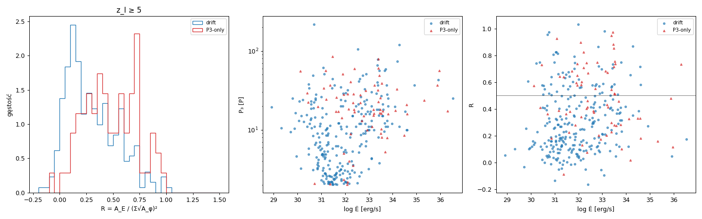
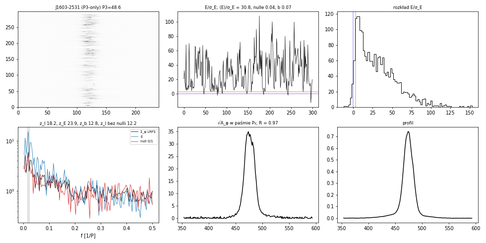
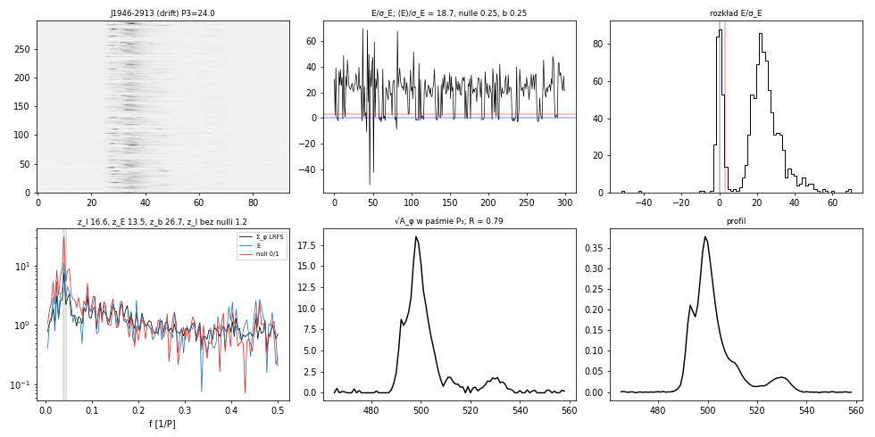
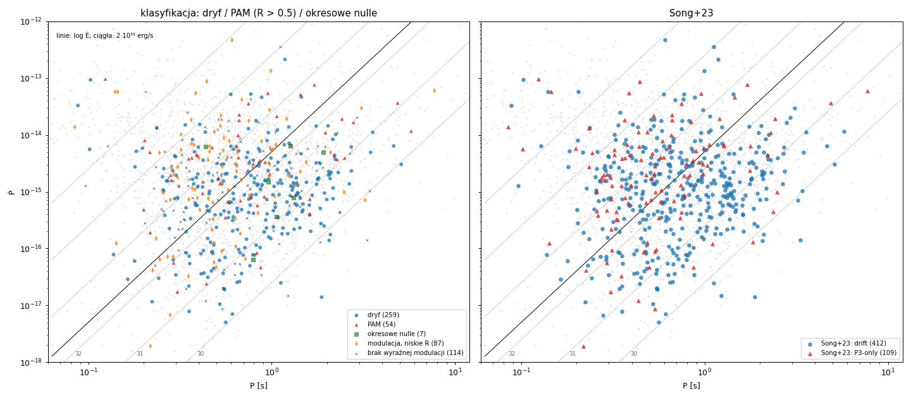

# P3-only jako okresowa modulacja amplitudy (PAM) i okresowe nulle — test hipotezy Basu et al.

**Stan na 2026-10-07.** Pierwsza wersja (v1) na pełnej próbce + klasyfikacja trzykategoriowa (§5). Pytanie zmienione z „czy jest ruch” (travel, P3Track, pairshift,
flow) na „czy P3-only mają podpis innego zjawiska”.

Repozytorium: `github.com/aszary/spats`, gałąź `claude`. Kod poza repo: `~/claude/work/scripts/basu.jl`, `basu_run.sh`,
`basu_summary.py`; dziennik `~/claude/work/basu/NOTES_basu.md`; wyniki `~/output/claude/basu/`.
Pokrewne: [`p3track_method.md`](p3track_method.md), [`subpulse_methods.md`](subpulse_methods.md),
[`flow_test_method.md`](flow_test_method.md), [`polarization_test_method.md`](polarization_test_method.md).

---

## 0. Podsumowanie

**Hipoteza (Basu, Mitra & Melikidze 2016, 2020).** Okresowa modulacja amplitudy (PAM) i okresowe nulle to zjawiska inne niż dryf:
modulacja obejmuje **cały profil jednocześnie**, bywa związana z **nullami** i **nie zależy od Ė**, podczas gdy dryf występuje
głównie poniżej ~2·10³² erg/s, a jego P₃ maleje z Ė.

**Wynik (521 pulsarów; cecha P₃ w I z_I ≥ 5: 261 drift, 69 P3-only):**

| test | drift | P3-only | komentarz |
|---|---|---|---|
| A. R (modulacja w fazie w całym profilu), mediana | 0.26 [0.12–0.47] | **0.46** [0.28–0.68] | MWU p = 5·10⁻⁷; R > 0.5: 23% vs 46% |
| B. ułamek nulli, mediana (nf > 0.1) | 0.08 (44%) | **0.19** (60%) | |
| B. okresowe nulle (z_null ≥ 5, S/N impulsu ≥ 10) | 12/164 (7%) | 5/35 (14%) | |
| C. Spearman(log Ė, log P₃), Ė < 2·10³² | **−0.41** (p 8·10⁻⁷; z wykrytym ruchem) | −0.30 (p 0.14, n = 26) | R > 0.5: −0.21 (p 0.13) |
| D. udział w przedziałach Ė (28–31 → 34–38) | ruch wykryty 77% → ~40% | 8% → 47% | R > 0.5 płasko 24–37% |

1. **P3-only zachowują się jak PAM, nie jak słaby dryf**: modulacja częściej obejmuje cały profil (R), częściej nullują, a
   relacji P₃–Ė (podpisu dryfu u Basu) nie widać — choć przy n = 26 to słaba przesłanka.
2. **Modulacja globalna występuje w całym zakresie Ė, dryf zanika powyżej ~2·10³²** — zgodnie z Basu. Udział P3-only rośnie
   z Ė, bo maleje udział dryfu, a nie dlatego, że rośnie udział PAM.
3. **Nowe względem Song+23: okresowe nulle wśród „dryferów”.** J1946-2913 — po zastąpieniu nulli średnim profilem cecha P₃ znika
   (z_I 16.6 → 1.2), cała modulacja pochodzi z nulli; podobnie J1819+1305 (z_null 46, R 0.83), J1536-3602, J1946+1805,
   J2253+1516 (P₃ 218). Część z nich ma też wykryty ruch (flow/pairshift/P3Track) — możliwa mieszanka zjawisk.
4. **Zastrzeżenie:** test A jest częściowo tautologiczny — wysokie R ⇔ płaska faza modulacji w długości ⇔ cecha 2DFS przy
   P₂ = 0, czyli definicja P3-only. Niezależne od definicji są B, C, D.



*Rys. 1. Od lewej: rozkład R (z_I ≥ 5); P₃ wobec Ė; R wobec Ė (koła drift, trójkąty P3-only).*

---

## 1. Dane

I z cache okien on-pulse (`~/output/claude/pol/cache`, z `pol_batch.jl`: `pulsar.spCf16`, `pdv -t -F`, linia bazowa off-pulse
per impuls, σ off-pulse), zapowane impulsy usunięte, do 10 000 impulsów. P₃ i nfft z `params.json` (`_16/`); nfft zmniejszane,
gdy < 4 bloki. Ė z `~/claude/work/psrcat_ppdot.csv` (I = 10⁴⁵ g cm²). Etykiety Song+23 z `p3track_v4b_pulsars.csv`.
„Ruch wykryty”: |z| ≥ 3 w flow (blokowe) lub pairshift v1, lub werdykt P3Track `drift`/`partial`.

## 2. Miary

**Pasmo P₃.** Maksimum widma I sumowanego po długości w 0.7–1.3 × 1/P₃ (alias dla P₃ < 2), szerokość FWHM, min. ±1 bin
(jak w `pol_batch.jl`).

**A. Modulacja globalna.** Eₙ = Σ_φ I(n, φ). A_φ — nadwyżka mocy w paśmie P₃ nad medianą widma poza pasmem w binie φ;
A_E — to samo dla Eₙ.

  R = A_E / (Σ_φ √A_φ)²

R = 1, gdy wszystkie biny modulowane są w fazie (amplituda Eₙ jest sumą amplitud); R ≈ 0, gdy faza modulacji zmienia się
w długości o ≥ 1 cykl (dryf) lub jest losowa. z_I, z_E — istotność cechy w I (suma po binach) i w Eₙ względem 100 tasowań impulsów.

**B. Nulle.** σ_E = σ·√n_bin. Ułamek nulli nf = 2·P(Eₙ < 0) (nulle symetryczne wokół 0, emisja dodatnia). Ciąg binarny
bₙ = [Eₙ < 3σ_E] — wiarygodny tylko przy ⟨E⟩/σ_E ≥ 10 (inaczej słabe impulsy emisji wpadają poniżej progu).
z_null — cecha P₃ w bₙ (okresowe nulle). zIn — z_I po zastąpieniu impulsów z bₙ = 1 średnim profilem emisji (ile okresowości
wynika z nulli).

## 3. Pilot: zestaw kontrolny

| etykieta | PSR | P₃ | R | z_I | z_E | ⟨E⟩/σ_E | nulle | z_null | z_I bez nulli |
|---|---|---|---|---|---|---|---|---|---|
| P3-only | J1401-6357 | 2.2 | 0.39 | 4.3 | 2.0 | 69.2 | 0.02 | −0.7 | 4.6 |
| P3-only | J1603-2531 | 48.6 | **0.97** | 18.2 | 23.9 | 30.8 | 0.04 | **12.8** | 12.2 |
| P3-only | J1001-5939 | 2.1 | 0.36 | 6.9 | 3.5 | 13.0 | 0.15 | −0.7 | 9.5 |
| P3-only | J1146-6030 | 10.9 | 0.56 | 3.5 | 4.1 | 29.0 | 0.00 | −0.4 | 3.6 |
| P3-only | J2307+2225 | 3.5 | 0.50 | 3.3 | 1.4 | 16.8 | 0.02 | 0.0 | 3.8 |
| P3-only | J1825+0004 | 14.2 | 0.28 | 7.1 | 2.2 | 11.1 | 0.00 | 0.1 | 6.9 |
| drift | J0034-0721 | 6.6 | 0.12 | 8.1 | 1.0 | 43.2 | **0.42** | 0.4 | 11.5 |
| drift | J0151-0635 | 14.3 | 0.17 | 72.2 | 22.1 | 17.0 | 0.01 | 1.3 | 69.2 |
| drift | J0820-1350 | 4.8 | 0.19 | 89.0 | 26.0 | 107.4 | 0.02 | −1.6 | 96.1 |
| drift | J1750-3503 | 49.0 | 0.05 | 32.7 | 2.9 | 5.2 | 0.13 | 1.7 | 31.5 |

R rozdziela zestaw kontrolny (P3-only 0.28–0.97, drift 0.05–0.19). J1603-2531 — okresowe nulle tłumaczą część modulacji
(z_I 18 → 12). J0034-0721 — 42% nulli, ale nieokresowych.



*Rys. 2. J1603-2531 (P3-only). Górny rząd: stos impulsów, Eₙ/σ_E (czerwona linia: próg 3σ_E), rozkład Eₙ/σ_E. Dolny: widma
(Σ_φ LRFS — czarne, Eₙ — niebieskie, ciąg nulli 0/1 — czerwone; pasmo P₃ zaznaczone), √A_φ w paśmie P₃, profil.*

## 4. Pełna próbka

**A.** R wg werdyktu P3Track: am 0.56, inconclusive 0.39, partial 0.40, nogroup 0.37, nocat 0.28, drift 0.16. Dryfery z wykrytym
ruchem 0.21, bez 0.36. Jako dyskryminator: próg R > 0.3 / 0.4 / 0.5 — P3-only 72 / 58 / 46%, drift 44 / 33 / 23%.

**B. Okresowe nulle** (z_null ≥ 5, z_I ≥ 5, ⟨E⟩/σ_E ≥ 10), mediana zIn/z_I: drift 0.76, P3-only 0.67.

| PSR | etykieta | P₃ | R | z_I | nulle | z_null | z_I bez nulli | log Ė | P3Track | ruch |
|---|---|---|---|---|---|---|---|---|---|---|
| J1819+1305 | drift | 61 | 0.83 | 63.8 | 0.34 | 45.8 | 26.0 | 31.1 | drift | tak |
| J1536-3602 | drift | 51 | 0.82 | 38.8 | 0.37 | 28.1 | 19.7 | 31.1 | nocat | tak |
| **J1946-2913** | drift | 24 | 0.79 | 16.6 | 0.25 | 26.7 | **1.2** | 31.8 | am | tak |
| J2253+1516 | drift | 218 | 0.95 | 31.6 | 0.63 | 21.1 | 10.9 | 30.7 | inconclusive | tak |
| J1048-5832 | P3-only | 17.4 | 0.73 | 102 | 0.00 | 15.8 | 94.1 | 36.3 | inconclusive | nie |
| J1603-2531 | P3-only | 48.6 | 0.98 | 18.2 | 0.04 | 12.8 | 12.2 | 33.4 | am | nie |
| J1946+1805 | drift | 19 | 0.82 | 18.9 | 0.56 | 9.6 | 15.4 | 31.0 | inconclusive | nie |
| J0855-3331 | P3-only | 2.04 | 0.90 | 15.1 | 0.33 | 9.2 | 5.6 | 32.1 | nyquist | nie |
| J1839-1238 | drift | 34 | 0.63 | 10.3 | 0.22 | 9.1 | 5.7 | 31.4 | am | tak |
| J1133-6250 | drift | 10.3 | 0.34 | 18.7 | 0.04 | 7.9 | 17.6 | 31.2 | drift | tak |
| J1057-5226 | P3-only | 8.51 | 0.33 | 49.0 | 0.05 | 7.4 | 49.0 | 34.5 | partial | tak |
| J1157-6224 | drift | 78 | 0.24 | 22.4 | 0.01 | 6.9 | 21.8 | 33.4 | inconclusive | nie |
| J0905-4536 | drift | 28 | 0.31 | 25.9 | 0.07 | 6.8 | 25.2 | 30.8 | drift | tak |
| J1915+0738 | drift | 37 | 0.48 | 13.8 | 0.21 | 6.2 | 9.8 | 31.5 | nocat | nie |
| J1633-4453 | P3-only | 16.5 | 0.88 | 7.3 | 0.28 | 6.1 | 3.2 | 33.5 | inconclusive | nie |
| J1418-3921 | drift | 2.53 | 0.29 | 29.3 | 0.04 | 5.9 | 28.7 | 31.4 | drift | tak |
| J0820-4114 | drift | 19 | 0.43 | 16.1 | 0.06 | 5.2 | 22.4 | 30.7 | drift | tak |

Przy małym ułamku nulli (J1048-5832 0.002, J1133-6250 0.04) z_null mierzy raczej okresowe **słabe** impulsy (Eₙ < 3σ_E) niż
nulle — to modulacja amplitudy, nie nulle. Okresowe nulle w ścisłym sensie: nf ≳ 0.2 i duży spadek z_I po ich usunięciu
(J1946-2913, J0855-3331, J1633-4453, J2253+1516, J1819+1305, J1839-1238).



*Rys. 3. J1946-2913 (Song+23: drift). Wyraźnie dwumodalny rozkład energii (25% nulli), cecha P₃ ≈ 24 w ciągu nulli
(z_null 26.7) i w Eₙ; po zastąpieniu nulli średnim profilem z_I spada z 16.6 do 1.2. Pojedyncze ujemne wartości Eₙ/σ_E do −50
— prawdopodobnie RFI lub błąd linii bazowej, niesprawdzone.*

**C. P₃–Ė** (Spearman log Ė vs log P₃; J0108-1431 pominięty, P₃ ≤ 0 w params):

| grupa | cały zakres Ė | Ė < 2·10³² |
|---|---|---|
| drift (wszystkie) | +0.23 (p 2·10⁻⁴, n 260) | −0.38 (p 2·10⁻⁷, n 170) |
| drift z wykrytym ruchem | +0.07 (p 0.32) | **−0.41 (p 8·10⁻⁷, n 135)** |
| drift bez ruchu | +0.39 (p 4·10⁻⁴) | −0.30 (p 0.08, n 35) |
| P3-only | −0.05 (p 0.69) | −0.30 (p 0.14, n 26) |
| R > 0.5 | +0.09 (p 0.42) | −0.21 (p 0.13, n 52) |
| R < 0.3 z ruchem | +0.04 (p 0.70) | −0.40 (p 7·10⁻⁵, n 95) |

**D. Ė** (z_I ≥ 5):

| log Ė | n | P3-only | ruch wykryty | R > 0.5 | R > 0.5 bez ruchu |
|---|---|---|---|---|---|
| 28.0–31.0 | 62 | 8% | 77% | 27% | 11% |
| 31.0–32.0 | 108 | 13% | 69% | 25% | 14% |
| 32.0–32.3 | 27 | 26% | 63% | 30% | 15% |
| 32.3–33.0 | 54 | 22% | 41% | 24% | 22% |
| 33.0–34.0 | 60 | 37% | 37% | 37% | 23% |
| 34.0–38.0 | 19 | 47% | 42% | 26% | 16% |

## 5. Klasyfikacja trzykategoriowa i diagram P–Ṗ (2026-10-07)

Skrypt `~/claude/work/scripts/classify3.py [R_thr]` → `~/output/claude/basu/classify3_R0.5.csv`, `classify3_ppdot_R0.5.png`;
logi `~/claude/work/logs/classify3_R0.5.log`, `classify3_sens.log`.

**Reguły** (pierwsza spełniona wygrywa):

1. **okresowe nulle** — z_I ≥ 5, ⟨E⟩/σ_E ≥ 10, z_null ≥ 5, nf ≥ 0.15 i zIn ≤ 0.6·z_I (nulle tłumaczą modulację);
2. **dryf** — wykryty ruch: flow |z| ≥ 3 (blokowe) lub pairshift v2 |z_blk| ≥ 3 (drugi agent) lub P3Track `drift`/`partial`;
3. **PAM** — z_I ≥ 5, R > 0.5, brak ruchu;
4. **modulacja, niskie R** — z_I ≥ 5 (pozostałe);
5. **brak wyraźnej modulacji** — z_I < 5 i brak ruchu.

| kategoria | Song+23: drift (412) | Song+23: P3-only (109) |
|---|---|---|
| dryf | **249 (60%)** | 10 (9%) |
| PAM | 25 (6%) | **29 (27%)** |
| okresowe nulle | 5 (1%) | 2 (2%) |
| modulacja, niskie R | 56 (14%) | 31 (28%) |
| brak wyraźnej modulacji | 77 (19%) | 37 (34%) |

- **Dryf ≈ etykieta drift.** Detekcja ruchu w 1 / 2 / 3 metodach: 102 / 69 / 88. Przy wymogu ≥ 2 metod: 156 drift i 1 P3-only
  (J1810-5338: flow z = 3.0 i P3Track `drift`; pairshift 1.9). Pozostałe P3-only w kategorii dryf to pojedyncze słabe detekcje.
- **PAM to głównie P3-only, ale 25 „dryferów” Song+23 trafia do PAM** (modulacja globalna, żadna z trzech metod nie widzi ruchu) —
  kandydaci do przeglądu etykiety.
- **Okresowe nulle:** J1946-2913, J1819+1305, J1536-3602, J2253+1516, J1839-1238 (Song: drift; J1819, J2253, J1839 także
  z wykrytym ruchem — mieszanka), J1633-4453, J0855-3331 (Song: P3-only). Wszystkie przy log Ė < 33.
- **P3-only Song+23 to mieszanka:** PAM (27%), słaba modulacja z niskim R (28%) i brak wyraźnej cechy P₃ w tych danych (34%).

**P₃–Ė w kategoriach** (Spearman log Ė vs log P₃):

| kategoria | n | cały zakres Ė | Ė < 2·10³² | mediana log Ė | mediana P₃ |
|---|---|---|---|---|---|
| dryf | 258 | +0.06 (p 0.34) | **−0.34 (p 3·10⁻⁶, n 178)** | 31.7 | 5.8 |
| PAM | 54 | +0.05 (p 0.74) | −0.18 (p 0.38, n 25) | 32.5 | 17.8 |
| modulacja, niskie R | 87 | +0.41 (p 10⁻⁴) | −0.05 (p 0.79, n 33) | 32.6 | 16.3 |
| okresowe nulle | 7 | −0.96 | −1.00 (n 6) | 31.5 | 34.0 |

Relację P₃–Ė Basu (2016) ma tylko kategoria dryf. Dla okresowych nulli n = 6–7 — bez znaczenia statystycznego.

**Udział kategorii w przedziałach Ė (%):**

| log Ė | n | dryf | PAM | okresowe nulle | modulacja, niskie R | brak modulacji | Song P3-only |
|---|---|---|---|---|---|---|---|
| 28–31 | 90 | 67 | 8 | 1 | 8 | 17 | 10 |
| 31–32 | 160 | 61 | 9 | 2 | 12 | 14 | 12 |
| 32–32.3 | 43 | 49 | 7 | 2 | 14 | 28 | 26 |
| 32.3–33 | 103 | 40 | 12 | 0 | 20 | 28 | 27 |
| 33–34 | 97 | 31 | 14 | 1 | 25 | 29 | 32 |
| 34–38 | 28 | 32 | 11 | 0 | 32 | 25 | 36 |

Dryf maleje z Ė (67% → ~31%), PAM rośnie słabo (8% → 11–14%), najsilniej rośnie „modulacja, niskie R” (8% → 25–32%) —
przy wysokim Ė dominuje modulacja ani dryfująca, ani globalna (np. niezależne składowe, nieregularna).

**Wrażliwość na progi** (drift / P3-only):

| wariant | dryf | PAM | okresowe nulle | modulacja, niskie R | brak |
|---|---|---|---|---|---|
| ≥ 1 metoda, R > 0.4 | 249 / 10 | 35 / 37 | 5 / 2 | 46 / 23 | 77 / 37 |
| ≥ 1 metoda, R > 0.5 | 249 / 10 | 25 / 29 | 5 / 2 | 56 / 31 | 77 / 37 |
| ≥ 1 metoda, R > 0.6 | 249 / 10 | 12 / 21 | 5 / 2 | 69 / 39 | 77 / 37 |
| ≥ 2 metody, R > 0.5 | 156 / 1 | 39 / 30 | 5 / 2 | 103 / 37 | 109 / 39 |



*Rys. 4. Diagram P–Ṗ. Lewy panel: klasyfikacja trzykategoriowa (koła — dryf, trójkąty — PAM, kwadraty — okresowe nulle,
romby — modulacja z niskim R, krzyżyki — brak wyraźnej modulacji). Prawy: etykiety Song+23. Tło: pulsary ATNF; linie przerywane:
stałe log Ė (30–35), ciągła: Ė = 2·10³² erg/s.*

## 6. Ograniczenia i sprawy otwarte

1. **A częściowo tautologiczne** (§0, pkt 4); R nie odróżnia PAM od dryfu z P₂ ≫ szerokość profilu.
2. **Definicja nulli przybliżona**: bez pełnego okna off-pulse, próg 3σ_E, nf = 2·P(E < 0); przy niskim S/N impulsu
   z_null niewiarygodne (stąd warunek ⟨E⟩/σ_E ≥ 10, co ogranicza P3-only do 35). Nie odróżnia nulli od okresowo słabych impulsów.
3. **C dla P3-only słabe statystycznie** (n = 26 przy Ė < 2·10³²). Antykorelacja P₃–Ė u dryferów może być częściowo efektem aliasu
   przy P₃ ≈ 2 (Basu: P₃ rzeczywiste maleje do ~2 przy Ė ~ 2·10³²).
4. **Okresowe nullery z etykietą drift** wymagają obejrzenia stosów impulsów (dryf w seriach między nullami czy sama modulacja
   nulli) — następny krok.
5. Ujemne wartości Eₙ/σ_E do −50 (J1946-2913) — RFI/linia bazowa, do sprawdzenia przed dalszym użyciem nf.
6. Klasyfikacja trzykategoriowa (§5): progi R i liczba metod wybrane arbitralnie; 25 „dryferów” w PAM i okresowe nullery do przejrzenia.

## 7. Użycie

```bash
# zestaw kontrolny (wykresy ~/claude/work/figures/basu/)
psrx julia --project=/home/psr/software/spats /home/psr/work/scripts/basu.jl [PSR ...]
# cała próbka (wymaga cache z pol_batch.jl) → ~/output/claude/basu/basu_v1_part<k>of8.csv, figures/
~/claude/work/scripts/basu_run.sh
# podsumowanie → basu_v1.csv, basu_v1_summary.png (łączy flow_v1b.csv, pairshift_v1.csv, P3Track v4b, Ė)
psrx python3 /home/psr/work/scripts/basu_summary.py
# klasyfikacja trzykategoriowa i P–Ṗ (próg R jako argument)
psrx python3 /home/psr/work/scripts/classify3.py 0.5
```
