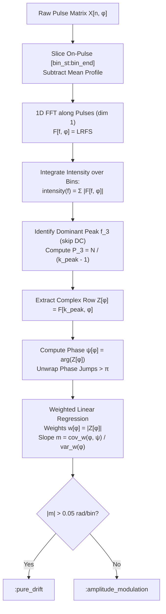
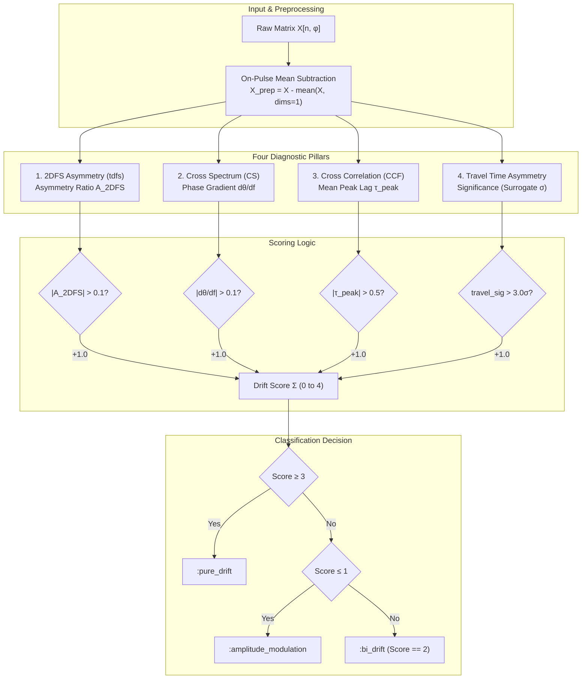

# Distinguishing $P_3$-Only Amplitude Modulation from Subpulse Drift in SPATS

This document explains the mathematical foundations, algorithmic implementations, and comparative workflows used in **SPATS** (*Single Pulse Analysis Tool Set*) to distinguish between **$P_3$-only amplitude modulation** and **subpulse drifting**. 

Two diagnostic pipelines are implemented in the codebase:
1. **LRFS Phase Tracking**: [`LrfsDiagnostics.jl`](file:///c:/Users/macie/PULSAR/spats/modules/LrfsDiagnostics.jl) and [`lrfs_batch.jl`](file:///c:/Users/macie/PULSAR/spats/modules/lrfs_batch.jl)
2. **Multi-Method Diagnostic Ensemble**: [`DriftDiagnostics.jl`](file:///c:/Users/macie/PULSAR/spats/modules/DriftDiagnostics.jl) and [`drift_batch.jl`](file:///c:/Users/macie/PULSAR/spats/modules/drift_batch.jl)

---

## 1. Physical & Mathematical Foundations

### 1.1 The Single-Pulse Fluctuation Matrix
A single-pulse observation is represented as a 2D intensity matrix $X(n, \varphi)$ of size $N \times M$:
- Pulse index (slow time): $n \in \{1, \dots, N\}$ (sampling interval $P_1$, the pulsar rotation period).
- Pulse longitude (fast time / rotation phase): $\varphi \in \{1, \dots, M\}$ across the on-pulse window $[\text{bin\_st}, \text{bin\_end}]$.

Before fluctuation analysis, both suites subtract the static average profile across pulses:
$$\delta I(n, \varphi) = X(n, \varphi) - \langle X(n, \varphi) \rangle_n$$
This removes the time-invariant pulse shape, isolating pulse-to-pulse fluctuations $\delta I(n, \varphi)$.

---

### 1.2 Pure Amplitude Modulation ($P_3$-Only)
In pure amplitude modulation, subpulses fluctuate periodically in intensity with period $P_3$, but **do not migrate in longitude**:

$$\delta I_{\text{AM}}(n, \varphi) = a(\varphi) \cdot w(n)$$

where $w(n)$ is a periodic function with fundamental frequency $f_3 = 1/P_3$, and $a(\varphi)$ is the spatial intensity envelope across pulse longitude.

**Key Mathematical Characteristics**:
- **Separability**: The 2D matrix factorizes into spatial and temporal components.
- **Equal Phase**: All longitude bins fluctuate synchronously (or in antiphase if $a(\varphi)$ changes sign).
- **Zero Phase Slope**: Across longitude, $\frac{d\psi}{d\varphi} = 0$.
- **Zero Inter-Bin Lag**: Temporal cross-correlations between longitudes peak at lag $\tau = 0$.
- **2D Spectral Symmetry**: Fluctuation power in the 2D Fluctuation Spectrum (2DFS) is symmetric about spatial frequency $1/P_2 = 0$.
- **Exact Time-Reversal Symmetry**: The 2D autocorrelation $K(\Delta, \tau) = \sum_{n, \varphi} \delta I(n, \varphi) \delta I(n+\tau, \varphi+\Delta)$ satisfies $K(\Delta, \tau) = K(\Delta, -\tau)$ identically, so the antisymmetric difference $A(\Delta, \tau) \equiv 0$.

---

### 1.3 Subpulse Drifting (Travelling Waves)
In drifting pulsars, subpulses systematically shift in longitude from pulse to pulse, forming tilted drift bands in the pulse stack (traditionally attributed to a rotating carousel of emission sparks under $\vec{E} \times \vec{B}$ drift):

$$\delta I_{\text{drift}}(n, \varphi) = f\left(\varphi - v n\right) \approx \cos\left(2\pi\left(\frac{n}{P_3} - \frac{\varphi}{P_2}\right)\right)$$

where:
- $P_3$ is the vertical repetition period (in pulse periods $P_1$).
- $P_2$ is the horizontal subpulse separation across longitude (in bins or degrees).
- $v = \frac{\Delta \varphi}{\Delta n} = \frac{P_2}{P_3}$ is the subpulse drift velocity.

**Key Mathematical Characteristics**:
- **Non-Separability**: The spatial and temporal coordinates are coupled through the drift velocity $v$.
- **Phase Gradient**: The Fourier phase at frequency $f_3$ varies linearly across longitude: $\psi(\varphi) = 2\pi \frac{\varphi}{P_2} + \psi_0$, yielding $\left|\frac{d\psi}{d\varphi}\right| = \frac{2\pi}{P_2} > 0$.
- **Non-Zero Inter-Bin Lag**: Adjacent bins exhibit temporal peak lags $\tau_{\text{peak}} \approx 1/v = P_3 / P_2 \neq 0$.
- **2DFS Asymmetry**: Fluctuation power concentrates off-axis into the quadrant matching the sign of the drift.
- **Time-Asymmetry ($A(\Delta, \tau) \neq 0$)**: The 2D autocorrelation satisfies $K(\Delta, \tau) = C_f(\Delta - v\tau) \neq K(\Delta, -\tau)$, creating substantial antisymmetric power.

---

## 2. Pipeline 1: `LrfsDiagnostics.jl` & `lrfs_batch.jl`

[`LrfsDiagnostics.jl`](file:///c:/Users/macie/PULSAR/spats/modules/LrfsDiagnostics.jl) performs a focused, single-frequency phase tracking analysis on the complex **Longitude-Resolved Fluctuation Spectrum (LRFS)**.

### 2.1 Algorithmic Steps in `lrfs_phase_track`

1. **Preprocessing**:
   Isolates on-pulse bins `bin_st:bin_end` and subtracts the mean profile across pulses:
   $$X_{\text{prep}} = X[:, \text{bin\_st}:\text{bin\_end}] - \langle X[:, \text{bin\_st}:\text{bin\_end}] \rangle_{\text{pulses}}$$

2. **Self-Contained LRFS Computation**:
   Applies a 1D FFT along the pulse axis (time dimension) for each longitude bin $\varphi$:
   $$F(f_k, \varphi) = \sum_{n=0}^{N-1} X_{\text{prep}}(n, \varphi) e^{-i 2\pi k n / N}, \quad k = 0, \dots, \lfloor N/2 \rfloor - 1$$
   The spectral intensity per frequency row is obtained by summing absolute amplitudes across bins:
   $$\text{intensity}(k) = \sum_{\varphi=1}^{M} |F(f_k, \varphi)|$$

3. **Dominant $P_3$ Frequency Extraction**:
   Excluding the DC component ($k=1$), the index of peak intensity is identified:
   $$k_{\text{peak}} = \arg\max_{k \ge 2} \text{intensity}(k)$$
   The dominant fluctuation period in pulses is:
   $$P_3 = \frac{N}{k_{\text{peak}} - 1}$$

4. **Phase Tracking Across Longitude**:
   Extracts the complex Fourier coefficient row at $k_{\text{peak}}$:
   $$Z(\varphi) = F(k_{\text{peak}}, \varphi)$$
   The complex phase across longitude is:
   $$\psi(\varphi) = \text{atan2}\left(\text{Im}(Z(\varphi)), \text{Re}(Z(\varphi))\right)$$
   `unwrap!(phase_track)` resolves phase wraps by adding or subtracting $2\pi$ whenever consecutive differences $|\psi(\varphi) - \psi(\varphi-1)| > \pi$.

5. **Weighted Linear Regression**:
   Off-pulse edges or low-intensity bins have poorly constrained phases. The slope is computed using weighted linear regression with weights set to the spectral magnitude:
   $$w(\varphi) = |Z(\varphi)|$$
   The weighted means and coordinates are:
   $$\bar{\varphi} = \frac{\sum w_i \varphi_i}{\sum w_i}, \quad \bar{\psi} = \frac{\sum w_i \psi_i}{\sum w_i}$$
   $$\text{cov}_{w}(\varphi, \psi) = \sum_{i=1}^{M} w_i (\varphi_i - \bar{\varphi})(\psi_i - \bar{\psi}), \quad \text{var}_{w}(\varphi) = \sum_{i=1}^{M} w_i (\varphi_i - \bar{\varphi})^2$$
   The phase slope $m$ (in radians per bin) is:
   $$m = \frac{\text{cov}_{w}(\varphi, \psi)}{\text{var}_{w}(\varphi)}$$

6. **Classification Threshold**:
   - **$|m| > 0.05\text{ rad/bin}$**: Classified as **`:pure_drift`** (systematic phase advance/retardation with longitude).
   - **$|m| \le 0.05\text{ rad/bin}$**: Classified as **`:amplitude_modulation`** ($P_3$-only standing modulation).
   - **$\sum w_i = 0$**: Classified as **`:undetermined`**.

---

### 2.2 Batch Execution & Visualization (`lrfs_batch.jl`)
- **`batch_analyze_lrfs(vpmout, list_file, out_csv)`**:
  - Traverses the pulsar target list (`drift_pulsars_P3.txt`).
  - Resolves directory structures (e.g. `NAME_16` or `NAME`), reading `params.json` for `bin_st` and `bin_end`.
  - Parses single-pulse data from `pulsar.debase.txt` (or auto-generates it from `pulsar.spCf16` via `Data.make_fullrange_debase`).
  - Executes `lrfs_phase_track`, outputting:
    `Name, P3_Pulses, Phase_Slope, Classification`.
- **`plot_lrfs_results(csv_file, out_plot)`**:
  - Generates a scatter plot of **Dominant $P_3$ Period (pulses)** vs. **$|\text{Phase Slope}|$ (rad/bin)**.
  - Highlights the $0.05\text{ rad/bin}$ decision boundary:
    - **Red circles**: Amplitude modulation ($|m| \le 0.05$).
    - **Blue circles**: Subpulse drift ($|m| > 0.05$), annotated if $|m| > 0.15$.
    - **Gray crosses**: Undetermined noise.

---

## 3. Pipeline 2: `DriftDiagnostics.jl` & `drift_batch.jl`

[`DriftDiagnostics.jl`](file:///c:/Users/macie/PULSAR/spats/modules/DriftDiagnostics.jl) uses an **ensemble approach** combining four independent metrics across the frequency, cross-spectral, time-correlation, and time-reversal symmetry domains.

### 3.1 The Four Diagnostic Pillars

#### Pillar 1: Two-Dimensional Fluctuation Spectrum (2DFS) Asymmetry
- **Module**: [`FluctuationSpectrum.jl`](file:///c:/Users/macie/PULSAR/spats/modules/FluctuationSpectrum.jl) (`tdfs`)
- **Principle**: Computes the 2D FFT across both pulse index $n$ and longitude bin $\varphi$:
  $$F(f_3, f_2) = \mathcal{F}_{2D}\{X_{\text{prep}}\}, \quad P(f_3, f_2) = |F(f_3, f_2)|^2$$
  Zero-frequency is centered using `fftshift`.
- **Metric**:
  The spatial frequency axis ($1/P_2$) is bisected into negative frequencies ($P_{\text{left}}$) and positive frequencies ($P_{\text{right}}$) relative to the center $1/P_2 = 0$:
  $$A_{\text{2DFS}} = \frac{P_{\text{left}} - P_{\text{right}}}{P_{\text{left}} + P_{\text{right}}}$$
- **Discrimination**:
  - Pure amplitude modulation creates vertical ridges symmetric about $1/P_2 = 0 \implies A_{\text{2DFS}} \approx 0$.
  - Drift creates tilted power concentrated in either positive or negative spatial quadrants $\implies |A_{\text{2DFS}}| \gg 0$.
  - **Threshold**: Adds $+1.0$ to drift score if $|A_{\text{2DFS}}| > 0.1$.

---

#### Pillar 2: Cross-Spectral Phase Gradient
- **Module**: [`CrossSpectrum.jl`](file:///c:/Users/macie/PULSAR/spats/modules/CrossSpectrum.jl) (`phase_gradient`)
- **Principle**: Evaluates the complex cross-spectral density $S_{i, i-1}(f)$ between adjacent longitude bins:
  $$S_{i, i-1}(f) = F_i(f) \cdot F_{i-1}^*(f)$$
  The cross-spectra are coherently averaged across all adjacent pairs $i = 2, \dots, M$:
  $$\bar{S}(f) = \sum_{i=2}^{M} S_{i, i-1}(f)$$
  The phase spectrum $\theta(f) = \text{unwrap}(\arg(\bar{S}(f)))$ is extracted.
- **Metric**:
  By the Fourier shift theorem, an inter-bin time delay $\Delta \tau$ introduces a linear phase ramp: $\theta(f) = 2\pi f \Delta \tau$. An origin-constrained weighted linear regression estimates the phase gradient:
  $$\text{gradient} = \frac{\sum w_k f_k \theta_k}{\sum w_k f_k^2}, \quad w_k = |\bar{S}(f_k)|$$
- **Discrimination**:
  - In amplitude modulation, intensity changes occur simultaneously across longitudes $\implies \Delta \tau = 0 \implies \text{gradient} \approx 0$.
  - In drifting pulsars, subpulses systematically arrive earlier/later in neighboring bins $\implies |\text{gradient}| > 0$.
  - **Threshold**: Adds $+1.0$ to drift score if $|\text{gradient}| > 0.1$.

---

#### Pillar 3: Pairwise Cross-Correlation Peak Lags
- **Module**: [`CrossCorrelation.jl`](file:///c:/Users/macie/PULSAR/spats/modules/CrossCorrelation.jl) (`peak_lags`)
- **Principle**: Computes the temporal cross-correlation function (CCF) across all longitude pairs up to `max_lag`:
  $$C_{i, j}(\tau) = \sum_{n} X_{\text{prep}}(n, i) X_{\text{prep}}(n+\tau, j), \quad \tau \in [-\text{max\_lag}, \text{max\_lag}]$$
  The lag $\tau_{\text{peak}}(i, j)$ maximizing $C_{i, j}(\tau)$ is determined.
- **Metric**:
  The average peak lag between adjacent bins ($i$ and $i-1$) is computed:
  $$\bar{\tau}_{\text{adj}} = \frac{1}{M-1} \sum_{i=2}^{M} \tau_{\text{peak}}(i, i-1)$$
- **Discrimination**:
  - In amplitude modulation, subpulses peak in the same pulse across all longitudes $\implies \tau_{\text{peak}} = 0 \implies |\bar{\tau}_{\text{adj}}| \approx 0$.
  - In drifting pulsars, subpulse drift bands produce non-zero peak lags $\implies |\bar{\tau}_{\text{adj}}| \ge 1$.
  - **Threshold**: Adds $+1.0$ to drift score if $|\bar{\tau}_{\text{adj}}| > 0.5\text{ pulses}$.

---

#### Pillar 4: Travel Time-Asymmetry Significance
- **Module**: [`travel.jl`](file:///c:/Users/macie/PULSAR/spats/modules/travel.jl) (`travel_test`)
- **Principle**: Based on an algebraic identity of the 2D autocorrelation:
  $$K(\Delta, \tau) = \sum_{n, \varphi} \delta I(n, \varphi) \, \delta I(n+\tau, \varphi+\Delta)$$
  Under separable amplitude modulation $\delta I(n, \varphi) = a(\varphi) w(n)$:
  $$K(\Delta, \tau) = \left[\sum_{\varphi} a(\varphi) a(\varphi+\Delta)\right] \left[\sum_{n} w(n) w(n+\tau)\right]$$
  The temporal factor $\sum_n w(n) w(n+\tau)$ is **strictly even in $\tau$** for any real time series $w(n)$ (substituting $m = n - \tau$ yields the identical sum over identical pairs). Consequently:
  $$A(\Delta, \tau) = K(\Delta, \tau) - K(\Delta, -\tau) \equiv 0$$
  **identically for realized data**, regardless of whether $w(n)$ is strictly periodic, wobbles, switches mode, or nulls!
- **Metric**:
  A travelling subpulse pattern breaks time symmetry ($K(\Delta, \tau) = C_f(\Delta - v\tau)$), generating significant power in $A(\Delta, \tau)$. The significance is evaluated using surrogate realizations:
  $$\text{travel\_sig} = \frac{T - \langle T_{\text{null}} \rangle}{\sigma(T_{\text{null}})} \quad [\sigma]$$
  where $T = \sum_{\Delta, \tau} A(\Delta, \tau)^2$.
- **Discrimination**:
  - Amplitude modulation yields consistent zero-asymmetry, with measured values within noise fluctuations ($\text{travel\_sig} \le 3\sigma$).
  - Genuine drifting produces significant time-reversal asymmetry ($\text{travel\_sig} > 3\sigma$).
  - **Threshold**: Adds $+1.0$ to drift score if $\text{travel\_sig} > 3.0\sigma$.

---

### 3.2 Drift Score & Classification Rules

The total drift score is the sum of the binary conditions:
$$\text{Score} = \mathbf{1}_{|A_{\text{2DFS}}| > 0.1} + \mathbf{1}_{|\text{grad}| > 0.1} + \mathbf{1}_{|\bar{\tau}_{\text{adj}}| > 0.5} + \mathbf{1}_{\text{travel\_sig} > 3.0} \quad \in [0, 4]$$

The classification heuristic maps the score to three distinct physical regimes:
1. **$\text{Score} \ge 3$ $\implies$ `:pure_drift`**:
   At least 3 of the 4 diagnostic methods detect clear drifting signatures.
2. **$\text{Score} \le 1$ $\implies$ `:amplitude_modulation`**:
   The pulsar behaves consistently as a stationary standing wave / $P_3$-only modulation across the metrics.
3. **$\text{Score} == 2$ $\implies$ `:bi_drift`**:
   Inconclusive or split indicators. This is characteristic of **bi-drifting** (simultaneous positive and negative drift bands) or complex mode changes, where opposite drifts cancel out in 2DFS asymmetry or mean CCF lag, but trip the Travel time-asymmetry or cross-spectral coherence metrics.

---

### 3.3 Batch Execution & Visualization (`drift_batch.jl`)
- **`batch_analyze_drift(vpmout, list_file, out_csv)`**:
  - Processes each pulsar in the list using `analyze_drift`.
  - Outputs a CSV file with:
    `Name, Travel_Sig, Asymmetry_Ratio, Phase_Gradient, Mean_Peak_Lag, Score, Classification`.
- **`plot_drift_results(csv_file, out_plot)`**:
  - Plots the 2D diagnostic space: **$|A_{\text{2DFS}}|$ (2DFS Asymmetry)** vs. **$|\text{Phase Gradient}|$ (Cross-Spectrum)**.
  - Dashed lines at $0.1$ demarcate the decision thresholds:
    - **Red**: `:amplitude_modulation` (clustered at the lower-left origin $(0, 0)$).
    - **Blue**: `:pure_drift` (upper-right quadrant).
    - **Green**: `:bi_drift` (split along one axis).
    - **Gray 'x'**: `:undetermined`.

---

## 4. Comprehensive Comparison of Both Suites

| Feature / Dimension | `LrfsDiagnostics` / `lrfs_batch` | `DriftDiagnostics` / `drift_batch` |
| :--- | :--- | :--- |
| **Primary Philosophy** | Single-frequency targeted phase tracking | Multi-domain ensemble cross-validation |
| **Core Method** | 1D LRFS complex phase slope $d\psi/d\varphi$ | 4-way consensus: 2DFS, Cross-Spec, CCF, Travel |
| **Dependency on $P_3$** | **High**: Directly identifies $f_3 = 1/P_3$ and extracts the Fourier row | **Low / None**: Evaluates broadband dynamics, cross-bins, and 2D correlation |
| **Output Quantity** | Phase slope $m$ (rad/bin) & dominant $P_3$ period (pulses) | Metric values, consensus Drift Score (0–4), class flag |
| **Classification Categories** | `:pure_drift`, `:amplitude_modulation`, `:undetermined` | `:pure_drift`, `:amplitude_modulation`, `:bi_drift`, `:undetermined` |
| **Decision Thresholds** | $|m| > 0.05\text{ rad/bin}$ | Score $\ge 3$ (Drift), Score $\le 1$ (AM), Score $= 2$ (Bi-drift) |
| **Bi-Drifting Handling** | Can cancel or produce net slope near zero $\implies$ risk of misclassifying as AM | **Explicitly recognized**: opposite drifts trigger score $= 2$ (`:bi_drift`) |
| **Sensitivity to Nulling / Jitter** | Can degrade Fourier peak sharpness $Q$ | Highly robust (Travel algebraic symmetry holds even with nulls) |
| **Computational Footprint** | Extremely fast (single 1D FFT per bin + 1 weighted regression) | Moderate (2D FFT, pairwise CCF map, Travel surrogate testing) |
| **Visual Diagnostic Plot** | $P_3$ vs. $|\text{Phase Slope}|$ | $|A_{\text{2DFS}}|$ vs. $|\text{Cross-Spectrum Phase Gradient}|$ |

---

## 5. Practical Guide: When to Use Which Pipeline

### When to use `lrfs_batch.jl`:
- **Fast parameter estimation**: When you need both the dominant modulation period $P_3$ and a quantitative measurement of the subpulse phase drift rate ($m = d\psi/d\varphi$) across longitude.
- **Physical drift rate derivation**: The phase slope $m$ in rad/bin maps directly to the horizontal subpulse separation $P_2 = \frac{2\pi}{m}\text{ bins}$, and subpulse drift rate $D = \frac{d\varphi}{dn} = \frac{2\pi}{P_3 \cdot m}$.
- **Large-scale initial screening**: Rapid scanning over large pulsar surveys to identify candidate drifters with high SNR periodicities.

### When to use `drift_batch.jl`:
- **Definitive classification**: When cataloging pulsars or resolving disputed classifications between $P_3$-only standing modulation and true subpulse drift.
- **Complex emission phenomena**: Pulsars exhibiting bi-drifting, mode transitions, or strong nulling where a single Fourier frequency cannot fully capture the subpulse pattern.
- **Immunity to baseline/profile systematics**: By requiring consensus across time-domain (CCF), frequency-domain (2DFS), phase coherence (Cross-Spectrum), and algebraic time-reversal invariance (Travel), false positives from interstellar scintillation, gain wander, or profile shape variations are minimized.

---

## 6. Comparison with Song et al. (2023, TPA VIII; doi:10.1093/mnras/stad135)

The methodology in [Song et al. (2023)](https://doi.org/10.1093/mnras/stad135) (*"The Thousand-Pulsar-Array programme on MeerKAT – VIII. The subpulse modulation of 1198 pulsars"*, arXiv:2301.04067) represents the standard modern observational framework based on **PSRSALSA** (Weltevrede 2016). Understanding how SPATS compares to Song et al. (2023) highlights both the classical 2DFS approach and the innovations introduced in SPATS.

### 6.1 The Approach in Song et al. (2023)
In Song et al. (2023), distinguishing between drifting and $P_3$-only modulation relies on the **Two-Dimensional Fluctuation Spectrum (2DFS)**:
1. **2DFS Generation**: A 2D Fourier transform decomposes the single-pulse sequence into vertical modulation frequency $f_3 = 1/P_3$ (in cycles per period, cpp) and horizontal spatial frequency $f_2 = 1/P_2$ (in cycles per period or deg$^{-1}$).
2. **Rectangular Bounding Box Selection**: For any detected modulation feature, a rectangular region of interest is defined around the peak in the 2DFS.
3. **Power Centroid Estimation**:
   $$\bar{f}_3 = \frac{\sum f_3 P(f_3, f_2)}{\sum P(f_3, f_2)}, \quad \bar{f}_2 = \frac{\sum f_2 P(f_3, f_2)}{\sum P(f_3, f_2)}$$
   Uncertainties on the centroid are estimated from off-pulse spectral rms and by varying the bounding box boundaries.
4. **Classification Rule**:
   - **Drifting Subpulse Feature**: If the centroid $\bar{f}_2$ shows a **statistically significant offset** from the vertical axis ($|\bar{f}_2| > 0$ relative to noise/box errors), indicating that modulation involves a phase advance/retardation across pulse longitude.
   - **$P_3$-Only Feature**: If the feature peaks at $\bar{f}_3 \neq 0$ but has **no significant offset from $1/P_2 = 0$** (the centroid is consistent with zero within errors), indicating longitude-stationary periodic amplitude modulation.

---

### 6.2 Key Differences & Methodological Contrast

#### 1. Bounding Box Centroids vs. Fully Automated Extraction
- **Song et al. (2023)**: Requires manually or semi-heuristically placing a rectangular bounding box around features in the 2DFS. The authors explicitly note that **subjectivity in selecting the rectangular region is often the dominant source of systematic error**.
- **SPATS (`LrfsDiagnostics`)**: 100% automated and deterministic. It identifies the dominant $P_3$ frequency from the longitude-summed LRFS power, unwraps the complex phase, and fits the slope via weighted linear regression without any manual boundary tuning.
- **SPATS (`DriftDiagnostics`)**: Operates on global quadrants ($A_{\text{2DFS}}$ across all positive vs. negative spatial frequencies) and the full lag plane $(\Delta, \tau)$, eliminating user-defined bounding boxes entirely.

#### 2. The 2DFS Symmetric Ridge Problem vs. Algebraic Projection (`Travel`)
- **Limitation in 2DFS Centroiding (Song et al. 2023)**:
  Stochastic pulse-to-pulse shape variation and unmodulated profile flux pile up power along the vertical axis $1/P_2 = 0$ as a broad symmetric ridge. When a bounding box is placed around a candidate drift feature, this symmetric ridge enters the box and:
  - Pulls true drift centroids toward zero, risking false-negative demotions (classifying true drift as $P_3$-only).
  - Noise fluctuations along the ridge can bias centroids away from zero, risking false-positive drift detections.
- **SPATS Innovation in `travel.jl`**:
  Under separable amplitude modulation $\delta I = a(\varphi) w(n)$, the 2D autocorrelation $K(\Delta, \tau)$ is **strictly even in $\tau$**, meaning the antisymmetric map:
  $$A(\Delta, \tau) = K(\Delta, \tau) - K(\Delta, -\tau) \equiv 0 \quad \text{identically!}$$
  Instead of measuring a centroid in a noisy spectral box, **SPATS projects out the entire symmetric component algebraically before estimating anything**. Under $H_0$ (pure amplitude modulation), the signal contributes exactly zero, leaving only receiver noise to be modeled with surrogates.

#### 3. Continuous 1D Complex Phase Track vs. 2D Spectral Power
- **Song et al. (2023)**: Characterizes drift as a single bulk offset $(1/P_3, 1/P_2)$ in the 2D Fourier plane. If a pulsar's drift rate curves or varies across profile components, the 2DFS peak broadens and its centroid smears.
- **SPATS (`LrfsDiagnostics`)**: Retains the full complex phase track $\psi(\varphi) = \arg(F(f_3, \varphi))$ as a function of longitude. This allows one to examine the detailed spatial behavior of the subpulse phase across individual components, detecting phase jumps, reversals, or non-linear drift rates across the pulse window.

#### 4. Single-Feature 2DFS vs. Multi-Domain Consensus Ensemble
- **Song et al. (2023)**: Relies predominantly on the 2DFS centroid offset (supported by LRFS inspections).
- **SPATS (`DriftDiagnostics`)**: Uses a **4-pillar consensus ensemble** requiring agreement across:
  1. Global 2DFS power asymmetry ($A_{\text{2DFS}}$).
  2. Cross-spectral phase velocity ($d\theta/df$).
  3. Time-domain cross-correlation peak lag ($\bar{\tau}_{\text{adj}}$).
  4. Time-reversal asymmetry significance ($\text{travel\_sig}$).

#### 5. Handling of Bi-Drifting and Opposing Modes
- **Song et al. (2023)**: Identifies bi-drifting when two distinct spectral features appear on opposite sides of the $1/P_2$ axis in the 2DFS, requiring separate bounding boxes for each feature.
- **SPATS (`DriftDiagnostics`)**: Explicitly recognizes bi-drifting via conflicting diagnostic responses ($\text{Score} == 2 \implies$ `:bi_drift`). In bi-drifting pulsars, equal and opposite drift bands cancel out in global 2DFS asymmetry ($A_{\text{2DFS}} \approx 0$) and average CCF lag ($\bar{\tau} \approx 0$), but trigger high travel time-asymmetry ($\text{travel\_sig} > 3\sigma$) and cross-spectral coherence.

#### 6. Breaking Catalog Circularity via the $R$ Statistic
- **The Circularity Problem**: Testing new classification algorithms against existing literature catalogues (such as Song et al. 2023 or Weltevrede et al. 2006) risks circularity: if the literature contains amplitude modulators mislabeled as drifters due to 2DFS centroid leakage, calibrating a classifier on those catalogues forces the classifier to tolerate zero travel power in "drifters", destroying its discriminating power.
- **SPATS Solution (`travel.jl`)**:
  SPATS defines the internal yardstick $R = \text{frac} / \text{frac\_even}$:
  - $\text{frac}$: Matched projection onto the antisymmetric drift template.
  - $\text{frac\_even}$: Matched projection onto the symmetric (even) template.
  Both halves share identical modulation amplitudes, so modulation strength, pulse shape, and harmonics cancel in the ratio. A value of $R \approx 1$ confirms rigid drift, while $R \approx 0$ confirms pure amplitude modulation, calibrated entirely from the pulsar's own data rather than an external training set.

---

### 6.3 Side-by-Side Summary

| Dimension | Song et al. (2023) / TPA VIII | SPATS `LrfsDiagnostics` | SPATS `DriftDiagnostics` |
| :--- | :--- | :--- | :--- |
| **Core Diagnostic** | 2DFS power centroid offset from $1/P_2 = 0$ | 1D LRFS complex phase slope $d\psi/d\varphi$ | 4-way consensus: 2DFS, Cross-Spec, CCF, Travel |
| **User Intervention** | Manual/semi-heuristic 2DFS bounding box | Fully automated (FFT + weighted regression) | Fully automated (quadrant sums + lag planes) |
| **Symmetric Noise Ridge** | Enters bounding box; can bias centroid | Excluded by frequency row selection & weights | Algebraically projected out to zero in `Travel` |
| **Phase Granularity** | Global $(1/P_2, 1/P_3)$ point measurement | Resolves continuous $\psi(\varphi)$ across bins | Integrated over profile window |
| **Bi-Drifting Detection** | Requires separate boxes on twin peaks | Prone to net slope cancellation | Automatically flagged as `:bi_drift` ($\text{Score}=2$) |
| **Model Independence** | Tied to 2DFS Fourier resolution | Tied to 1D Fourier frequency binning | `Travel` & `CCF` require **no assumed $P_3$** |

