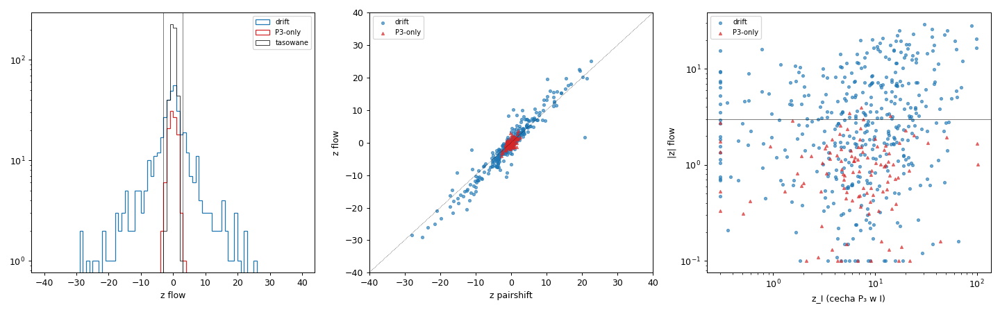
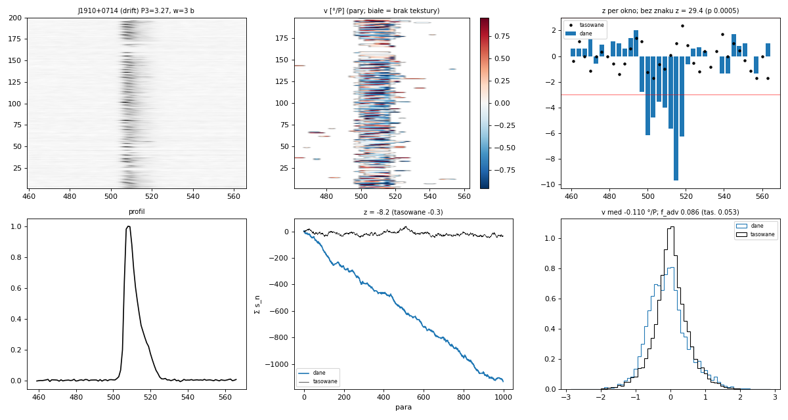

# Przepływ optyczny: transport vs zmiana w miejscu (dryf vs P3-only)

**Stan na 2026-10-02. Kierunek zamknięty jako ślepy zaułek** — wynik zapisany, żeby go nie powtarzać.

Repozytorium: `github.com/aszary/spats`, gałąź `claude`. Kod poza repo: `~/claude/work/scripts/flow*.jl`, `flow_*.py`;
dziennik `~/claude/work/flow/NOTES_flow.md`; wyniki `~/output/claude/flow/`.
Pokrewne: [`subpulse_methods.md`](subpulse_methods.md) (subtrack, pairshift — drugi agent), [`p3track_method.md`](p3track_method.md),
[`polarization_test_method.md`](polarization_test_method.md).

---

## 0. Podsumowanie

**Idea.** Rozłożyć zmianę natężenia między kolejnymi impulsami na przesunięcie wzoru w długości (transport, v) i zmianę
jasności w miejscu (a) — bez detekcji podpulsów (w odróżnieniu od pairshift) i bez okresowości (w odróżnieniu od 2DFS / P3Track).
Hipoteza zerowa: proces odwracalny w czasie (każda AM, jitter, wahania energii, nulle). Dryf łamie odwracalność.

**Wynik (521 pulsarów, pierwsze 1000 P, z blokowe):**

| | flow \|z\| ≥ 3 | pairshift \|z\| ≥ 3 | P3Track drift/partial | suma trzech metod |
|---|---|---|---|---|
| drift (412) | **184 (45%)** | 165 | 161 | 257 (62%) |
| P3-only (109) | 6 (6%), żaden ≥ 5 | 0 | 5 | 10 (9%) |

1. Flow ≈ pairshift + ~10% detekcji (zysk głównie tam, gdzie cecha P₃ w I jest słaba). Kierunek zgodny z pairshift w 100%
   (142/142) i ze znakiem gradientu fazy P3Track w 98% (126/128).
2. Syntetyki: czysty null także dla AM **nieodwracalnej w czasie** (piłokształtna, skoki energii z zanikiem); czułość przy
   szumie 2 wyższa niż pairshift (dryf z 19 vs 11, wolny dryf 6.3 vs 1.7).
3. **P3-only mają trwałą słabą strzałkę czasu** (połówki obserwacji r = +0.49, p = 2·10⁻⁷), ale **tylko przy k = 1** (pary n, n+1),
   bez związku z P₃, z Δψ i z S/N — to nie ukryty dryf. Pochodzenie (fizyczna „pamięć” n → n+1 czy przeciek instrumentalny)
   niesprawdzone.
4. Jedyny kandydat na słaby ukryty dryf wśród P3-only: **J1816-5643** (P₃ 19.7; z(k) = 2.7, 4.2, 3.5, 3.8 dla k = 1–5, sygnał
   w paśmie P₃, znak zgodny z Δψ P3Track +6.1).

**Dlaczego ślepy zaułek.** Metoda nie zmienia obrazu z P3Track i pairshift: ~45% dryferów Song+23 z wykrywalnym ruchem,
P3-only praktycznie bez. Wszystkie dotychczasowe metody (fazowe, polaryzacja, ruch podpulsów, przepływ) zbiegają się
do tego samego podziału — granicą jest S/N pojedynczych obserwacji, nie wybór estymatora.



*Rys. 1. Od lewej: rozkład z (drift, P3-only, tasowane); z flow wobec z pairshift; |z| wobec z cechy P₃ w I.*

---

## 1. Konstrukcja

Dane: I z cache okien on-pulse (`~/output/claude/pol/cache`, pełne pasmo, linia bazowa odjęta), zapowane impulsy usunięte,
pierwsze 1000 impulsów (porównywalność z pairshift).

1. Skala podpulsu w: HWHM autokorelacji fluktuacji (I − profil) w długości, lag ≥ 1 (bez piku szumu w 0). Wygładzenie
   każdego impulsu Gaussem σ = w/2.
2. Para (A = Iₙ, B = Iₙ₊₁): Iₜ = B − A, Ā = (A + B)/2, G = (A′ + B′)/2 (pochodna centralna).
3. Lokalnie (okno Gaussa σ_w = w, środki co w): najmniejsze kwadraty Iₜ ≈ a·Ā − v·G.
   - Zamiana A ↔ B: Iₜ → −Iₜ, Ā i G bez zmian ⇒ (a, v) → −(a, v) **dokładnie** (lekcja z pairshift: statystyka musi być
     antysymetryczna przy odwróceniu pary).
   - Skalowanie natężenia (B = g·A) jest pochłaniane przez a·Ā, więc nie daje v (wahania energii nie udają ruchu).
   - Tylko okna z teksturą: wariancja G po odjęciu Ā > 3× wariancja szumu gradientu (z σ off-pulse).
4. Statystyka: sₙ = Σⱼ sign(vₙⱼ) (znak zamiast wartości — odporność na dalekie dopasowania szumu, lekcja z pairshift).
   - z = Σsₙ / √Σsₙ² (losowanie znaków par) — **za liberalne** na danych: znaki kolejnych par są skorelowane.
   - **z blokowe** (wersja główna, v1b): losowanie znaków bloków L = clamp(2·P₃, 10, 100) par.
   - Bez znaku (bi-dryf, reverserzy): Σⱼ zⱼ² po oknach z losowaniem znaków całych par (2000 losowań).
   - f_adv: ułamek wariancji Iₜ wyjaśniony przez G ponad Ā (opisowo; porównanie z impulsami w losowej kolejności).



*Rys. 2. J1910+0714 (drift, P₃ 3.27 — krótkie pasma, których subtrack nie widzi). Stos impulsów (wygładzony), mapa v w parach,
z w oknach długości (dane vs tasowane), profil, Σsₙ (dane vs tasowane), rozkład v. z = −8.2 (wersja par; blokowa w CSV v1b).*

## 2. Walidacja na syntetykach (`flow_synth.jl`)

Generator jak w `subtrack_synth.jl` (podpulsy σ = 3 biny, P₃ = 8, P₂ = 24, 1000 P) + rodzaje nieodwracalne w czasie.

| syntetyk | szum 1: z med / max \|z\| | szum 2 | \|z\| ≥ 3 |
|---|---|---|---|
| AM stałe pozycje / przeciwfaza / losowe podpulsy | ≤ 1.6 | ≤ 1.9 | 0 / 120 |
| AM piłokształtna (szybki wzrost, wolny zanik) | 1.4 | 1.4 | 0 / 40 |
| skoki energii z zanikiem wykładniczym, bez okresu | 1.0 | 1.4 | 0 / 40 |
| stałe składowe zapalane kolejno (degeneracja dryf/AM) | −1.6 / 3.4 | −1.8 / 2.6 | 1 / 20 |
| dryf | 27.7 | **19.3** (pairshift 10.6) | 10 / 10 |
| reverser (epizody ~60 P) | 8.9 | 4.4 (bez znaku 6.0) | 6 / 10 |
| wolny dryf (P₃ = 40) | 10.5 | 6.3 (pairshift 1.7) | 10 / 10 |
| alias (P₃ = 2.1) | 7.5 | 3.6 — v bez znaczenia | 8 / 10 |

v niedoszacowane (2.07 vs 3.0 bin/P przy szumie 1) — wygładzanie i najmniejsze kwadraty.

## 3. Pełna próbka

- v1 (z par, wykresy `~/output/claude/flow/figures/`): drift 46%, P3-only 3/108 — ale rozkład z dla P3-only szerszy niż dla
  tasowanych (5–95%: −2.3…1.8 vs ±1.15) ⇒ wersja blokowa.
- v1b (z blokowe): tabela w §0. Wg werdyktu P3Track: drift 66%, partial 44%, inconclusive 39% (pairshift 32%), nocat 39% (28%),
  am 19%, nogroup 9%. Wg z cechy P₃ w I: z_I < 3 — flow 47%, pairshift 34%; z_I ≥ 20 — 58% / 58%.
- Zgodność: flow i pairshift oba 142, tylko flow 35, tylko pairshift 23; znak 100% zgodny.

## 4. Strzałka czasu w P3-only

| test | wynik |
|---|---|
| znak flow vs znak Δψ P3Track (dryfery / P3-only) | 98% zgodny, Spearman +0.81 / +0.19 (p 0.1) |
| \|z\| vs S/N (z_I, snr, N) w P3-only | brak zależności (Spearman ≤ 0.17), std z ≈ 1.5 w każdym przedziale |
| połówki pełnej obserwacji (do 10 000 P) | dryfery r = +0.94; **P3-only r = +0.49 (p 2·10⁻⁷)**, bez \|z\| ≥ 2: +0.33 (p 0.004) |
| przesuwanie się profilu w czasie (efemeryda) | ~0.1°/1000 P, korelacja z z 0.13 — wykluczone |
| z(k) dla par (n, n+k), k = 1…34 | dryfery: sygnał dla wielu k, znak oscyluje z aliasem P₃; **P3-only: prawie tylko k = 1** |
| flow po filtrze zerofazowym: pasmo P₃ / niskie | dryfery: w paśmie P₃; P3-only: niespójnie |

Wniosek: nadwyżka rozrzutu z u P3-only to trwały efekt na skali jednego impulsu, niezwiązany z modulacją P₃. Kandydat
J1816-5643 (§0) — jedyny z sygnałem spójnym dla k = 1–5 i w paśmie P₃; słabiej J1652-1400.

## 5. Sprawy otwarte (nie będą kontynuowane)

1. Pochodzenie efektu k = 1 w P3-only — test na oknach samego szumu obok impulsu (przeciek między subintegracjami?).
2. J1816-5643 z bliska (stos, porównanie z pairshift i P3Track).
3. Pełne obserwacje zamiast 1000 P (wyższa czułość, utrata porównywalności z pairshift).

## 6. Użycie

```bash
# zestaw kontrolny + losowe 20 (wykresy ~/claude/work/figures/flow/)
psrx julia --project=/home/psr/software/spats /home/psr/work/scripts/flow.jl
# syntetyki
psrx julia --project=/home/psr/software/spats /home/psr/work/scripts/flow_synth.jl
# cała próbka (wymaga cache z pol_batch.jl): v1 z wykresami, v1b bez wykresów z z blokowym
~/claude/work/scripts/flow_batch_run.sh
FLOW_VER=v1b FLOW_ENV="FLOW_NOPLOT=1 FLOW_VER=v1b" ~/claude/work/scripts/flow_batch_run.sh
psrx python3 /home/psr/work/scripts/flow_summary.py v1b
# testy strzałki czasu w P3-only
psrx python3 /home/psr/work/scripts/flow_sign_test.py
~/claude/work/scripts/flow_halves_run.sh
psrx julia --project=/home/psr/software/spats /home/psr/work/scripts/flow_ephem_check.jl
psrx julia --project=/home/psr/software/spats /home/psr/work/scripts/flow_scale.jl
```
