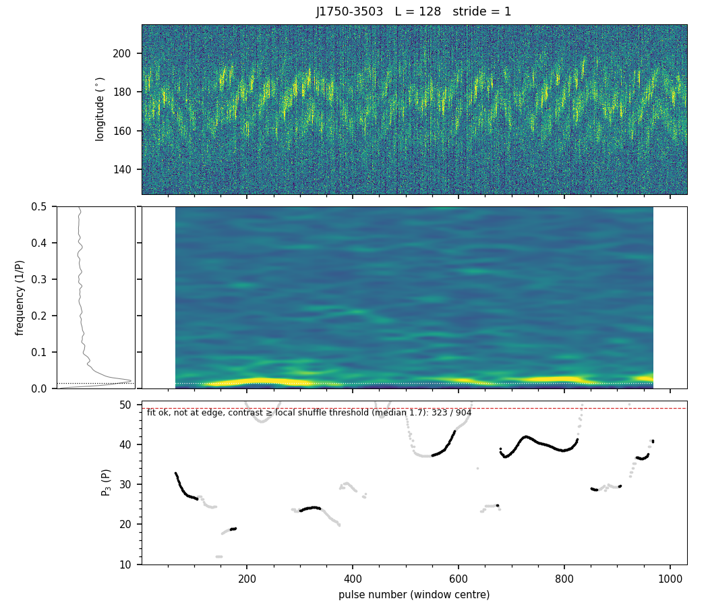
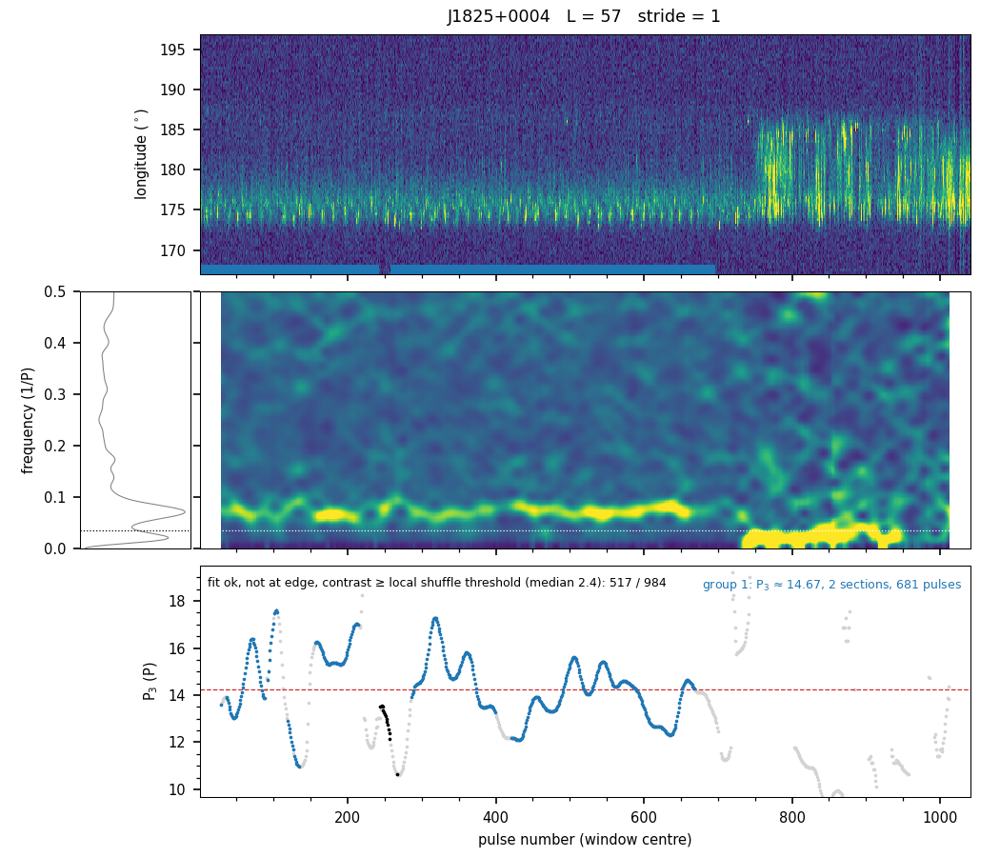
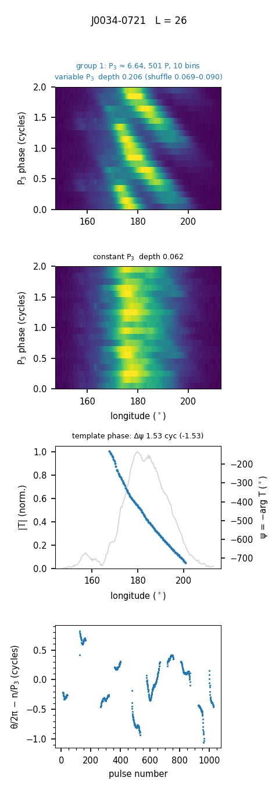
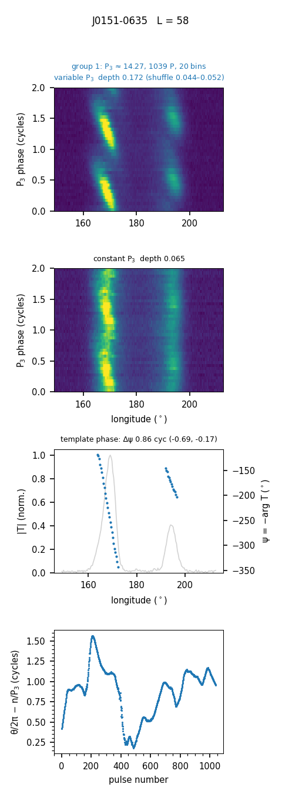
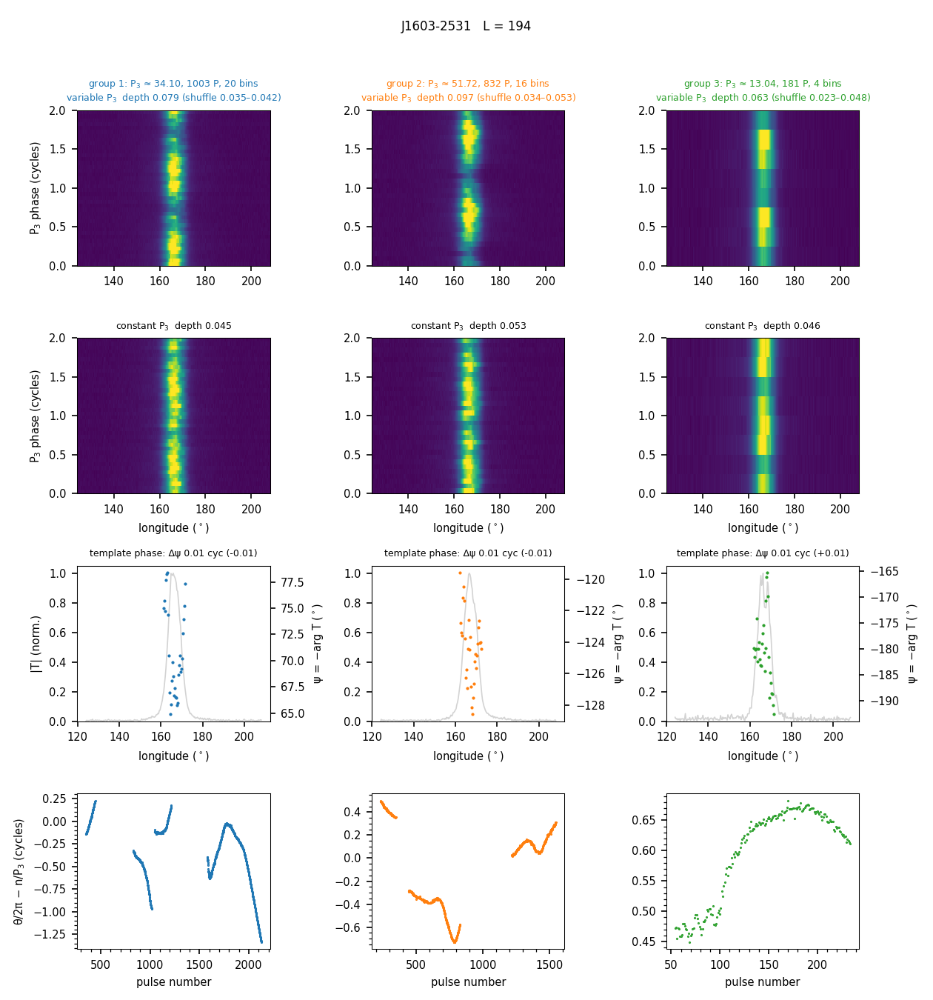
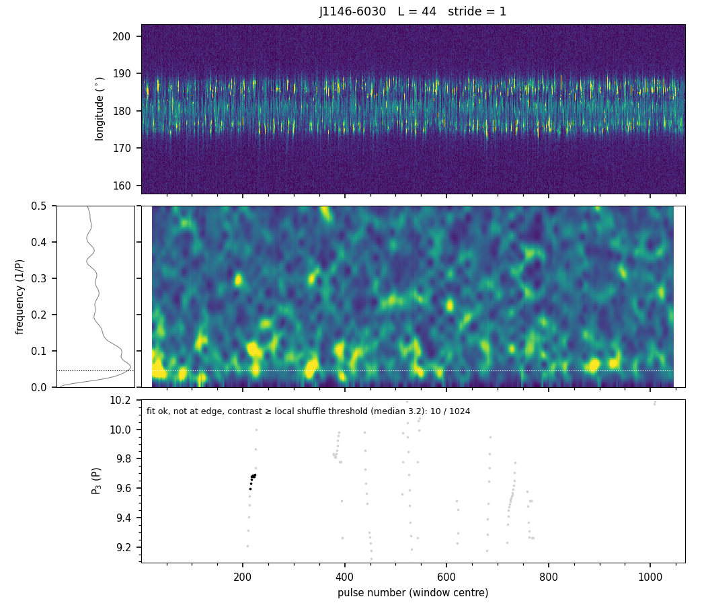

# P3Track: ślad P₃(t), fold z kompensacją zmiennego P₃ i faza szablonu

**Stan na 2026-10-01 (pełna metoda: dwa przejścia, test harmonicznej, istotność Δψ, dryf częściowy).** Nowa
metoda rozstrzygania, czy pulsar **dryfuje**, czy ma tylko modulację amplitudową z okresem P₃ (**P3-only**).
Zastępuje test „travel” (`docs/travel_test_method.md`) i nie jest na nim wzorowana.

Repozytorium: `github.com/aszary/spats`, gałąź `claude`.
Kod: `modules/p3track.jl` (moduł `P3Track`, wszystko w jednym pliku, łącznie z wykresami).
Skrypty: `~/claude/work/scripts/p3track_*.jl`, `j1825_*.jl` (§10).
Dziennik: `docs/separations_analysis_log.md` (= `~/claude/work/NOTES.md`), wpisy 2026-10-01 cd. 4–16.
Wykresy: `~/claude/work/figures/p3track/`, wybrane w `docs/figures/p3track_*.png`.

---

## 0. Podsumowanie

**Idea.** Zamiast jednej statystyki dla całej obserwacji: (1) znaleźć odcinki, w których P₃ jest
mierzalne i zmienia się w sposób ciągły, (2) złożyć je z **kompensacją zmiennego P₃** — faza modulacji jest
mierzona w każdym impulsie, a nie wyliczana ze stałego P₃, (3) sprawdzić w złożeniu, czy faza modulacji
**zmienia się z długością** (dryf), czy jest płaska (modulacja amplitudowa), i z jaką istotnością.

**Kroki.**

1. Sliding LRFS jak Fig. 4 w Szary et al. (2022): okno L = max(16, 4·P₃) impulsów, krok 1 impuls (§2).
2. Ślad P₃(t) z dopasowania Gaussa, jakość okna z lokalnego tasowania impulsów (§3).
3. Odcinki ciągłego P₃ → grupy o podobnym P₃; kandydaci 2:1 sprawdzani testem harmonicznej
   (harmonic / separate / inconclusive); grupa ≥ 5·P₃ impulsów (§4).
4. Drugie przejście dla impulsów spoza grup: reżimy o P₃ dłuższym niż mierzalne przy L₁ (§4a).
5. Fold grupy z kompensacją zmiennego P₃: demodulacja leave-one-out + wspólny szablon (§5).
6. Dyskryminator: zmiana fazy szablonu w długości Δψ (gradient ważony amplitudą, osobno w każdej składowej)
   z błędem z bootstrapu blokowego → werdykt **drift / partial / am / inconclusive** (§6, §6.1).

**Wyniki (5 dryferów + 5 P3-only bez oczekiwanego dryfu, §7):**

| werdykt | grupy | Δψ [cykle], z |
|---|---|---|
| **drift** | J0034-0721, J0151-0635, J0820-1350, J1750-3503 | 0.97–1.76, z = 15–37 |
| **partial** | J1825+0004, mod dryfu (impulsy 1–696) | globalnie 0.10 ± 0.04; zbocze składowej −0.29, z = 7.9 |
| **am** | J1603-2531 (grupy P₃ 34 i 52), J1401-6357 | 0.00–0.01, górna granica < 0.1 |
| inconclusive | J1825 mod AM po ~715 (P₃ ≈ 37), J1603 grupa P₃ 13, J1146-6030 (obie grupy) | za mało bloków / Δψ < 0.1 |
| brak grup | J1001-5939, J2307+2225 | brak stabilnego P₃ w oknach 4·P₃ |

Kalibracja na syntetykach (AM z jitterem i losowymi podpulsami, składowe w przeciwfazie, dryf): 0/80 fałszywych
`drift` i `partial`, dryf wykryty 10/10.

1. **Kompensacja zmiennego P₃ działa:** głębokość modulacji złożenia rośnie 2–3× względem stałego P₃
   (J0034: 0.206 vs 0.062), kontrola z tasowaniem pozostaje na poziomie stałego P₃ lub niżej.
2. **Głębokość modulacji nie odróżnia dryfu od AM** — rośnie też dla P3-only (J1603: P₃ wędruje 13–52).
   Odróżnia **faza szablonu**: dla P3-only płaska (J1603: −0.01 ± 0.03), dla dryferów 1–1.8 cyklu przy z ≥ 15.
3. **Przypadki, które zgubił T_cv, są rozpoznane:** J0034-0721 (dryf w seriach między nullami) → drift;
   J1825+0004 → dwa mody: dryf częściowy w impulsach 1–696 (faza płaska na szczycie składowej, zmienia się
   o ~0.7 cyklu w dół zbocza, trwale) i modulacja amplitudowa P₃ ≈ 37 po zmianie modu (drugie przejście).
4. **Część P3-only nie ma stabilnego P₃ na skali 4·P₃** — metoda zwraca wtedy „brak werdyktu”, nie „AM”.

Sprawy otwarte w §8 (m.in. reverserzy, próg 0.1 cyklu, parametry w binach, batch na pełnej próbce).

---

## 1. Dlaczego inaczej niż travel

Test travel (antysymetria korelacji czasowo-długościowej, `T_cv`) pytał o **trwałość** uporządkowania przez
całą obserwację. Przez konstrukcję gubił reverserów, dryf epizodyczny (J1825+0004) i długie P₃, a jego miara
siły `f_trav` miała w mianowniku całą zmienność impulsów. Użytkownik nie był zadowolony z czułości na znane
dryfery, interpretowalności `f_trav` i zgodności z oceną wzrokową.

P3Track działa **lokalnie w czasie** (okno kilku P₃), jest niezależny od znaku dryfu na skali dłuższej niż
okno (każdy odcinek/grupa ma własny szablon) i daje wynik czytelny wprost na złożeniu — tym, na co patrzy
się, oceniając dryf wzrokowo.

---

## 2. Krok 1: sliding LRFS

Dla okna L impulsów zaczynającego się w s (s = 1, 2, …, N − L + 1):

```
X(n,φ)  = data[s:s+L−1, on] − średnia kolumn     (profil statyczny okna)
F(f,φ)  = FFT_n( taper(n) · X(n,φ) ),  zero-padding do 8L
P(f)    = Σ_φ |F(f,φ)|² / Σ taper²
```

- **Taper Hann (periodyczny, bez zer na końcach).** Bez niego przy L = 16–32 składowa stała i wolne zmiany
  jasności rozlewają się na cały zakres 0–0.5.
- **Zero-padding** tylko interpoluje widmo pod dopasowanie Gaussa; nie zwiększa rozdzielczości (FWHM głównego
  listka ≈ 1.44/L).
- **fmin = 2/L**: poniżej siedzi wyciek składowej stałej. Z osłoną 1/L (§3) mierzalne jest praktycznie
  **P₃ ≲ L/3**.
- Oś x wykresów to **środek okna** (w artykule: impuls początkowy), żeby cechy pokrywały się ze stosem impulsów.

**Długość okna** (decyzja 2026-10-01): `window_length(P₃) = max(16, round(4·P₃))`, P₃ z `params.json`.

| pulsar | P₃ | najkrótsze działające L | dobre okna |
|---|---|---|---|
| J0820-1350 | 4.8 | **16** | 76% (L = 32: 95%) |
| J0034-0721 | 6.6 | 32 | 25% (tylko serie bez nulli) |
| J0151-0635 | 14.4 | 64 | 94% (L = 32: 7%, P₃ błędne) |
| J1825+0004 | 14.5 | 64 | 53% (dokładnie impulsy 1–680) |
| J1750-3503 | 40–50 | 128 (na granicy), 256 | 36% / 65% |

Przy L = 128 J1750-3503 jest jakościowo zgodny z Fig. 4b artykułu (minimum P₃ ≈ 45 ok. impulsu 230,
~37–42 w 500–600), ale P₃ ≈ 40–60 to tylko 2–3 cykle w oknie.



*Rys. 1. J1750-3503, L = 128 (odpowiednik Fig. 4b w Szary+2022). Od góry: impulsy, widma okien (każde
podzielone przez własną medianę), ślad P₃ (czarne: dobre okna).*

---

## 3. Krok 2: ślad P₃(t)

**Pik.** Najwyższe **lokalne maksimum** P(f) wewnątrz (fmin, 0.5), dopracowane Gaussem + stałą na ±1/L
(`p3_track`). Globalny argmax łapał czerwony szum od nulli (J0034-0721) i wolnych zmian jasności.
Okno jest `edge`, gdy nie ma maksimum wewnętrznego albo pik leży bliżej niż 1/L od fmin (wyciek DC).
Górnej osłony nie ma: cecha przy P₃ ≈ 2.1 (f ≈ 0.48) jest prawdziwa.

**Jakość okna: kontrast wobec lokalnego tasowania** (`contrast_null`, `good_windows`).

- S/N względem off-pulse'u jest bezużyteczne dla jasnych pulsarów (J0820: mediana 3000–12 000 w każdym oknie).
- Kontrast = pik / mediana widma w zakresie poszukiwań — mierzy, czy cecha wystaje ponad własne kontinuum
  fluktuacji (jitter, wahania energii).
- Próg: kwantyl 99% kontrastu po **przetasowaniu impulsów wewnątrz okna** (40 tasowań co L/8 impulsów,
  łączone z ±L/2). Tasowanie zachowuje każdy impuls (jasność, spike'i, nulle), niszczy tylko kolejność.
- **Lokalnie, nie globalnie:** globalne tasowanie rozsmarowuje jasne epizody po wszystkich oknach
  (J1825+0004, L = 64: próg 3.79 globalnie wobec 2.38 z samych impulsów 1–700).

Okno dobre = dopasowanie zbiegło się, nie `edge`, kontrast ≥ próg lokalny.

---

## 4. Krok 3: odcinki, grupy, harmoniczne

**Odcinki ciągłego P₃** (`p3_segments`). Sąsiednie dobre okna i < j należą do jednego odcinka, gdy
j − i ≤ L/2 i |f₃[j] − f₃[i]| ≤ 0.25/L. Przy kroku 1 okna dzielą L − 1 impulsów, więc rzeczywista,
nawet monotoniczna zmiana P₃ przesuwa f₃ o ≪ 1/L między sąsiadami; skok cechy (zmiana trybu, przeskok na
harmoniczną) to nieciągłość rzędu 1/L. **Nie jest potrzebny żaden model zmienności P₃** — monotoniczne
zmiany są dozwolone (decyzja użytkownika), kompensuje je fold.
Zakres impulsów odcinka: środki pierwszego i ostatniego okna ± L/2 (bez tego serie ~100 P w J0034
wychodziły jako 17–40 P), przycięte w połowie odstępu do sąsiedniego odcinka. Minimum max(3, L/4) okien.

**Grupy** (`p3_groups`): odcinki posortowane po medianie f₃, łączone, gdy sąsiedzi różnią się o ≤ 1/L
(rozdzielczość okna). Przy 0.5/L szum estymatora tworzył fałszywe grupy (J1825: 33 P przy P₃ = 11.7 obok
14.5, Δf = 0.95/L).

**Harmoniczne** (`harmonic_groups`, `harmonic_test`, `fundamental_track`): grupa z f₃ ≈ 2·f₃ większej grupy
(±1/L) może być tym samym reżimem z dominującą 2. harmoniczną **albo** osobnym modem o połowie P₃ — sam stosunek
częstości tego nie rozstrzyga. Test: impulsy kandydata demodulowane i składane przy **f₃/2**; złożenie rozkładane
wzdłuż fazy P₃ na składowe Fouriera. Harmoniczna niesie słabszą fundamentalną zgraną fazowo ze wzorem → składowa
**h = 1** (raz na cykl folda) ponad maksimum z 20 tasowań; osobny mod przy f₃/2 nie ma nic. (Całkowita głębokość
złożenia nie nadaje się: sygnał przy f złożony przy f/2 to po prostu dwa cykle na fold — pierwsza wersja testu
uznała osobny mod za harmoniczną.) Werdykt: `harmonic` → dołączana, ślad przeliczany na fundamentalną;
`separate` (h1 nieistotne przy ≥ 10 cyklach fundamentalnej) → osobna grupa; `inconclusive` (krótsza grupa, brak
mocy testu) → odcinki usuwane (sąsiednie odcinki tej samej grupy mogą się na lukę rozszerzyć o L/2, jak przy
każdej przerwie). Syntetyk (P₃ = 8 + 400 P drugiego reżimu): osobny mod P₃ = 4 → `separate` 2/2, wersja
z dominującą harmoniczną → `harmonic` 2/2 (przy szumie 1.2 o włos: 0.084 vs 0.080), 42 P przy dużym szumie →
`inconclusive`. **J0151-0635: 40 P przy P₃ = 7.46 obok 14.3 → `inconclusive` (2.7 cyklu).**

**Scalanie** (`merge_sections`): stykające się odcinki tej samej grupy łączone (J0820 przy L = 19 rozpadał
się na 13–20 odcinków o tym samym P₃).

**Selekcja** (`select_groups`): grupa musi mieć ≥ **5·P₃** impulsów.



*Rys. 2. J1825+0004, L = 57: jedna grupa P₃ ≈ 14.7 w impulsach 1–696 (pasek pod stosem impulsów); jasna
część po ~715 odrzucona przez próg kontrastu.*

### 4a. Drugie przejście: reżimy o długim P₃ (`long_p3_pass`)

Okno L₁ = 4·P₃ z `params.json` mierzy tylko P₃ ≲ L₁/3, więc reżim o dłuższym P₃ jest dla niego niewidoczny.
Zauważone przez użytkownika na J1825+0004: po zmianie modu (~715) stabilna cecha przy P₃ ≈ 35–55, której
L₁ = 57 nie widzi (podobnie tryb A J0034-0721 przy L₁ = 26). `analyse(...; second_pass=true)` (domyślnie):

1. **Wolne impulsy**: poza wszystkimi odcinkami pierwszego przejścia; wymagany wolny fragment ≥ 2·L₁.
2. **Sonda**: średnie widmo kontrastu z okien Lp = min(256, najdłuższy wolny fragment) leżących w całości
   w wolnych fragmentach; P₃′ = maksimum lokalne w 3/Lp ≤ f < 3/L₁ o największej **wybitności**
   (`prominence`) — najwyższe bywa garbem czerwonego kontinuum przy 3/Lp (J1825: 57, J2307: 85).
3. **Drabinka okien**: min(4·P₃′, najdłuższy wolny fragment) oraz L₁·{2, 3, 4, 6, 8} (≤ najdłuższy wolny
   fragment). Wędrujące długie P₃ rozmywa widmo sondy (J1825: P₃ 55 → 23, sonda daje 21 → L = 84, które widzi
   tylko P₃ ≤ 28), więc jedno okno z sondy nie wystarcza; same potęgi dwójki (114, 228) omijały działające ~160.
4. Dla każdego okna: ślad z poszukiwaniem tylko w f < 3/L₁, próg z lokalnego tasowania w tym samym zakresie,
   dobre okno musi mieć środek na wolnym impulsie i ≥ połowę impulsów wolnych; odcinki, grupy, scalanie jak
   w pierwszym przejściu, potem **przycięcie odcinka do najdłuższego wolnego fragmentu** (żaden impuls nie jest
   w dwóch przejściach), grupy ≥ 5·P₃. Wygrywa okno z największą liczbą impulsów w grupach (`ladder`).

**Kontrast zawsze względem mediany z pełnego zakresu f ≥ fmin**, także gdy poszukiwanie jest ograniczone
(`frange`): mediana wąskiego zakresu niskich częstości siedzi na czerwonym kontinuum i chowa cechę
(J1825 przy L = 228: żadne okno nie przechodziło).

### 4b. Ścieżka Nyquista: P₃ ≈ 2 (`nyquist_pass`)

**Problem** (zgłoszony i przetestowany przez sesję claude-ac, `~/claude/work/scripts/play/nyquist_*.jl`): przy f₃ blisko 0.5
cecha i jej lustro 1 − f₃ zlewają się w listku Hanna (±2/L) w jedno maksimum dokładnie w f = 0.5, na krawędzi zakresu;
`feature_peak` wymaga maksimum wewnętrznego, więc okno jest odrzucane. W v2/v3 żaden z 17 pulsarów z P₃ ≤ 2.13 nie miał
grupy przy swoim P₃ (najmniejsze P₃ grupy 2.15) — ostre odcięcie, artefakt.

**Ścieżka** (dla P₃ z params ≤ 2.2, na impulsach spoza grup pierwszego przejścia, przed drugim przejściem):
1. Test B: bloki 32 P (krok 16) składane przy P₃ = 2, A(φ) = Σ(−1)ⁿxₙ(φ), S = Σ|A|² vs 300 tasowań bloku; bloki > 99% →
   sklejone odcinki. **Warunek łączny**: liczba istotnych bloków niezachodzących (co drugi) vs Binomial(n, 0.01),
   p < 10⁻³ (≥ 4 z ~32); inaczej nic nie jest zgłaszane. (Bez niego v4 dało 16 × `nyquist`, w tym 5 z jednego bloku
   i 3 z dwóch, przy ~0.6 fałszywie istotnego bloku na pulsar.)
2. f₃ z periodogramu odcinków (okno prostokątne, siatka 0.40–0.5), δ = 0.5 − f₃.
3. f₃ i alias 0.5 + δ rozdzielne, gdy najdłuższy odcinek M·2δ ≥ 2: demodulacja przy f₃ w odcinkach (fazy odcinków
   wyrównane do najsilniejszego), szablon i istotność impuls po impulsie → drift / partial / am / inconclusive.
   Fold przy aliasie to lustro → mierzalne tylko |Δψ| i względne znaki składowych (bi-drift); **kierunek dryfu nieznany**.
   W przeciwnym razie werdykt **`nyquist`** (modulacja przy Nyquiście, bez pomiaru fazy — przy f = 0.5 szablon jest rzeczywisty).

**Walidacja** (`p3track_nyq_check.jl`, log `p3track_nyq_check.log`): J0846-3533 → drift (P₃ = 2.025 bez podpowiedzi,
|Δψ| = 0.61, z = 7.9; w v2 brak grup); J0943+2253 → nyquist (odcinki ≤ 96 P); kontrola J0924-5302 (P₃ 10.3, ścieżka
wymuszona) → 0 istotnych bloków; syntetyki P₃ = 2.05: AM → am 12/12, dryf → drift 6/6. W batchu wiersze `pass = 3`,
`verdict_src = nyquist`, kolumny `nyq_resolved`, `p3_alias`; wykres `<PSR>_nyquist.png`.

---

## 5. Krok 4: fold z kompensacją zmiennego P₃

`phase_fold`. Fazy **nie** całkuję z P₃(t) (szum f₃ sumowałby się w błądzenie losowe fazy) — **mierzę ją
w każdym impulsie**:

1. Lokalna częstość f(n): ślad f₃ dobrych okien odcinka interpolowany po środkach okien.
2. Demodulacja (`demodulate`): okno Hann L impulsów wokół n (przesunięte, nie skracane, przy brzegach
   obserwacji), jądro odniesione do samego impulsu:
   ```
   Z(n,φ) = Σ_m taper(m) · X(m,φ) · e^{−2πi f(n) (m − n)}
   ```
   Dla modulacji cos(θ(m) − ψ(φ)) daje arg Z(n,φ) = θ(n) − ψ(φ) — fazę modulacji **w impulsie n**.
3. **Leave-one-out:** impuls n ma wagę 0 we własnym oknie. Bez tego szum impulsu ustawiał jego fazę tam, gdzie
   najlepiej pasował do szablonu, i złożenie miało strukturę nawet dla przetasowanych danych (J0034: kontrola
   0.15–0.18 wobec 0.062 dla stałego P₃; po poprawce 0.069–0.090).
4. **Wspólny szablon grupy** (`align_phases`): θ(n) = arg Σ_φ Z(n,φ)·T*(φ), T = ⟨Z·e^{−iθ}⟩, iteracja od
   najsilniejszego impulsu. Szablon niesie kształt pasma dryfu w długości, więc odcinki rozdzielone nullami
   lub złymi oknami zgrywają się same.
5. Impuls trafia do binu ⌊nb·(θ mod 2π)/2π⌋; nb jak `Functions.find_ybins` (2·P₃, ≥ 50 impulsów na bin, ≥ 4).

**Kontrole w każdym złożeniu:** fold ze stałym P₃ tych samych impulsów (`constant_fold`, jak `Tools.p3fold`)
i 5 tasowań kolejności impulsów grupy przez cały łańcuch (kroki 2–5). Miarą porównawczą jest
`modulation_depth` = √⟨var_faza F(·,φ)⟩_φ / max profilu — **miara porównawcza, nie istotność**.

---

## 6. Krok 5: dyskryminator dryf / AM — faza szablonu

`template_phase`. ψ(φ) = −arg T(φ) to faza modulacji w funkcji długości:

- **dryf**: ψ zmienia się monotonicznie w poprzek emisji, o ≈ W/P₂ cykli — nachylone pasma w złożeniu;
- **AM**: ψ płaskie w obrębie składowej (skoki o ½ cyklu między składowymi w przeciwfazie) — poziome pasy.

Biny z |T| ≥ 0.15·max tworzą ciągłe fragmenty (składowe); liczą się fragmenty ≥ 5 binów i ≥ 5% mocy
szablonu. Gradient w fragmencie z przyrostów ważonych amplitudą, **bez rozwijania fazy**:
G = Σ_j T*_j·T_{j+1}, nachylenie = −arg G/2π [cykle/bin], Δψ_fragmentu = nachylenie × długość. Skok o ½ cyklu
w miejscu, gdzie |T| się znosi (składowe w przeciwfazie), waży mało. Fragmenty osobno, bo faza między
rozdzielonymi składowymi jest określona tylko mod 1 cykl (jedno dopasowanie przez przerwę dawało dla J0151
0.06 zamiast 0.86). **Δψ = Σ |Δψ_fragmentu|** (bi-drifting się liczy); znakowane Δψ fragmentów zachowane.

### 6.1 Istotność i werdykt (`template_significance`)

**Null:** pod AM każde Δψ_fragmentu ma wartość oczekiwaną 0. Tasowanie impulsów się nie nadaje — niszczy
modulację, szablon staje się szumem o losowej fazie. Zamiast tego **bootstrap blokowy** po impulsach grupy:
bloki L/2 kolejnych impulsów (demodulacje bliższe niż ~L/2 dzielą większość impulsów), losowane ze zwracaniem,
szablon T* = ⟨Z·e^{−iθ}⟩ z wylosowanych impulsów (θ z pełnego dopasowania), gradienty w tych samych fragmentach;
σ fragmentu = odchylenie bootstrapu. χ² = Σ (Δψ_frag/σ_frag)² ~ χ²(n_frag) → p → równoważne z.

**Werdykt:** `drift` gdy z ≥ 5 **i** Δψ ≥ 0.1 cyklu (bardzo jasny AM może mieć malutki, formalnie istotny
gradient) **i** składowe dryfujące samodzielnie (z_frag ≥ 5, |Δψ_frag| ≥ 0.1) niosą ≥ 50% mocy szablonu
(definicja b — wzór przesuwa się przez dominującą część emisji; reguła po przeglądzie batcha v1: J1057-5226 z płaską
składową dominującą i dryfem −0.19 ± 0.03 w słabszej, J1543+0929 bez żadnej składowej istotnej samodzielnie);
**`partial`** (dryf częściowy, decyzja 2026-10-01) gdy gradient globalny jest istotny, ale nie spełnia reguły mocy,
albo gdy w jakimś oknie 5 binów wewnątrz
maski emisji lokalna zmiana fazy |Δψ_okna| ≥ 0.1 przy z_okna ≥ 5 (ten sam bootstrap), rozłożona na biny — żaden
przyrost bin→bin nie niesie > 50% zmiany netto, w oknie nie ma głębokiego minimum |T| (bin < 0.5 × niższe
z maksimów po obu stronach, `deep_dip`), a każdy bin ma błąd fazy ≤ 20° (kołowe σ z bootstrapu); **`am`** gdy
brak gradientu (**z < 2**; przy z < 3 J1511-5414 z widoczną rampą +0.09 ± 0.03, z = 2.7, dostawał `am`), brak
okna `partial` i górna granica Σ|Δψ_frag| + 2·√(Σσ²_frag) < **0.25 cyklu**
(połowa najmniejszego wyraźnego dryfu: grupy `drift` mają Δψ ≈ 0.5–2.1); `inconclusive` w pozostałych przypadkach
oraz gdy grupa ma < 5 niezależnych bloków (npulse/(L/2)). Progi 0.1 (drift) i 0.25 (am) — wartości robocze.
Pierwsza wersja `am` (Σ(|Δψ_frag| + 2σ_frag) < 0.1, błędy liniowo) nie dawała `am` ani razu w pilocie batcha
(J0709-5923: Δψ = 0.04, granica 0.17; J0849-6322: 0.04, 0.13).

`partial` opisuje układ J1825+0004: faza płaska na jasnym szczycie składowej, zmienia się o ~0.7 cyklu w dół
opadającego zbocza, tak samo w czterech ćwiartkach czasu. Dryf w sensie „wzór przesuwa się przez dominującą część
emisji” to nie jest (definicja b), czysta AM też nie. Trzy warunki przeciw fałszywym detekcjom wyszły z kalibracji:
udział przyrostu (skok o ½ cyklu między składowymi w przeciwfazie), głębokie minimum (szum rozmywa ten skok na
kilka binów: 2/20 fałszywych `partial`), błąd fazy na bin (biny szumu na krawędziach skaczą o 60–100°/bin:
nadal 2/20). Po wszystkich trzech: 0/80 fałszywych `partial` w AM.

**Kalibracja na syntetykach** (`~/claude/work/scripts/p3track_dpsi_calib.jl`; 600 P, P₃ = 8, dwie nakładające
się składowe, wahania energii, losowe podpulsy; 20 ziaren × szum 0.6 / 1.5 dla AM, 5 dla dryfu):

| przypadek | fałszywy `drift` | `am` | max z | p < 0.05 / p < 0.01 |
|---|---|---|---|---|
| AM wspólna faza, szum 0.6 / 1.5 | 0 / 0 | 20 / 0 (reszta inconclusive) | 2.5 / 2.5 | 2 / 1 i 1 / 1 z 20 |
| AM składowe w przeciwfazie, 0.6 / 1.5 | 0 / 0 | 12 / 0 | 3.6 / 2.6 | 2 / 2 i 2 / 2 z 20 |
| dryf, 0.6 / 1.5 | — | — | z ≈ 36–37 | `drift` 10/10 |

Z kategorią `partial` (`p3track_dpsi_calib_partial.log`): AM 0/80 `partial`; syntetyk z drugą, równie jasną
składową dryfującą → `drift` 9/10 (dryf jednej składowej to dryfer); syntetyk „zbocze” (jasna AM + słaby
nakładający się ogon dryfujący) → `drift` 10/10 przy szumie 0.6 — jego gradient łapie już miara globalna, więc nie
odtwarza J1825, gdzie globalnie Δψ = −0.10 ± 0.04.

Z nowym `am` (`p3track_dpsi_calib_am.log`; dodany wolny dryf P₂ = 120 binów, Δψ ≈ 0.3 cyklu):

| syntetyk | szum 0.6 | szum 1.5 |
|---|---|---|
| AM wspólna faza | am 20/20 | am 13, inconclusive 7 |
| AM przeciwfaza | am 19, inconclusive 1 | inconclusive 20 |
| zbocze / dwie składowe / wolny dryf / dryf | drift 10+5+10+5, **am 0** | drift 1+4+7+5, reszta inconclusive/brak grup, **am 0** |

Z regułą mocy i z < 2 dla `am` (`p3track_dpsi_calib_v2.log`): AM wspólna faza am 19/20 (0.6), 13/20 (1.5); przeciwfaza
18/20 (0.6); dwie składowe (AM + dryf) przy szumie 1.5 → `partial` 4/5 (żadna składowa nie spełnia progów sama);
dryf, wolny dryf, zbocze — bez zmian; fałszywe `drift`/`am`: 0.

**Krótkie grupy (< 5 bloków) — werdykt z folda.** Bootstrap blokowy po demodulacjach ma przy krótkiej grupie za mało
niezależnych prób: J1528-4109 (34 P, L = 16, 4.25 bloku) z wyraźnie nachylonym pasmem dostawał `inconclusive`, a krótkie
grupy P3-only miały formalnie z ≈ 11–13 (J0601, J0659) z niedoszacowanego σ. Drugi estymator liczy szablon z samego
folda, C(n,φ) = (I(n,φ) − ⟨I⟩)·e^{−iθ(n)}: każdy impuls raz, jego faza z sąsiadów (leave-one-out), więc wkłady są
niezależne i bootstrap idzie impuls po impulsie (`tsig_fold`). Werdykt końcowy (`verdict`) = blokowy, gdy ≥ 5 bloków,
inaczej z folda (`verdict_src`). Kalibracja (`p3track_short_calib.jl`, N = 40/80/150, P₃ = 4): AM bez fałszywego dryfu
(max z_fold = 1.3), dryf N = 40: 8/8 (blokowy 6/8); słabszy dla wolnego dryfu i potwierdzania AM, stąd tylko dla
krótkich grup. Dane (`p3track_short_real.jl`): J1528 → drift (−1.09 ± 0.19, z = 5.5); J0601, J0659, J0709, J0849
(krótkie P3-only) → inconclusive (z_fold ≤ 1.9); długie grupy — oba estymatory zgodne.

**Bi-drift** (`bidrift`): ≥ 2 składowe dryfujące samodzielnie z przeciwnymi znakami Δψ. J1537-4912: −0.19 ± 0.02 (89%
mocy) i +0.17 ± 0.03 (11%), znaki stabilne w czterech ćwiartkach czasu (`j1537_bidrift.jl`).

Bootstrap jest lekko liberalny (p < 0.01 w ~5% przypadków AM zamiast 1%), dlatego próg z ≥ 5. Przy szumie
1.5 AM nie da się *potwierdzić* (upper > 0.1) — werdykt `inconclusive`, nie fałszywy dryf.

**Dwie poprawki wymuszone kalibracją.** (1) Pierwsza wersja (nachylenie z rozwiniętej fazy, fragmenty ≥ 3 biny)
dawała w AM z przeciwfazą przy szumie 1.5 **13/20 fałszywych dryfów** (Δψ ≈ 1.2, z → ∞): krótki fragment w strefie
znoszenia się składowych (ψ skacze o ½ cyklu) i szum na krawędziach. (2) Maska 0.2 z minimum 10% mocy odcinała
słaby ogon składowej J1825+0004 (~5% mocy, ψ zmienia się tam o ~¼ cyklu) i dawała pewny werdykt `am` z samej
płaskiej części głównej; przy 0.15 / 5% J1825 jest `inconclusive` (−0.10 ± 0.04, z = 2.5), a fałszywych dryfów
w syntetykach nadal 0/80.

**Znak.** Emisja w φ ma maksimum, gdy θ(n) = ψ(φ); θ rośnie w czasie, więc dψ/dφ > 0 ⇔ późniejsze długości
świecą później ⇔ **dryf dodatni** (konwencja Szary+2022). Zgodne z J0034-0721 (B0031−07, dryf ujemny:
Δψ = −1.53) i J1750-3503 (dominuje dryf dodatni: +1.73 w jednym fragmencie profilu, pozostałe ≈ 0). Do potwierdzenia na większej próbce.

---

## 7. Wyniki

**Aktualne wyniki to tabela „Z istotnością Δψ” niżej.** Pierwsza tabela pochodzi z pierwszej wersji miary
(bez błędów, faza rozwijana, maska 0.2, `~/claude/work/logs/p3track_control.log`) i zostaje dla historii —
kolejność obiektów ta sama, liczby Δψ inne. Głębokość: zmienne P₃ / kontrola z tasowaniem / stałe P₃.

| etykieta | PSR | L | w grupach | grupa: P₃ (impulsy) | głębokość | **Δψ [cykle]** (składowe) |
|---|---|---|---|---|---|---|
| P3-only | J1401-6357 | 16 | 6% | 2.28 (58) | 0.155 / 0.04–0.08 / 0.116 | **0.00** |
| P3-only | J1603-2531 | 194 | 95% | 34.1 (1003) | 0.079 / 0.04 / 0.045 | **0.01** |
| | | | | 51.7 (832) | 0.097 / 0.03–0.05 / 0.053 | **0.01** |
| | | | | 13.0 (181) | 0.063 / 0.02–0.05 / 0.046 | **0.01** |
| P3-only | J1001-5939 | 16 | 0% | — (3/502 dobrych okien) | — | — |
| P3-only | J1146-6030 | 44 | 0% | — (10/1024) | — | — |
| P3-only | J2307+2225 | 16 | 0% | — (12/1014; grupa 20 P < 5·P₃) | — | — |
| drift | J0034-0721 | 26 | 48% | 6.64 (501, 10 serii) | 0.206 / 0.07–0.09 / 0.062 | **1.53** (−1.53) |
| drift | J0151-0635 | 58 | 100% | 14.27 (1039, z harmon.; po teście harmonicznej 1037) | 0.172 / 0.05 / 0.065 | **0.86** (−0.69, −0.17) |
| drift | J0820-1350 | 19 | 98% | 4.77 (1034) | 0.142 / 0.02 / 0.071 | **1.94** (−1.94) |
| drift | J1825+0004 | 57 | 65% | 14.67 (681) | 0.086 / 0.04 / 0.043 | **0.23** (+0.03, −0.20) |
| drift | J1750-3503 | 196 | 87% | 44.9 (897) | 0.205 / 0.15 / 0.160 | **2.03** (+1.73 + 4 małe) |

Wybór kontroli P3-only: z wpisu 2026-10-01 cd. 2 w dzienniku (P3-only z wyraźną modulacją, najniższe z_cv);
J1401, J1603, J1001 obejrzane wcześniej wzrokowo — czysta AM. J1825+0004 (Song+23: P3-only) jest tu
w grupie „drift”, bo wzrokowo i w LRFS ma dryf w impulsach 1–700 (dziennik, cd. 3); werdykt metody: `partial`.

**Z istotnością Δψ (§6.1) — aktualne** — `~/claude/work/logs/p3track_control_partial.log`, oba przejścia,
test harmonicznej, kategoria `partial`:

| etykieta | PSR | przejście (L) | grupa: P₃ (impulsy) | Δψ ± σ [cykle] (fragmenty) | z | **werdykt** |
|---|---|---|---|---|---|---|
| drift | J0034-0721 | 1 (26) | 6.64 (501) | 1.61 (−1.61 ± 0.04) | 37 | **drift** |
| drift | J0151-0635 | 1 (58) | 14.27 (1037) | 0.97 (−0.77 ± 0.01, −0.20 ± 0.01) | 37 | **drift** |
| drift | J0820-1350 | 1 (19) | 4.77 (1034) | 1.53 (−1.53 ± 0.02) | 37 | **drift** |
| drift | J1750-3503 | 1 (196) | 44.9 (897) | 1.76 (+1.76 ± 0.11) | 15.4 | **drift** |
| drift | J1825+0004 | 1 (57) | 14.67 (681) | 0.10 (−0.10 ± 0.04); lokalnie zbocze 175.8–177.2°: −0.29, z = 7.9 | 2.5 | **partial** |
| | | 2 (171) | 36.7 (259) | 0.11 (+0.11 ± 0.05) | 1.9 | inconclusive (3 bloki) |
| P3-only | J1603-2531 | 1 (194) | 34.1 (1003) | 0.01 (−0.01 ± 0.03) | −0.8 | **am** |
| | | | 51.7 (832) | 0.01 (−0.01 ± 0.02) | 0.0 | **am** |
| | | | 13.0 (181) | 0.04 (−0.04 ± 0.01) | 7.6 | inconclusive (Δψ < 0.1, 1.9 bloku) |
| P3-only | J1401-6357 | 1 (16) | 2.28 (58) | 0.00 (± 0.04) | −1.2 | **am** |
| P3-only | J1146-6030 | 2 (132) | 20.8 (267) | 0.02 (± 0.08) | −0.8 | inconclusive (4 bloki) |
| | | | 16.2 (206) | 0.38 (−0.23 ± 0.08, −0.16 ± 0.04) | 4.4 | inconclusive (3.1 bloku) |
| P3-only | J1001-5939, J2307+2225 | — | brak grup | — | — | brak stabilnego P₃ |

Wartości Δψ w tabeli pierwszej wersji (wyżej) i w tabeli drugiego przejścia (niżej) pochodzą z wcześniejszej
wersji miary (rozwinięta faza, maska 0.2) — kolejność i wnioski te same, liczby nieco inne.

**Drugie przejście** (`~/claude/work/logs/p3track_control_pass2.log`; pierwsze przejście bez zmian):

| etykieta | PSR | sonda P₃′ | drabinka (L: impulsy w grupach) | grupa: P₃ (impulsy) | Δψ [cykle] |
|---|---|---|---|---|---|
| drift | J1825+0004 | 21.1 | 84:0, 114:141, **171:259**, 228:0, 342:0 | **36.7 (729–987, 259)** | **0.08** |
| P3-only | J1146-6030 | 21.1 | 84:422, 88:376, **132:473**, 176:240 | 20.8 (159–425, 267) | 0.02 |
| | | | | 16.2 (802–1007, 206) | **0.44** (−0.30, −0.13) |
| drift | J0034-0721 | 18.2 | 52:0, 73:0, 78:0 | — (33 P przy 10.4 < 5·P₃) | — |
| P3-only | J1401, J1001, J2307 | 60, 5.6, 85 | wszystkie 0 | — | — |
| | J1603, J0151, J0820, J1750 | — | brak drugiego przejścia (brak cechy / za krótkie wolne fragmenty) | | |

- **J1825+0004**: drugi reżim po zmianie modu odzyskany (P₃ ≈ 37, poziome pasy, Δψ = 0.08) — modulacja
  amplitudowa obok dryfu w impulsach 1–696. To może tłumaczyć etykietę P3-only u Song+23.
- **J1146-6030** (P3-only, pierwsze przejście: brak grup): dwie grupy. 159–425: płaska faza (0.02). 802–1007:
  Δψ = 0.44, ale złożenie ma prawie poziome pasy, modulacja słaba (głębokość 0.068 przy tasowaniu 0.04–0.05),
  a przy L = 84 te same impulsy (w grupie 773–974) dawały 0.04 — **Δψ niestabilne przy słabej modulacji**,
  co wzmacnia potrzebę kalibracji (§8.1).
- **J0034-0721 tryb A** nie odzyskany: impulsy 940–1031 są w większości zajęte przez odcinki pierwszego
  przejścia (P₃ ≈ 7, przejście między trybami), zostaje 33 P.
- Brak fałszywych grup w J1401, J1001, J2307.

**Obserwacje.**

- **J0034-0721**: dryf trybu B w 10 seriach między nullami zgrany w jedno złożenie; faza względem stałego P₃
  skacze między seriami i dryfuje w nich o 0.3–0.7 cyklu. Tryb A (P₃ ~ 12) przy L = 26 poza zasięgiem
  (przy L = 48: osobna grupa P₃ ≈ 10.1, impulsy 940–1031).
- **J0151-0635**: ostre nachylone pasma w obu składowych; faza względem stałego P₃ wędruje o ~1.3 cyklu.
- **J0820-1350**: rozrzut P₃ 4.4–5.3 przy L = 19 nie szkodzi — jeden odcinek, faza mierzona w każdym impulsie.
- **J1825+0004**: jasna część po ~715 odrzucona; faza względem P₃ = 14.22 z params narasta o ~1.8 cyklu.
- **J1750-3503**: fold czytelny, ale to **mieszanina** epizodów o przeciwnym kierunku (epizody ujemne
  28 ± 4 P ≪ L = 196) — jeden szablon na grupę przyjmuje kierunek dominujący.
- **J1603-2531**: P₃ wędruje od 13 do 52 (trzy grupy), kompensacja podnosi głębokość, ale faza w składowej
  jest płaska (±4–12°): czysta modulacja amplitudowa.

 

*Rys. 3. Złożenia dryferów. Od góry: zmienne P₃, stałe P₃, |T| i ψ = −arg T w funkcji długości, faza impulsów
względem stałego P₃.*



*Rys. 4. J1603-2531 (P3-only): trzy grupy P₃, płaska faza szablonu w każdej.*



*Rys. 5. J1146-6030 (P3-only): brak okien ze stabilną cechą — modulacja niekoherentna na skali 4·P₃.*

---

## 8. Sprawy do rozstrzygnięcia

1. **Kalibracja Δψ — zrobiona (§6.1)**, zostaje: próg wielkości 0.1 cyklu jest roboczy; bootstrap lekko
   liberalny; grupy z < 5 blokami (krótkie względem L) zawsze `inconclusive` — dotyczy m.in. drugiego przejścia
   (długie L). **J1825+0004 mod dryfu wychodzi `inconclusive`**: główna część składowej ma płaską fazę, zmiana
   fazy jest tylko na zboczu → kategoria `partial` (decyzja: definicja b z dryfem częściowym). Werdykt odporny na
   okno 4–5 binów i udział ≤ 0.4–0.5, znika przy udziale 0.3. Parametry `partial` (5 binów, 0.5, 0.5, 20°) zależą
   od nbin = 1024 — do przeliczenia na stopnie przed batchem. Potrzebna skala szumu Δψ:
   tasowanie impulsów grupy przez cały łańcuch (już liczone dla głębokości — dodać Δψ) albo błąd ψ na bin
   z rozrzutu Z. Potem: próg na Δψ/σ_Δψ, nie na Δψ.
2. **Kategoria „brak stabilnego P₃”** (J1001, J1146, J2307). Czy to osobna klasa wyniku, czy próbować
   dłuższego okna / niższego progu? Ile takich obiektów jest wśród P3-only i wśród dryferów Song+23?
3. **Długość okna przy wielu trybach** — częściowo rozwiązane drugim przejściem (§4a): J1825 odzyskany,
   J0034 tryb A nie (jego impulsy zajmuje pierwsze przejście). Do decyzji: czy pierwsze przejście powinno
   oddawać impulsy, gdy drugie znajduje tam lepszą (dłuższą, silniejszą) cechę; koszt drabinki (do 6 pełnych
   przebiegów na pulsar).
4. **Reverserzy** (J1750-3503). Jeden szablon na grupę miesza kierunki. Możliwa naprawa: podział grupy według
   znaku nachylenia fazy w długości liczonego w oknach ~16–32 P (krótszych od epizodu). Odłożone.
5. **J1401-6357: tylko 6% impulsów w grupach** przy P₃ ≈ 2.2 (blisko Nyquista, L = 16). Sprawdzić, czy to
   rzeczywista niekoherencja, czy próg kontrastu przy f ≈ 0.45.
6. **Maska składowych w Δψ** (|T| ≥ 0.2·max, ≥ 3 biny): słabe, zaszumione fragmenty profilu dzielą się na
   wiele krótkich składowych (J1750: 5). Sprawdzić czułość Δψ na `frac`, `minrun`.
7. **Harmoniczne: moc testu.** Test h = 1 przy f₃/2 rozstrzyga dopiero przy ≥ 10 cyklach fundamentalnej;
   krótsze kandydatury (J0151: 2.7 cyklu) są `inconclusive`. Próg 10 cykli ustawiony z dwóch syntetyków —
   do sprawdzenia na większej liczbie przypadków (także: harmoniczna przy szumie 1.2 przeszła o włos).
8. **Δψ a P₂.** Dla dryfu Δψ ≈ W/P₂ — można wyprowadzić P₂ z szablonu i porównać z separacjami / ρ.
9. **Znak dryfu** zgodny z J0034 i J1750; sprawdzić na kilku dryferach o znanym kierunku z literatury.
11. **Do rozważenia (2026-10-02): werdykt pulsara z grup pierwszego przejścia zamiast reguły ±30% P₃ katalogowego.**
    Reguła A daje 23% „nocat”: 64 pulsary mają tylko wolną modulację z drugiego przejścia, ale reszta to cecha w danych
    inna niż w katalogu (J1807+0756: grupa P₃ ≈ 6 z werdyktem drift, katalog 19, brak piku przy 1/19), wędrujące P₃
    (J1915+0738: 17 → 35, katalog 37) lub harmoniczne (≈ ½ P₃, 20 pulsarów). Propozycja: werdykt z pierwszego przejścia,
    drugie jako „inne mody”, w CSV stosunek P₃ grupy do katalogowego do wyłapania obcych cech (RFI).
10. **Pełna próbka.** Batch na 533 pulsarach nie był jeszcze puszczany. Koszt dominuje `contrast_null`
    (40 tasowań × N/(L/8) kotwic) i tasowania w `phase_fold`.

---

## 9. Historia poprawek

| błąd | objaw | naprawa |
|---|---|---|
| globalny argmax widma | P₃ przy fmin (czerwony szum nulli, J0034) | najwyższe lokalne maksimum wewnątrz zakresu |
| S/N off-pulse jako jakość | 500–12 000 wszędzie, nic nie rozróżnia | kontrast vs tasowanie |
| tasowanie globalne | próg zawyżony w ciemnych odcinkach (J1825: 3.79 vs 2.38) | tasowanie w obrębie okna |
| zakres odcinka = środki okien | serie ~100 P jako 17–40 P (J0034) | ± L/2, przycięte w połowie odstępu |
| tolerancja grup 0.5/L | fałszywa grupa 33 P (J1825) | 1/L (rozdzielczość) |
| brak scalania | J0820: 13–20 odcinków o tym samym P₃ | `merge_sections` |
| impuls we własnym oknie demodulacji | kontrola tasowaniem 0.15–0.18 vs 0.06 stałe P₃ | leave-one-out |
| górna osłona krawędzi | P₃ ≈ 2.1 (f ≈ 0.48) odrzucane w całości | tylko wymóg maksimum wewnętrznego |
| jedno dopasowanie ψ przez przerwę | J0151: Δψ = 0.06 zamiast 0.86 | nachylenie osobno w każdej składowej |
| mianownik koherencji Σ\|Z\|·Σ\|T\| | koherencja ≈ 0 | ‖Z‖·‖T‖ |
| L z params.json dla wszystkich reżimów | drugi reżim J1825 (P₃ ≈ 37) niewidoczny | drugie przejście (§4a) |
| sonda: najwyższe maksimum | garb czerwonego kontinuum (J1825: 57, J2307: 85) | największa wybitność |
| kontrast względem mediany zakresu poszukiwań | długie P₃ chowa się w czerwonym kontinuum | mediana z f ≥ fmin |
| jedno L₂ z sondy / drabinka potęg 2 | J1825: 0 lub 141 P | drabinka L₁·{2,3,4,6,8}: 259 P |
| harmoniczna rozpoznawana tylko po stosunku 2:1 | osobny mod o połowie P₃ zostałby scalony | `harmonic_test` |
| test harmonicznej na głębokości złożenia przy f/2 | osobny mod uznany za harmoniczną (0.127 vs 0.096) | składowa h = 1 wzdłuż fazy |
| brak werdyktu „nierozstrzygnięty” | krótkie grupy (J0151, 40 P) uznawane za osobny mod | `inconclusive` przy < 10 cyklach |
| Δψ bez błędu | próg tylko empiryczny, J1146 0.44 vs 0.04 zależnie od L | bootstrap blokowy, χ², werdykt (§6.1) |
| nachylenie z rozwiniętej fazy, fragmenty ≥ 3 biny | 13/20 fałszywych dryfów w AM z przeciwfazą | gradient z Σ T*_j T_{j+1}, ≥ 5 binów, ≥ 5% mocy |
| maska 0.2, ≥ 10% mocy | J1825: pewne `am` z pominięciem ogona z gradientem | maska 0.15 |
| gradient tylko globalny (ważony amplitudą) | zmiana fazy na zboczu rozcieńczona (J1825) | kategoria `partial` |
| `partial` bez warunku minimum i błędu fazy | 2/20 fałszywych w AM z przeciwfazą przy szumie | `deep_dip`, σψ ≤ 20° |
| `am`: Σ(\|Δψ\|+2σ) < 0.1 | 0 × am w pilocie batcha (20 pulsarów) | z < 3 i Σ\|Δψ\| + 2√Σσ² < 0.25 |
| okno z wyzerowanych impulsów | kontrast 0/0 = NaN, błąd kwantyla (J1524, J1843) | okno puste w `feature_peak` |
| `drift` bez wag mocy składowych | dryf w słabej składowej → drift (J1057, J1543) | reguła mocy ≥ 50% → inaczej `partial` |
| `am` przy z < 3 | rampa +0.09 ± 0.03 (J1511) → am | z < 2 |
| werdykt pulsara z dowolnej grupy | `am` z wolnej modulacji w 2. przejściu (J1742: P₃ 7 → 48) | werdykt z grup o P₃ ±30% katalogowego |
| krótka grupa → zawsze inconclusive (< 5 bloków) | J1528-4109 z wyraźnym dryfem (34 P) | werdykt z folda, bootstrap impuls po impulsie |
| maksimum widma tylko wewnętrzne | P₃ ≤ 2.13: zero grup (cecha + lustro → maksimum w f = 0.5) | ścieżka Nyquista (§4b, zgłoszenie claude-ac) |
| `nyquist` z pojedynczych bloków | 8 z 16 werdyktów z 1–2 bloków (≈ szansa) | warunek łączny Binomial, p < 10⁻³ |

---

## 10. Użycie

```julia
include("modules/data.jl"); include("modules/p3track.jl"); using .P3Track
data = Data.load_ascii("/home/psr/output/J0820-1350/pulsar.debase.txt")
res = analyse(data, bin_st, bin_end, p3)          # cały łańcuch, L = window_length(p3)
plot_track(data, res.sl, res.tr, outdir; nbin=1024, name_mod="J0820-1350", good=res.good,
           threshold=res.threshold, segs=res.segs, groups=res.groups, suffix="_groups")
plot_folds(res, outdir; nbin=1024, name_mod="J0820-1350")
res.folds[1].tphase.dpsi                           # Δψ grupy 1 [cykle]
```

Kroki osobno: `sliding_lrfs` → `p3_track` → `contrast_null` → `good_windows` → `p3_segments` →
`p3_groups` → `harmonic_groups` + `fundamental_track` → `merge_sections` → `select_groups` →
`phase_fold` (+ `constant_fold`) → `template_phase`; drugie przejście `long_p3_pass`; wykres zbiorczy obu przejść `plot_summary`.

Pola `analyse`: `L, sl, tr` (ślad fundamentalny), `threshold, good, segs, groups, harm, dropped, folds, cfolds`,
`pass2` (te same pola drugiego przejścia + `p3_probe, probe, free, ladder`, albo `nothing`).
Pola `phase_fold`: `group, pulses, p3, nb, fold, counts, phase, theta, template, tphase, tsig, f, depth,
depth_null, coherence, sections, on_bins`. Pola `tphase`: `psi, amp, mask, runs, run_slope, run_dpsi, dpsi, span,
rms`. Pola `tsig`/`tsig_fold`: `verdict, z, p, chi2, nruns, sigma_run, z_run, dpsi_upper, nblocks, block, partial,
sigma_psi, pow_drift, bidrift`; w `phase_fold` także `verdict`, `verdict_src`, `bidrift`, `tphase_fold`.

Skrypty (`~/claude/work/scripts/`):
- `p3track_control.jl` — **pełna metoda na 10 pulsarach** (oba przejścia, test harmonicznej, werdykty, wykresy zbiorcze; tabela §7);
- `p3track_summary_one.jl <katalog> <plik>` — wykres zbiorczy dla jednego pulsara;
- kalibracja: `p3track_dpsi_calib.jl [frac minrun minpower]` (+ `p3track_dpsi_calib_synth.jl`), `p3track_harmonic_test.jl`;
- diagnostyka J1825+0004: `j1825_mode2.jl` (drugi mod), `j1825_inspect.jl` (faza szablonu), `j1825_partial_check.jl`;
- etapy wcześniejsze: `p3track_test.jl` (L = 16…256), `p3track_segments.jl`, `p3track_fold.jl`.

Logi: `~/claude/work/logs/p3track_*.log`, `j1825_*.log` (aktualne: `p3track_control_partial.log`,
`p3track_dpsi_calib_partial.log`). Wykresy: `~/claude/work/figures/p3track/<PSR>_p3track_summary.png` (oba przejścia),
`<PSR>_sliding_lrfs_L<L>_groups[_pass2].png`, `<PSR>[_pass2]_p3fold_groups.png`, `J1825+0004_inspect.png`.

**Uwaga techniczna:** w skryptach `using PyPlot` dopiero **po** `include("modules/data.jl")` — w odwrotnej
kolejności matplotlib wciąga systemową libmount i ładowanie Glib_jll się wywala (`MOUNT_2_40 not found`).

### Kolejność czytania wyniku

1. **Ślad P₃** (`plot_track`): czy są grupy i jaki ułamek impulsów obejmują. Brak grup = brak stabilnego P₃
   na skali 4·P₃ — **brak werdyktu**, nie „AM”.
2. **Fold** (`plot_folds`, wiersz 1 vs 2): kompensacja powinna dać głębokość wyraźnie ponad kontrolą
   z tasowaniem; jeśli nie, złożenie nie niesie informacji.
3. **Faza szablonu i werdykt** (wiersz 3, `tphase`, `tsig`): `drift` / `partial` / `am` / `inconclusive` (§6.1); znak Δψ:
   dodatni = od wcześniejszych do późniejszych długości.
4. **Faza impulsów vs stałe P₃** (wiersz 4): ile wędruje P₃ i czy odcinki są zgrane.
