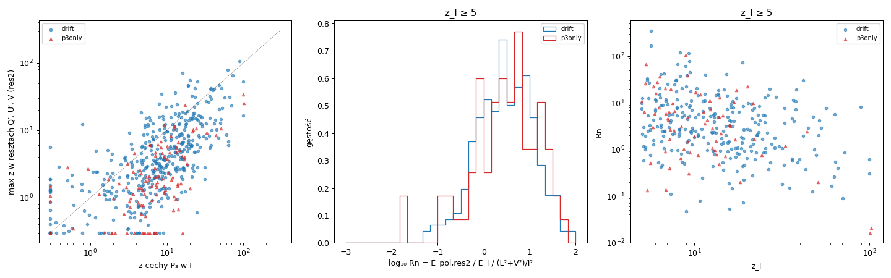
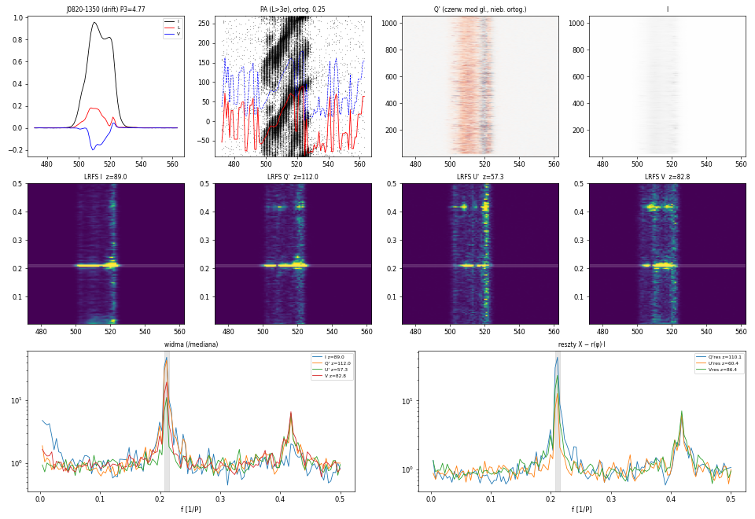
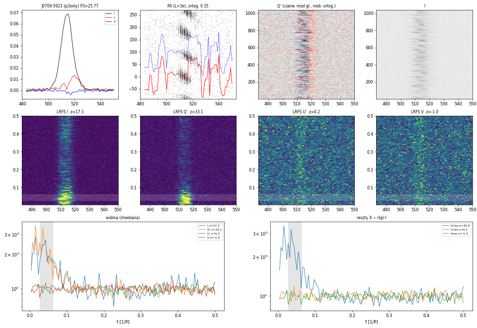

# Test polaryzacyjny: czy modulacja P₃ zmienia ułamek polaryzacji (dryf vs P3-only)

**Stan na 2026-10-02.** Próba zamknięta z wynikiem negatywnym jako dyskryminator; zostaje obserwacja fizyczna (§5).

Repozytorium: `github.com/aszary/spats`, gałąź `claude`. Kod **poza repo** (`~/claude/work/scripts/`), żeby nie kolidować
z równoległą pracą nad `subtrack` / `pairshift`. Dziennik: `~/claude/work/pol/NOTES_pol.md` (pilot także we wpisie
2026-10-02 w `separations_analysis_log.md`).

Poprzednie metody: [`travel_test_method.md`](travel_test_method.md), [`p3track_method.md`](p3track_method.md).

---

## 0. Podsumowanie

**Motywacja.** travel, P3Track, złożenie koherentne i Δψ(t) mierzą tę samą obserwablę — zależność fazy modulacji P₃ od
długości ψ(φ), czyli to, co Song+23 odczytują z 2DFS (przesunięcie cechy od osi P₂ = 0). Dlatego zgadzają się z etykietą
i różnią tylko czułością. Polaryzacja to informacja, której Song+23 nie używają.

**Hipoteza.** Przy modulacji amplitudowej podpuls jaśnieje w miejscu, więc w danej długości zmienia się natężenie, ale nie
**ułamek** polaryzacji. Przy dryfie przez daną długość przechodzi podpuls z własną strukturą polaryzacji (OPM na brzegach,
zmiana znaku V), więc ułamek polaryzacji jest modulowany z P₃. Statystyka liczy każdy bin długości osobno — **nie używa
ψ(φ)**, jest więc ortogonalna do 2DFS. Druga możliwość: P3-only jako okresowe przełączanie modów ortogonalnych.

**Wynik (521 pulsarów).**

| z cechy P₃ w I | drift: ułamek pol. modulowany (z ≥ 5) | P3-only |
|---|---|---|
| 5–10 | 35/109 (32%) | 6/36 (17%) |
| 10–20 | 56/91 (62%) | 8/26 (31%) |
| 20–50 | 55/65 (85%) | 5/6 (83%) |
| ≥ 50 | 14/14 | 3/3 |

1. **Nie dyskryminator.** Wielkość modulacji polaryzacji względem natężenia jest w obu klasach taka sama
   (mediana Rpol 0.237 vs 0.236, Mann–Whitney p = 0.93; po normalizacji przez (L² + V²)/I²: p = 0.75).
2. **Różnica populacyjna istnieje, ale słaba:** przy tym samym z_I dryfery mają ~2× wyższe z modulacji polaryzacji
   (regresja, t = 5.3; P3Track drift vs am: t = 4.1). Rozkłady silnie się nakładają.
3. **2f₃ w polaryzacji bez 2f₃ w I** (struktura polaryzacji wewnątrz cyklu podpulsu): 10% dryferów, 2% P3-only — rzadkie.
4. **Obserwacja fizyczna:** 22 P3-only mają silną modulację ułamka polaryzacji z P₃, w tym 8 z werdyktem P3Track `am`
   (J0709-5923 z = 24). Modulacja P3-only to w wielu przypadkach nie samo skalowanie jasności, tylko okresowa (lub
   quasi-okresowa) zmiana proporcji modów ortogonalnych. Kontrast z pilota (J1603-2531: brak modulacji polaryzacji) był
   wyjątkiem.



*Rys. 1. Od lewej: max z w resztach Q′, U′, V wobec z cechy P₃ w I (koła drift, trójkąty P3-only, linie z = 5);
rozkład Rn (z_I ≥ 5); Rn wobec z_I.*

---

## 1. Dane

Archiwa `~/output/claude/<PSR>_16/pulsar.spCf16`: 16 kanałów, **pełne Stokesy**, `rmc = 1` (RM skorygowane), `polc = 1`
(kalibracja polaryzacji), `scale = FluxDensity`, baza liniowa. `pdv -t -F` (suma kanałów — bezpieczna, bo RM jest
skorygowane). Okno on-pulse, P₃, nfft z `params.json` w `_16/`. Linia bazowa: średnia off-pulse per impuls i Stokes
(off-pulse = poza oknem rozszerzonym o połowę jego szerokości), σ ze wszystkich impulsów off-pulse.

## 2. Konstrukcja

**Wielkości liniowe** (bez obciążenia przy niskim S/N, w przeciwieństwie do L i PA):

- I, V;
- Q′, U′ — Q, U obrócone do lokalnego kąta odniesienia χ_ref(φ). χ_ref z ⟨L e^{4iχ}⟩ po impulsach z L > 3σ: czynnik 4
  sprawia, że oba mody ortogonalne (różnica 90°) dają ten sam kąt, więc mieszanie OPM nie zeruje średniej. Z dwóch osi
  (χ, χ + 90°) wybrana ta, w której rzutowane L jest dodatnie — **Q′ > 0 mod główny, Q′ < 0 mod ortogonalny**, U′ =
  odchylenia PA niebędące OPM. Biny bez detekcji PA: χ_ref z najbliższego binu.

**Reszty** — część wielkości niewyjaśniona przez natężenie w tym samym binie:

- `res`: X − (X̄/Ī)(φ)·I (stały ułamek polaryzacji);
- `res2`: reszta z regresji X ~ c + a·I + b·I² osobno w każdym binie (kontrola zależności ułamka polaryzacji od jasności).
  `res2` jest wielkością główną.

**Istotność cechy.** LRFS (bloki nfft bez nakładania; nfft zmniejszane, gdy < 4 bloki). Pasmo f₃ z widma I sumowanego po
oknie: maksimum w 0.7–1.3 × 1/P₃ (z aliasem dla P₃ < 2), szerokość FWHM, min. ±1 bin. Statystyka E = nadwyżka mocy w paśmie
nad medianą widma poza pasmem, suma po binach długości. **z względem 100 tasowań kolejności impulsów** (tasowanie niszczy
okresowość, zachowuje wszystko inne — bez modelu szumu). To samo w paśmie 2f₃.

**Miary:** `zpol` = max z(Q′res2, U′res2, Vres2); `Rpol` = (E_Q′res2 + E_U′res2 + E_Vres2)/E_I; `Rn` = Rpol / ((L̄² + V̄²)/Ī²)
(ważone natężeniem); `z2pol` = max z res2 w paśmie 2f₃.

## 3. Pilot: zestaw kontrolny (5 dryferów + 5 P3-only)

| etykieta | PSR | P₃ | z_I | z Q′res2 | z U′res2 | z Vres2 | E_Q′res2/E_I | 2f₃: z_I | 2f₃: max z res2 |
|---|---|---|---|---|---|---|---|---|---|
| P3-only | J1401-6357 | 2.21 | 4.6 | 2.3 | −1.4 | 0.4 | 0.054 | −0.5 | 1.1 |
| P3-only | J1603-2531 | 48.6 | 18.2 | 1.2 | 3.2 | −1.1 | 0.013 | 9.2 | 1.3 |
| P3-only | J1001-5939 | 2.09 | 9.7 | **8.2** | 1.3 | 1.5 | 0.087 | 0.9 | 1.7 |
| P3-only | J1146-6030 | 10.9 | 3.8 | 2.2 | 2.4 | 4.6 | 0.151 | −0.1 | 0.5 |
| P3-only | J2307+2225 | 3.48 | 4.7 | 1.4 | 0.1 | −0.3 | 0.122 | −0.5 | 1.1 |
| drift | J0034-0721 | 6.57 | 9.7 | **22.3** | 5.0 | 2.9 | 0.179 | −1.9 | 4.6 (U′) |
| drift | J0151-0635 | 14.3 | 72.2 | **65.5** | 5.0 | 8.3 | 0.104 | 5.2 | 10.3 (Q′) |
| drift | J0820-1350 | 4.77 | 89.0 | **105.5** | 36.6 | 75.1 | 0.162 | 1.3 | **23.7 (V)** |
| drift | J1825+0004 | 14.2 | 7.1 | 2.1 | 3.1 | 4.2 | 0.069 | 0.6 | 1.1 |
| drift | J1750-3503 | 49.0 | 32.7 | **12.6** | 3.6 | 2.6 | 0.265 | 21.7 | 6.1 (Q′) |

Pilot wyglądał obiecująco: J1603 (pewne AM) — silna modulacja I, ułamek polaryzacji niemodulowany; dryfery — z 13–105.
J0820: 2f₃ w V i U′ (z ≈ 24) przy braku 2f₃ w I; J0034: modulacja Q′ skupiona w długości mieszania OPM (spadek L).
Na pełnej próbce kontrast się nie utrzymał (§4).



*Rys. 2. J0820-1350 (drift). Górny rząd: profile I, L, V; PA pojedynczych impulsów (L > 3σ) z χ_ref (czerwona) i osią
ortogonalną (niebieska); Q′; I. Środkowy: LRFS I, Q′, U′, V (pasmo f₃ zaznaczone). Dolny: widma sumowane po oknie
(/mediana) i widma reszt. Druga harmoniczna w Q′, U′, V silniejsza względem podstawowej niż w I.*

## 4. Pełna próbka (batch v1)

533 pulsary z `p3track_v4b_pulsars.csv` (etykiety Song+23): ok 521 (412 drift, 109 P3-only), 7 bez okna/P₃, 3 bez
archiwum, 2 bez `params.json` (J2324-6054, J1402-5021). Cecha w I z_I ≥ 5: 279 drift, 71 P3-only.

- Tabela detekcji w §0. Różnice w przedziałach 5–20 częściowo wynikają z rozkładu S/N wewnątrz przedziału; regresja
  log zpol ~ log z_I + [drift] + log(L/I): z_I +0.91 ± 0.07, **drift +0.28 ± 0.05 (×1.9, t = 5.3)**, L/I +0.12 ± 0.09.
- Rpol: drift 0.237 [0.104–0.445], P3-only 0.236 [0.074–0.618]; Rn: 2.9 [1.1–8.2] vs 3.4 [1.0–10.1]. Bez różnic także
  przy 5 ≤ z_I < 20.
- Wg werdyktu P3Track (z_I ≥ 5): zpol ≥ 5 w 74% `drift`, 68% `partial`, 44% `inconclusive`, 36% `am`.
- 2f₃: drift 23/223 (10%), P3-only 1/53 (2%).

**P3-only z modulacją ułamka polaryzacji (zpol ≥ 5), 22 pulsary:** J1057-5226 (V, z 34), J1048-5832 (U′ 25), J0709-5923
(Q′ 24, Rn 18.6, `am`), J1539-5626 (`am`), J1543+0929, J1324-6302, J1932+2220 (`am`), J1326-6408 (`am`), J1722-3207 (`am`),
J1424-5822 (`am`), J1701-3130, J1849-0614, J1121-5444, J1001-5939, J1652-1400 (`am`), J1559-4438, J1757-2421, J1845-0434,
J1841-0157 (`am`), J1527-3931, J1625-4048, J1651-1709 (`am`).

**Dryfery z silną cechą w I (z_I ≥ 20) bez modulacji polaryzacji (zpol < 3):** J1537-4912 (bi-drift), J2253+1516,
J1627-5936, J1806+1023, J1225-6408, J0533+0402, J1901+0156.



*Rys. 3. J0709-5923 (P3-only, P3Track `am`, P₃ 25.8): Q′ modulowane silniej niż I (z 33 vs 17; reszty z = 35), U′ i V bez
modulacji. W Q′ widać naprzemienne serie modu głównego i ortogonalnego w środku profilu (ułamek ortogonalny 0.35) —
modulacja dotyczy proporcji OPM, nie tylko jasności. Cecha szeroka, w czerwonej części widma.*

## 5. Wnioski

1. W tej postaci (moc cechy P₃ w resztach polaryzacji, per bin długości) polaryzacja **nie odróżnia dryfu od P3-only**
   dla pojedynczego pulsara. Różnica jest populacyjna (~2× w z przy tym samym S/N).
2. Okresowa zmiana ułamka polaryzacji / proporcji OPM jest **powszechna w obu klasach** — u dryferów zgodna z obrazem podpulsu
   niosącego strukturę polaryzacji, u P3-only wskazuje, że modulacja nie jest czystym skalowaniem jasności.
3. Statystyka nie odróżnia „podpuls ze strukturą polaryzacji przechodzi przez długość” od „mody przełączają się w miejscu” —
   to wymagałoby pomiaru ułamka modu w funkcji fazy cyklu P₃ i długości (nie zrobione).

## 6. Ograniczenia i sprawy otwarte

1. **J1057-5226: L̄/Ī = 1.16** — problem linii bazowej lub okna w I; nie sprawdzone.
2. Pasmo f₃ z widma I: szeroka lub wędrująca cecha (J1603: P₃ 13–52) wpada częściowo poza pasmo.
3. z zależy od liczby impulsów i nfft — porównywalne tylko przy podobnych długościach obserwacji.
4. χ_ref w binach bez detekcji PA z najbliższego binu (dowolne przy niskim L; moc Q′ + U′ jest niezmiennicza względem obrotu,
   ale podział Q′/U′ wtedy nie).
5. Brak syntetyków (AM, dryf ze strukturą polaryzacji, AM z okresowym OPM) — progi i moc testu nieskalibrowane.
6. Możliwy następny krok (fizyka, nie klasyfikacja): ułamek modu ortogonalnego w funkcji fazy P₃ dla J0709-5923, J1539-5626,
   J1932+2220 — czy to okresowe przełączanie OPM.

## 7. Użycie

```bash
# pilot (10 pulsarów, wykresy w ~/claude/work/figures/pol/)
psrx julia --project=/home/psr/software/spats /home/psr/work/scripts/pol_pilot.jl [PSR ...]
# cała próbka: 8 części równolegle → ~/output/claude/pol/pol_v1_part<k>of8.csv, cache/, figures/
~/claude/work/scripts/pol_batch_run.sh
# podsumowanie → pol_v1.csv, pol_v1_derived.csv, pol_v1_summary.png
psrx python3 /home/psr/work/scripts/pol_summary.py v1
```

Wyniki: `~/output/claude/pol/` (QNAP, ~1.6 GB: cache okien on-pulse 1.3 GB, wykresy 263 MB). Logi:
`~/claude/work/logs/pol_pilot.log`, `pol_batch_v1_part*.log`, `pol_summary_v1.log`.
