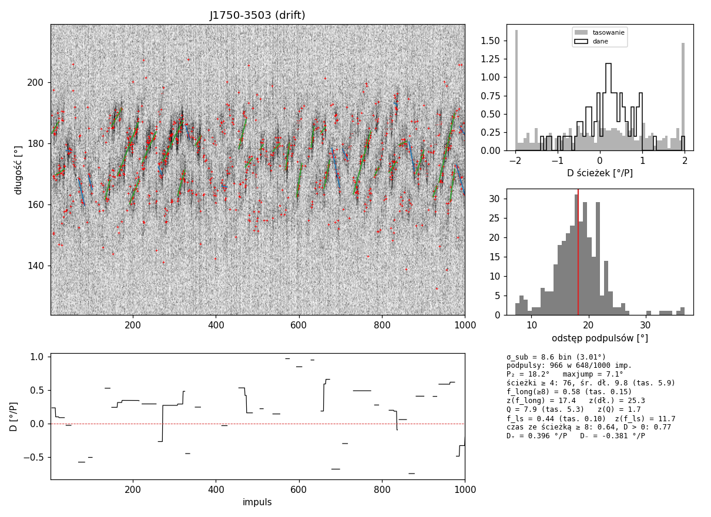
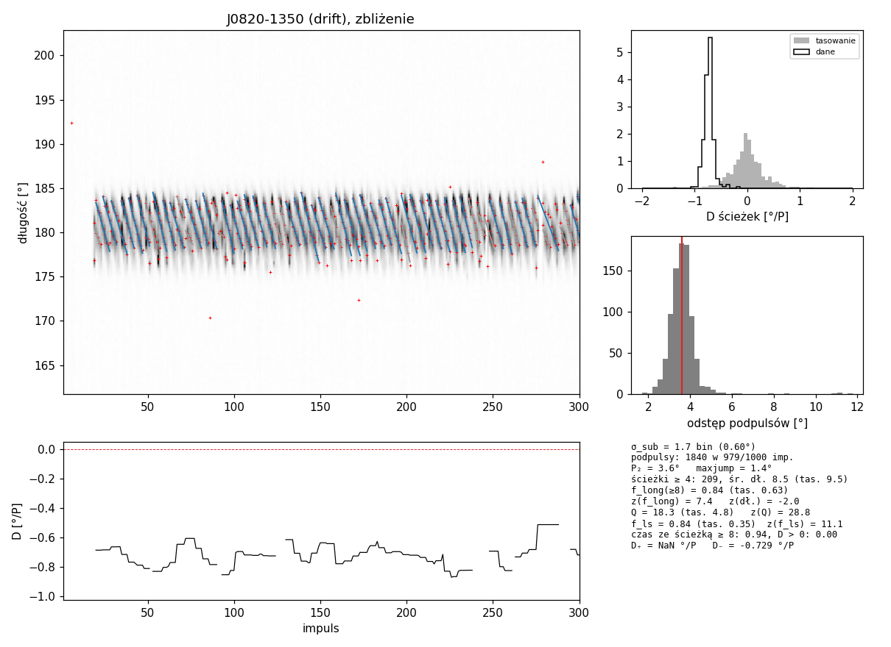
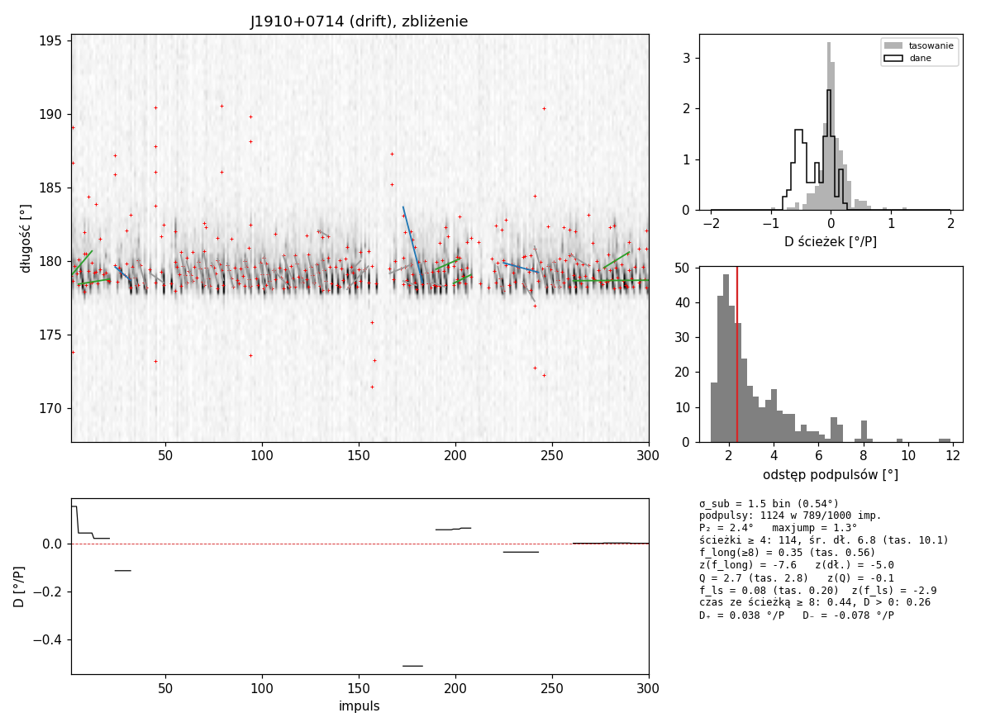
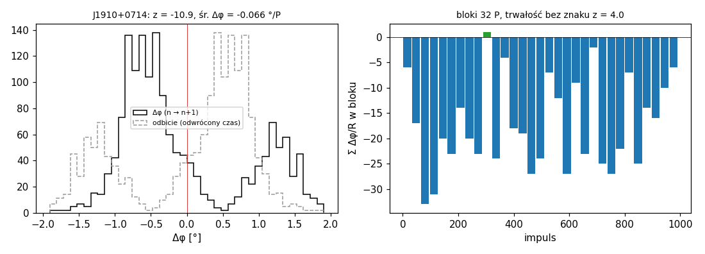
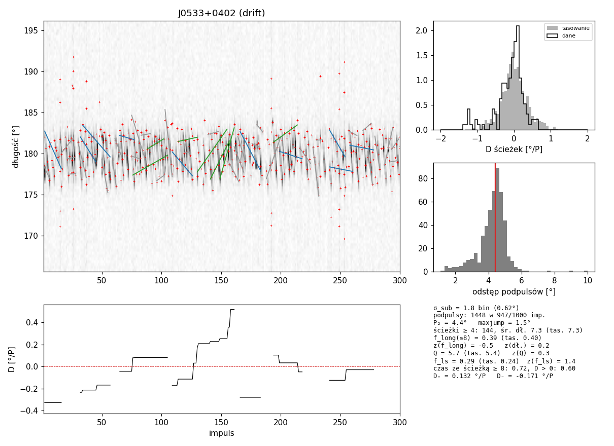
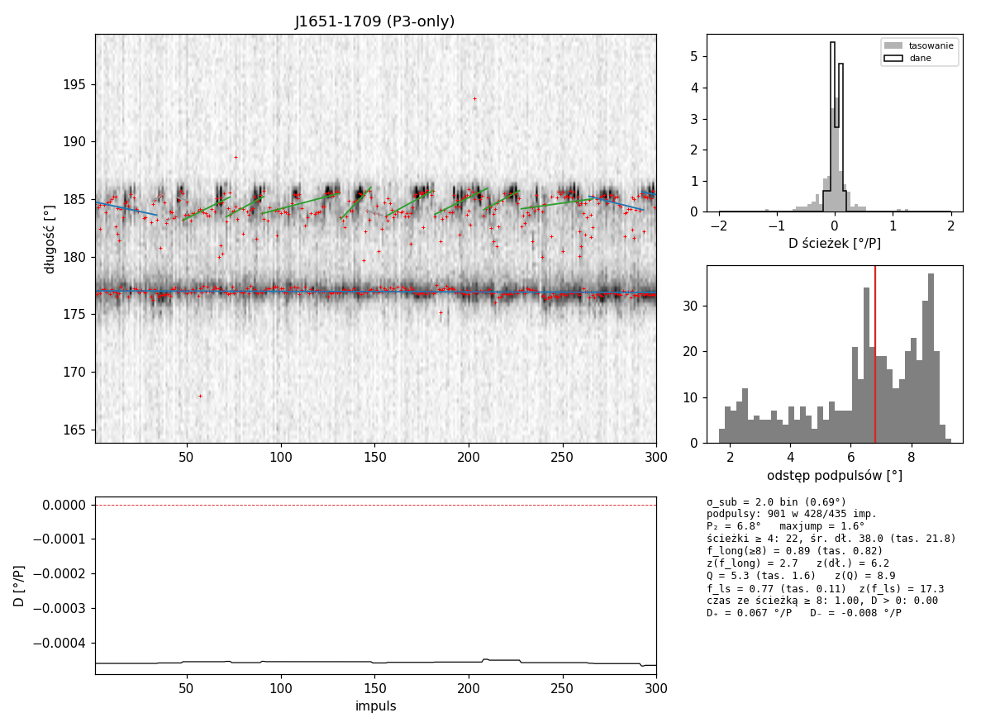

# Dryf w pojedynczych impulsach: subtrack i pairshift

**Stan na 2026-10-02.** Metody rozstrzygania, czy pulsar **dryfuje**, czy ma tylko modulację amplitudową z okresem P₃
(**P3-only**), oparte na **pozycjach podpulsów w pojedynczych impulsach**, a nie na fazie modulacji. Powstały po
P3Track (`docs/p3track_method.md`) i teście travel (`docs/travel_test_method.md`). Przed nimi sprawdzono i odrzucono
dwa warianty fazowe (§1).

Repozytorium: `github.com/aszary/spats`, gałąź `claude`. Kod jest poza repo, w skryptach (§8):
`~/claude/work/scripts/subtrack.jl`, `pairshift.jl` i `pairshift_batch.jl`.
Wyniki batcha: `~/output/claude/pairshift_batch/pairshift_v2.csv` (QNAP; v1 dla porównania).
Dziennik: `docs/separations_analysis_log.md` (= `~/claude/work/NOTES.md`), wpisy 2026-10-02 (cd.), od „nowa sesja”.
Wykresy dokumentu: `docs/figures/subtrack_*.png`, `docs/figures/pairshift_*.png`.

---

## 0. Podsumowanie

**pairshift** (§4) w każdej parze kolejnych impulsów łączy każdy podpuls z najbliższym podpulsem impulsu sąsiedniego,
w obu kierunkach, i liczy **znak** przesunięcia Δφ. Przy AM przesunięcia w obie strony są równie częste, przy dryfie
przeważa jeden znak. Rozkładem zerowym jest **odwrócenie czasu** — losowanie znaków bloków L_b = clamp(2·P₃, 10, 100)
kolejnych par (z_blk, od batcha v2) — bez żadnego modelu zmienności.

**Pełna próbka (batch v2, pierwsze 1000 impulsów na pulsar, próg |z_blk| ≥ 3):**

| etykieta Song+23 | policzone | pairshift | P3Track v4b drift/partial | obie metody | suma |
|---|---|---|---|---|---|
| drift | 388 | **152 (39%)** | 156 (40%) | 94 | **214 (55%)** |
| P3-only | 103 | **0** | 5 | 0 | — |

- **Brak fałszywych detekcji:** z_blk dla P3-only leży w przedziale od −2.6 do 2.8 (mediana −0.2, odchylenie 1.25). |z_blk| ≥ 2
  ma 12 ze 103, przy oczekiwanych ~5 dla N(0,1). Rozkład jest więc nieco szerszy niż normalny: przy 10–30 blokach statystyka
  S/√ΣS² ma cięższe ogony. Na syntetykach AM i losowych podpulsów 0 przypadków ze 120.
- **Nowe detekcje:** 58 dryferów wykrywa tylko pairshift. W P3Track miały werdykt inconclusive (30), inne P₃ (23), am (3)
  lub brak grup (2). Najsilniejsza to J0533+0402 (z_blk = −9.2). 33 z nich ma |z_blk| między 3 a 4, czyli tuż nad progiem.
- **Kierunek dryfu** zgadza się z P3Track w 92 na 94 pulsarach wykrytych przez obie metody. To niezależnie potwierdza
  konwencję znaku P3Track (sprawa otwarta `p3track_method.md` §8.11).
- **Batch v1** używał losowania znaków pojedynczych par (z): 165/388 (43%), suma z P3Track 221 (57%). Dla dryferów z dodatnią
  autokorelacją s_n ta wersja zawyża z (J0034-0721: −13.6 wobec −5.9 blokowo), więc obowiązuje v2 (§4.2, §5).
- **Ograniczenia:** metoda wymaga podpulsów z S/N ≥ 5 (29 pulsarów jest za słabych). Przy P₃ ≈ 2 łapie alias (2/20 dryferów
  z P₃ ≤ 2.2). Reverserów (J1750-3503) wersja globalna nie widzi.

**subtrack** (§3) to automatyczna wersja śledzenia podpulsów z Szary et al. (2022, ApJ 934, 23, §3.2): ścieżki pasm,
tempo dryfu D(t), P₂. Dla J1750-3503 odtwarza liczby z pracy (D₊ = 0.395 / D₋ = −0.338 °/P wobec 0.388 / −0.314). Wymaga
jednak pasm żyjących ≥ 8 impulsów, więc działa tylko dla jasnych dryferów z szerokim profilem. Na losowej próbce wykrył
0 z 10 dryferów. Przydaje się jako **opis** takich pulsarów, a nie jako klasyfikator.

**Wniosek wobec Song+23:**
- Żaden P3-only nie ma dryfu widocznego w pojedynczych impulsach w sensie pairshift.
- Wśród dryferów pairshift i P3Track razem potwierdzają 55%.
- Reszta to głównie pulsary za słabe na detekcję podpulsów albo z dryfem widocznym tylko statystycznie, jako gradient fazy.
- Kandydat do oceny wzrokowej: **J1651-1709** (P3-only u Song+23, am w P3Track) — rosnące pasma w końcowej składowej (§6).

---

## 1. Warianty fazowe sprawdzone i odrzucone

### 1.1 Ciągłe P₃(n) z `p3fold_coherent`

`SpaTs.p3fold_coherent` → `P3FoldViterbi.coherent_fold` (`modules/p3fold_viterbi.jl`) działa tak:
1. Globalna FFT daje szablon przestrzenny L(φ) przy f₃.
2. Każdy impuls jest rzutowany na conj(L) (filtr dopasowany).
3. Demodulacja przy f₃ i filtr dolnoprzepustowy 1/300 dają fazę θ(n) i P₃(n) w każdym impulsie.
4. Błędy pochodzą z jackknife po czterech zakresach długości.

Pytanie było, czy ciągłe P₃(n) odróżnia dryf od P3-only (`coh_control.jl`, zestaw kontrolny P3Track).
**Nie odróżnia.** Wędrówka P₃ (std/mediana) wynosi 0.007–0.063 dla dryferów i 0.009–0.113 dla P3-only, a wędrówka fazy
0.33–2.44 wobec 0.26–3.61 cyklu na 100 cykli P₃. Przyczyna leży w konstrukcji: filtr dopasowany Σ_φ x·conj(L) usuwa
ψ(φ), więc θ(n) i P₃(n) są takie same dla dryfu i AM. Dryf zostaje tylko w arg L(φ). Przy dużej wędrówce P₃(n) bywa
zawodne: J1603-2531 (P₃ według P3Track 13–52) daje 45–53 z ostrymi pikami w miejscach poślizgu fazy.
Faza szablonu (jak w P3Track) z jednego złożenia koherentnego na pulsar daje te same werdykty co P3Track dla 4 dryferów,
0 fałszywych, a gorzej przy dryfie w części obserwacji i przy P₃ ≈ 2.

### 1.2 Δψ(t): gradient fazy w poprzek składowej w oknach czasowych

`dpsi_time.jl`. Lokalne szablony T_w(φ) = ⟨(I − ⟨I⟩)·e^{−iθ(n)}⟩ w oknach W = 4·P₃ i gradient fazy w każdej składowej.
Trwałość bez globalnego znaku: iloczyn gradientów z dwóch połówek okna (σ z bootstrapu).
Na syntetykach daje 0 fałszywych, a dryf, reverser i dryf epizodyczny wychodzą przy szumie 0.6 z z = 30–95.
Na danych **nie łapie przypadków, dla których powstał**:
- **J1825+0004** — dryf słaby i tylko na zboczu składowej;
- **J1750-3503** — P₃ ≈ 49, a epizody jednego kierunku trwają 28 ± 4 P, krócej niż jeden cykl P₃, więc żadna metoda fazowa
  ich nie rozdzieli.

Wniosek z obu wariantów: ograniczeniem metod fazowych jest S/N i liczba cykli P₃, a nie sposób mierzenia fazy. Dlatego
kolejne podejście przeszło do pozycji podpulsów.

---

## 2. Detekcja podpulsów (wspólna dla subtrack i pairshift)

Według Szary et al. (2022) §3.2, z parametrami wziętymi z danych (`subtrack.jl`: `subpulse_sigma`, `detect`):

1. **Szerokość podpulsu** z autokorelacji fluktuacji δI = I − ⟨I⟩ w oknie on-pulse, uśrednionej po impulsach.
   Lag 0 jest pomijany (biały szum), a poziomem odniesienia jest lag 1. Wtedy σ_sub = HWHM_ACF / (√2 · √(2 ln 2)).
   Gdy ACF nie spada do połowy w zakresie ½ okna (szum dominuje, J1916+1030: lag 0 = 23 × lag 1), pulsar jest
   **niemierzalny**.
2. **Splot** każdego impulsu z Gaussem o σ_sub (cykliczny, jądro unormowane do jednostkowej sumy kwadratów).
3. **S/N** = (splot − mediana off-pulse) / rms off-pulse po tym samym splocie. Off-pulse jak `P3Track.off_pulse_bins`.
4. **Maksima** w oknie on-pulse z S/N ≥ 5. Z maksimów bliższych niż FWHM zostaje silniejsze, pozycja jest dopracowana
   parabolą.
5. **Długie obserwacje:** analizowane są tylko impulsy 1–1000 (`MAXPULSES`, decyzja użytkownika). Przy ~27 000 impulsów
   rozrzut tasowań jest tak mały, że z rośnie od znikomego efektu (subtrack, J1057-5226: 6.8 → −0.1 po przycięciu).

---

## 3. subtrack: ścieżki pasm

### 3.1 Konstrukcja (`analyse_subtrack`)

- **Łączenie** (zamiast przeglądu wzrokowego w pracy):
  - podpuls łączony z pozycją przewidywaną (ostatnia pozycja + nachylenie z ostatnich ≤ 5 punktów ścieżki);
  - przypisanie zachłanne jeden do jednego;
  - skok ≤ FWHM podpulsu, luka ≤ 2 impulsy.
- **Dopasowanie ścieżki:** Theil–Sen (D = mediana nachyleń par, σ z MAD reszt).
- **Tempo dryfu D₊ / D₋:** średnia ważona długością ścieżek ≥ 8 punktów, **bez** selekcji po istotności.
- **Punkt odniesienia:** tasowanie kolejności impulsów (20 razy), te same podpulsy. AM daje te same pionowe ścieżki, dryf się
  rozpada.
- **Kryterium:** f_ls = udział podpulsów w ścieżkach ≥ 8 punktów z |D|/σ ≥ 3; z(f_ls) względem tasowań.
- **Wykres** (`plot_subtrack`): stos impulsów z podpulsami i ścieżkami (zielone D > 0, niebieskie D < 0, szare < 8 punktów),
  D(n), rozkład D ścieżek wobec tasowania, rozkład odstępów podpulsów (P₂).

### 3.2 Kalibracja na J1750-3503 (`grid_subtrack.jl`, `j1750_dcheck.jl`)

Siatka: S/N 4/5 × skok P₂/2, 1.5, 1.0, 0.6 FWHM × luka 1/2 × LS/TS.

| | subtrack | Szary+2022 |
|---|---|---|
| D₊ / D₋ [°/P] | +0.395 / −0.338 | +0.388 / −0.314 |
| udział czasu z D > 0 | 74% | ~78% |
| P₂ | 18.1° | 18.6° |

Pierwsza wersja zawyżała D do 0.55–0.60 °/P. Brało się to z selekcji ścieżek po |D|/σ ≥ 3, która faworyzuje krótkie, strome
ścieżki. Ścieżki ≥ 8 punktów bez selekcji dają wartości z pracy.



*Rys. 1. J1750-3503 (1031 P): podpulsy (czerwone), ścieżki ≥ 8 punktów (zielone dodatnie, niebieskie ujemne), D(n),
rozkład D wobec tasowania, odstępy podpulsów.*

### 3.3 Wyniki

Zestaw kontrolny (1000 P; etykiety Song+23 — J1825+0004 jest P3-only):

| etykieta | PSR | P₂ [°] | f_ls (tas.) | z(f_ls) | D [°/P] |
|---|---|---|---|---|---|
| drift | J0034-0721 | 18.1 | 0.66 (0.13) | 14.3 | −2.34 |
| drift | J0151-0635 | 14.1 | 0.56 (0.20) | 13.0 | −0.40 |
| drift | J0820-1350 | 3.6 | 0.84 (0.35) | 11.1 | −0.73 |
| drift | J1750-3503 | 18.1 | 0.44 (0.10) | 11.7 | +0.40 / −0.38 |
| P3-only | J1401, J1603, J1001, J1146, J2307, J1825 | | | −0.3 … 0.7 | ≈ 0 |

Syntetyki (`subtrack_synth.jl`: 1000 P, podpulsy σ = 3 biny, P₂ = 24; szum 1.0 / 2.0 ≈ S/N podpulsu 9 / 4.6):
- AM ze stałymi pozycjami, AM w przeciwfazie i losowe podpulsy: max z = 2.2 na 120 przypadków;
- dryf: z = 30 / 1.5, D = 2.96 przy zadanym 3.0;
- reverser: 33 / 1.6;
- wolny dryf (P₃ = 40): 28 / 33;
- alias przy P₃ = 2.1: z = 22, ale D błędne.

**Losowa próbka 10 drift + 10 P3-only: 0 z 10 dryferów** (P3Track 3/10). Typowy dryfer próbki ma wąską składową
(σ_sub 0.5–0.9°, P₂ 2–7°), 1–2 podpulsy w impulsie i krótkie P₃. Pasmo żyje ~3–5 impulsów, więc ścieżki ≥ 8 punktów są
niemożliwe. Krótkie ścieżki (≥ 4 punkty) nie pomagają.



*Rys. 2. J0820-1350: subtrack w swoim reżimie — wiele równoległych ścieżek, D = −0.73 °/P.*



*Rys. 3. J1910+0714: dryf dobrze widoczny (krótkie opadające kreski), ale pasma żyją 3–5 P i subtrack go nie widzi
(z(f_ls) = −2.9). Ten przypadek był powodem powstania pairshift.*

---

## 4. pairshift: przesunięcia między kolejnymi impulsami

### 4.1 Konstrukcja (`analyse_pairs`, `pair_shifts`)

1. Detekcja jak w §2.
2. W każdej parze impulsów (n, n+1):
   - od każdego podpulsu n do najbliższego w n+1: Δ = φ′ − φ;
   - od każdego podpulsu n+1 do najbliższego w n: Δ = φ_{n+1} − φ_n, czyli też w kierunku czasu n → n+1;
   - brane są tylko pary z |Δ| ≤ R = 1.5·FWHM.
3. s_n = Σ sign(Δ) w parze. Odwrócenie czasu pary zamienia oba zbiory dopasowań i zmienia znak, więc s(Y, X) = −s(X, Y)
   **dokładnie**, także przy różnej liczbie podpulsów w impulsach.
4. Pod AM (proces odwracalny w czasie, kolejne impulsy wymienne) E s_n = 0, a rozkład jest symetryczny.
   Rozkład zerowy to losowanie znaków **bloków** L_b = clamp(2·P₃, 10, 100) kolejnych par (P₃ z params.json, bez P₃: 32):
   z_blk = Σ S_b / √Σ S_b², S_b = suma s_n w bloku. Nie wymaga modelu zmienności. Wersja z losowaniem pojedynczych par
   (z = Σ s / √Σ s², batch v1) zakłada niezależność s_n, a sąsiednie pary są skorelowane (§4.2).
5. Tempo dryfu: mediana Δ (°/P).
6. Dodatkowo wersja blokowa (bloki 32 P, iloczyn sum z połówek bloku, trwałość bez globalnego znaku) dla reverserów.
   Nasyca się przy √31 ≈ 5.6 i niewiele daje.

### 4.2 Dlaczego tak (historia poprawek, `pairshift_grid.jl`)

| wersja | objaw | poprawka |
|---|---|---|
| dopasowanie tylko n → n+1, waga Δ/R | fałszywe dryfy w P3-only: J0629+2415 z = −11.0, J1825+0004 −7.2, J1401-6357 +5.3 | dopasowanie dwukierunkowe (antysymetria dokładna) |
| dwukierunkowe, waga Δ/R, R = 3·FWHM | null czysty, ale J1910+0714 tylko −2.2 przy medianie Δφ −0.41 °/P (dalekie dopasowania szumu dominują średnią) | waga sign(Δ), R = 1.5·FWHM: J1910 −10.9 |
| losowanie znaków pojedynczych par (v1) | s_n są skorelowane: u P3-only ρ(1) ≈ −0.2…−0.46 (para (n, n+1) i (n+1, n+2) dzielą impuls n+1; jitter daje + w jednej i − w drugiej → null konserwatywny), u części dryferów ρ(1) > 0 (J0034-0721 +0.28 → z zawyżone: −13.6) | losowanie znaków bloków L_b = clamp(2·P₃, 10, 100) par (sugestia sesji „flow”, u której pary były za liberalne): J0034 −5.9, J0820 −27.9 → −9.8; P3-only nadal ≤ 2.8 |

Siatka wag {liniowa, znak, przycięta do FWHM} × R {1.5, 3}·FWHM na 30 pulsarach: znak przy R = 1.5·FWHM daje najsilniejsze
dryfery przy czystym nullu.

### 4.3 Kalibracja

Syntetyki (`pairshift_synth.jl`, te same co dla subtrack):

| syntetyk | szum 1.0 | szum 2.0 |
|---|---|---|
| AM stałe pozycje / przeciwfaza / losowe podpulsy (po 20) | max \|z\| 2.3 / 2.1 / 1.7 | 1.7 / 1.2 / 2.4 |
| dryf | z = 25.8 | **10.6** (subtrack: 1.5) |
| reverser (epizody ~60 P) | 8.0 | 2.2 |
| wolny dryf (P₃ = 40) | 8.6 | 1.7 |
| alias (P₃ = 2.1) | 5.5 | 2.0 |

Zestaw kontrolny i losowe 20 (`pairshift.jl`):

| etykieta | PSR | mediana Δφ [°/P] | z (pary) | z_blk | P3Track v4b |
|---|---|---|---|---|---|
| drift | J0034-0721 | −1.96 | −13.6 | −5.9 | drift |
| drift | J0151-0635 | −0.32 | −9.7 | −5.2 | drift |
| drift | J0820-1350 | −0.71 | −27.9 | −9.8 | drift |
| drift | J1750-3503 (reverser) | +0.25 | 1.7 | 1.7 | drift |
| drift | J1910+0714 | −0.41 | −10.9 | **−7.7** | drift |
| drift | J0932-3217 | +0.22 | 3.3 | 3.0 | drift |
| drift | J1614+0737 | | −2.6 | −3.2 | inconclusive |
| drift | pozostałe 6 losowych | | −2.2 … 0.3 | −2.6 … 0.4 | |
| P3-only | 16 (6 kontrolnych + 10 losowych) | | −2.4 … 1.1 | −2.4 … 1.4 | |

(`pairshift_blk.jl`, log `pairshift_blk.log`.)



*Rys. 4. J1910+0714: rozkład Δφ między kolejnymi impulsami (czarny) i jego odbicie w czasie (szary); z = −10.9.
Prawy panel: suma znaków w blokach 32 P.*

---

## 5. Pełna próbka: batch pairshift v2 (v1 dla porównania)

**Przebieg.** `pairshift_batch.jl` + `pairshift_batch_run.sh`: 8 procesów, wznawialny, lista i pliki jak w batchu P3Track
(418 drift + 115 P3-only), pierwsze 1000 P. W tym samym przebiegu liczony jest subtrack.
Podsumowanie: `pairshift_summary.py v2 zblk` (v1: `pairshift_summary.py v1`).

**Pliki** (`~/output/claude/pairshift_batch/`):
- `pairshift_v2.csv` — wiersz na pulsar: liczba podpulsów i par, R, P₃, z (pary), **z_blk**, L_b, ρ(1) dla s_n, z blokowe bez
  znaku (zrev), średnia i mediana Δφ, a z subtrack ścieżki, P₂, f_ls, z(f_ls), D₊, D₋;
- `pairshift_v1.csv` — to samo bez z_blk (losowanie znaków pojedynczych par);
- części `pairshift_v{1,2}_partKof8.csv`;
- `pairshift_test_part1of1.csv`, `pairshift_test2_part1of1.csv` — testy, do usunięcia.

Wykresy dla |z_blk| ≥ 3 (para + subtrack) są w `~/claude/work/figures/pairshift_batch_v2/` (304 pliki; v1: `_v1/`, 330).

**Błędy:** 12 × brak danych, 29 × płaska ACF (pulsary za słabe na detekcję podpulsów).

**Próg** (dryfery Song+23 z detekcją / P3-only z detekcją / suma dryferów z P3Track drift/partial):

| \|z_blk\| ≥ | 2.5 | 3 | 3.5 | 4 | 5 |
|---|---|---|---|---|---|
| drift (388) | 189 | **152** | 126 | 106 | 82 |
| P3-only (103) | 6 | **0** | 0 | 0 | 0 |
| suma z P3Track | 239 | **214** | 194 | 181 | 174 |

**Krzyżowo z P3Track v4b, dryfery Song+23 (388 policzonych, |z_blk| ≥ 3; w nawiasach v1):**

| P3Track | pairshift+ | pairshift− |
|---|---|---|
| drift | 85 (90) | 46 (41) |
| partial | 9 (10) | 16 (15) |
| inconclusive | 30 (33) | 69 (66) |
| inne P₃ (nocat) | 23 (26) | 65 (62) |
| am | 3 (4) | 16 (15) |
| brak grup | 2 (2) | 24 (24) |

- v1 → v2: 18 dryferów spada pod próg, 5 dochodzi.
- Nowe detekcje (58): mediana |z_blk| 3.9, 33 z nich ma |z_blk| między 3 a 4. Najsilniejsze: J0533+0402 −9.2 (P3Track
  inconclusive), J0924-5814 +6.7, J1246+2253 +6.4, J1847-0438 −6.3, J1850+0026 −6.2, J1428-5530 −6.2, J1819-0925 +6.1,
  J1627-5936 −5.9.
- **Kierunek:** znak z_blk wobec znaku Δψ (ważonego mocą) dominującej grupy drift/partial P3Track jest zgodny w 92 przypadkach
  i przeciwny w 2 (J1741-0840, J1614+0737; |z_blk| ≥ 3 i |Δψ| ≥ 0.1). W v1: 97 / 2 (J1741-0840, J1819+1305).
  Sesja „flow” (przepływ optyczny) ma kierunek zgodny z pairshift 142/142.
- **P₃ ≤ 2.2:** pairshift wykrywa 1 z 20 dryferów (v1: 2).
- **Sprzeczne:** pairshift+ przy P3Track `am` — J1740+1311 (3.5), J1424-5556 (3.3), J1839-1238 (−3.1).
- **Rozkład nulla** (P3-only): z_blk od −2.6 do 2.8, odchylenie 1.25 (z par: 1.06); |z_blk| ≥ 2.5 ma 6 ze 103. Część poszerzenia
  to ciężkie ogony statystyki przy małej liczbie bloków (L_b do 100 par → 10 bloków); sesja „flow” widzi też w P3-only słabą,
  powtarzalną strzałkę czasu tylko przy parach (n, n+1) (§7).



*Rys. 5. J0533+0402 (drift, P3Track inconclusive): najsilniejsza nowa detekcja pairshift, z_blk = −9.2 (z par −16.2).
Krótkie opadające kreski na stosie; subtrack ich nie składa w ścieżki ≥ 8 P.*

---

## 6. Subtrack w batchu i J1651-1709

subtrack daje z(f_ls) ≥ 5 dla 58 dryferów i **6 P3-only**. Te ostatnie są w większości fałszywe: długie pionowe ścieżki
mają tak mały błąd σ_D, że D ≈ 0 wychodzi jako istotne (J1531-5610: z = 64 przy f_ls 0.06 wobec 0.00). Poprawka (do zrobienia):
wymagać przesunięcia na całej ścieżce |D|·długość ≥ FWHM podpulsu.

Wyjątek wart oceny wzrokowej to **J1651-1709** (P3-only u Song+23, P₃ 28.4; P3Track `am`, grupa P₃ 25.6). Wiodąca składowa
(177°) stoi w miejscu, a w końcowej (183–186°) widać rosnące pasma co ~20–25 P (D ≈ +0.1 °/P). pairshift daje z = 0.35 (z_blk = 0.6), bo
pary w jasnej, nieruchomej składowej rozcieńczają statystykę. Możliwy dryf tylko w jednej składowej — wersja pairshift
osobno dla składowych by to rozstrzygnęła.



*Rys. 6. J1651-1709 (P3-only): pasma w końcowej składowej.*

---

## 7. Sprawy otwarte

1. **pairshift osobno dla składowych** (J1651-1709) — pary z nieruchomej, jasnej składowej rozcieńczają dryf w słabszej.
2. **P₃ ≈ 2:** dopasowanie najbliższego łapie alias. Ścieżka Nyquista P3Track albo dopasowanie n → n+2.
3. **Reverserzy:** wersja blokowa się nasyca. Możliwy podział na odcinki według znaku D(n) z subtrack.
4. **Poprawka subtrack** (§6): minimalne przesunięcie ścieżki ≥ FWHM.
5. **Wybór fragmentu 1000 P:** zawsze impulsy 1–1000. Alternatywa: fragment z największą liczbą podpulsów.
6. **Pulsary bez detekcji** (płaska ACF, 29) — dla nich zostają metody fazowe albo przepływ optyczny bez detekcji podpulsów
   (planowany w sesji „Agent 2”).
7. **Przejrzeć** 3 sprzeczne przypadki (pairshift+ / P3Track am) i 2 z przeciwnym kierunkiem.
9. **Rozkład nulla z_blk szerszy niż N(0,1)** (σ = 1.25 u P3-only): kalibracja progu na P3-only (np. kwantyl) zamiast stałego 3;
   sprawdzić, czy to ogony przy małej liczbie bloków, czy realna strzałka czasu przy k = 1 (wynik sesji „flow”,
   `docs/flow_test_method.md`).
8. **Tempo dryfu** z mediany Δφ wobec P₂/P₃ z katalogu oraz zależność udziału detekcji od Ė (jak dla P3Track).

---

## 8. Użycie

Skrypty w `~/claude/work/scripts/` (w kontenerze `/home/psr/work/scripts/`):

```bash
# zestaw kontrolny + losowe 20 (domyślnie) albo lista "etykieta katalog plik" w pliku .txt
psrx julia --project=/home/psr/software/spats /home/psr/work/scripts/pairshift.jl [lista.txt]
psrx julia --project=/home/psr/software/spats /home/psr/work/scripts/subtrack.jl [lista.txt | katalog plik ...]
# pełna próbka (8 procesów, wznawialne) i podsumowanie
bash ~/claude/work/scripts/pairshift_batch_run.sh
python3 ~/claude/work/scripts/pairshift_summary.py v2 zblk
```

W Julii:

```julia
include("/home/psr/work/scripts/pairshift.jl")          # wciąga subtrack.jl (detekcja, wykresy)
r  = analyse_pairs(data, bin_st, bin_end; p3=p3)        # zblk, z, rho, zrev, mean/median Δφ [biny], det, R, σ
st = analyse_subtrack(data, bin_st, bin_end)            # st.fits, f_ls, z_ls, Dpos, Dneg, Dn, p2
plot_pairs(r, "out.png"; nbin=1024); plot_subtrack(st, data, "out2.png"; nbin=1024, prange=1:300)
```

Pozostałe skrypty: `subtrack_synth.jl` i `pairshift_synth.jl` (syntetyki), `grid_subtrack.jl` i `pairshift_grid.jl` (siatki
parametrów), `j1750_dcheck.jl` (D wobec długości ścieżek), `subtrack_short.jl` (krótkie ścieżki), `coh_control.jl` (§1.1),
`dpsi_time.jl synth|real` (§1.2), `j1651_check.jl`, `pairshift_blk.jl` (z par vs z_blk).
Logi: `~/claude/work/logs/{coh_control,dpsi_time_*,subtrack_*,pairshift*}.log`.
Losowa próbka: `~/claude/work/subtrack_random20.txt` (`random.Random(20261002)`, bez 18 pulsarów już oglądanych).
