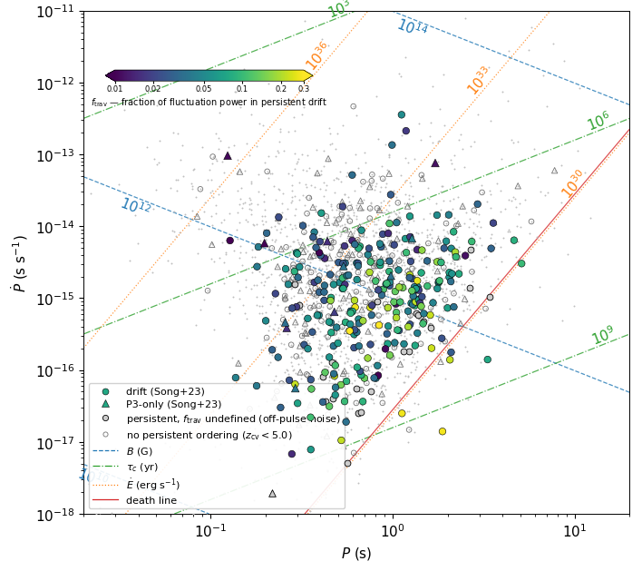
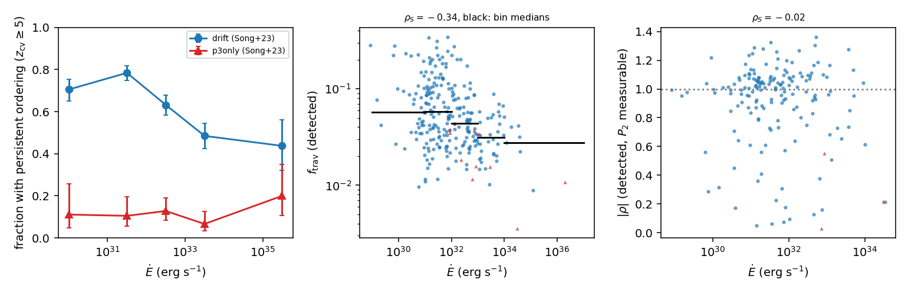
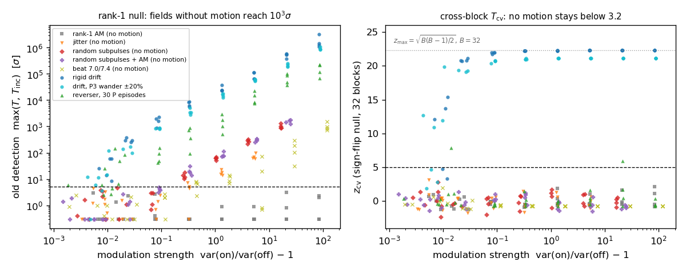
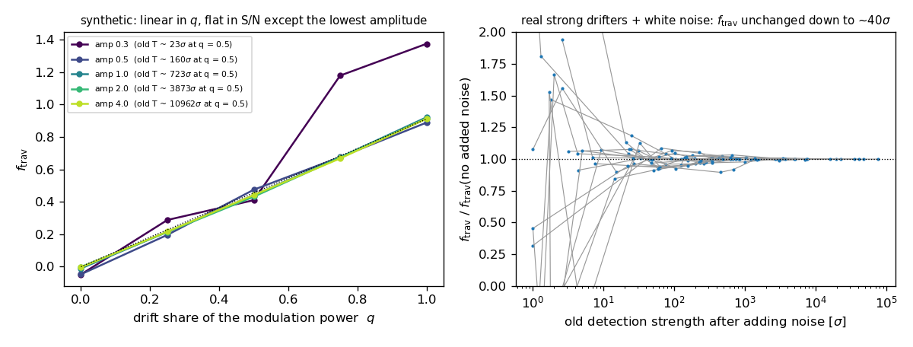
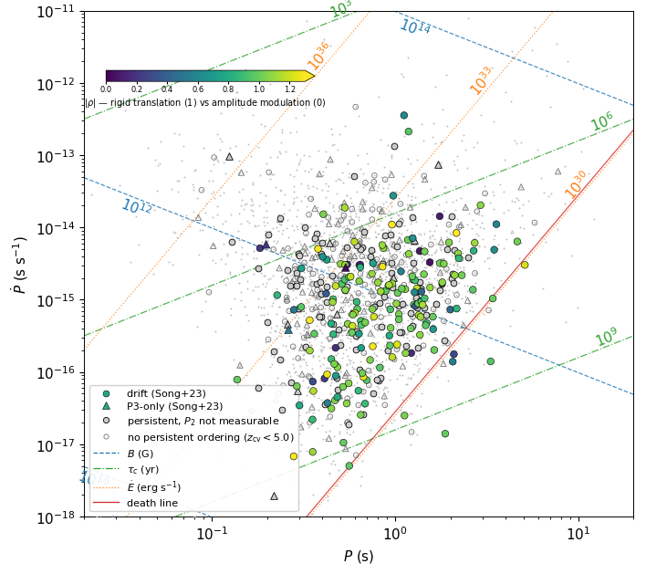

# Test „travel": dryf podpulsów czy modulacja amplitudowa

**Stan na 2026-09-30.** Metoda rozstrzygania, czy wzór podpulsów **przemieszcza się** w długości
(dryf), czy tylko **jaśnieje i gaśnie w miejscu** (P3-only) — niezależna od kryterium
Song et al. (2023) i wolna od jego głównego obciążenia.

Repozytorium: `github.com/aszary/spats`, gałąź `claude`.
Kod: `modules/travel.jl` (moduł `Travel`), `Plot.travel`, `Plot.ppdot_travel`, `SpaTs.travel_test`.
Skrypty: `~/claude/work/scripts/travel_*.{jl,py}`, `check_onpulse.jl`.
Dziennik: `docs/separations_analysis_log.md` (= `~/claude/work/NOTES.md`, symlink).
Wykresy do tego dokumentu: `docs/figures/`.

---

## 0. Podsumowanie

**Co mierzymy.** Dla każdego pulsara pytamy, czy wzór podpulsów *przesuwa się w długości w trwały
sposób*, czy tylko zmienia jasność w miejscu. Odpowiedź daje antysymetryczna część korelacji
czasowo-długościowej A (§2): czysta modulacja amplitudowa daje A ≡ 0 tożsamościowo.

**Główna zmiana (2026-09-24).** Pierwotny rozkład zerowy (surogat rank-1 + szum z off-pulse'u, §7.1)
nie niesie **przypadkowej, niezależnej od impulsu do impulsu zmienności kształtu** (jitter, podpulsy
w losowych pozycjach). Takie pola nie mają żadnego ruchu, a mimo to dają T do tysięcy σ, rosnąco z siłą
modulacji — kontrola off-pulse tego nie łapie (rys. 1). Zastąpiono go statystyką krzyżową między blokami
**`T_cv`** z rozkładem zerowym z losowania znaków bloków, który **nie wymaga żadnego modelu zmienności**
(§5.2). Siłę dryfu mierzy **`f_trav`** — ułamek mocy fluktuacji w trwałym dryfie, niezależny od S/N (§5.4).

**Wyniki (513 pulsarów, przebieg v4):**

| | etykieta drift | etykieta P3-only |
|---|---|---|
| trwałe uporządkowanie, z_cv ≥ 5 | **271/406 (67%)** | **12/107 (11%)** |
| stary T ≥ 5σ (zawyżone, §5.1) | 368/406 (91%) | 79/107 (74%) |
| mediana `f_trav` wśród detekcji | 0.049 (kw. 0.030–0.090) | 0.018 |
| mediana \|ρ\| (P₂ mierzalne) | 1.000 (n = 167) | 0.22 (n = 3) |

1. **Stary test przesadzał.** Wcześniejsze „74% P3-only nie jest czystą modulacją amplitudową” było
   w większości artefaktem modelu zerowego. Trwały ruch ma ok. 2/3 dryferów i ok. 1/9 P3-only.
2. **Gdzie dryf jest, jest sztywny.** |ρ| ≈ 1 i nie zależy od niczego — ani od Ė, τ_c, B, P, ani Ṗ.
3. **Dryf to mała część zmienności pulsów:** typowo 3–10%, najwyżej ~30% mocy fluktuacji. Resztę
   stanowią wahania energii i przypadkowe zmiany kształtu.
4. **Im wyższe Ė, tym rzadziej jest trwały dryf** (~75% → ~45% wśród etykiety drift) **i tym mniejszą
   część zmienności stanowi** (ρ_S = −0.30 dla `f_trav`). Nie wynika to z S/N; B nie gra roli (§5.6).

**Możliwa interpretacja fizyczna (hipotezy).** Sztywność tam, gdzie dryf jest, pasuje do karuzeli iskier
obracającej się jako całość — mechanizm (E×B) wygląda na wspólny dla wszystkich. Z Ė zmienia się to, czy
układ iskier utrzymuje porządek: w bardziej energetycznych pulsarach szczelina może być bardziej
„burzliwa”, iskry powstają i gasną chaotyczniej, więc uporządkowany wzór rzadziej trwa dłużej niż
kilkadziesiąt obrotów. Przejście jest ciągłe, bez ostrego progu przy Ė ~ 10³² erg/s (por. Basu et al.
2016). P3-only w ~90% nie są „ukrytymi dryferami” — ich okresowa modulacja nie przesuwa się trwale.
Kilkanaście wyjątków (np. J0837+0610, J1048-5832, J1057-5226) warto obejrzeć indywidualnie.

**Zastrzeżenia.** Etykieta Song+23 sama zależy od Ė (selekcja); `f_trav` ma w mianowniku całą zmienność
pulsów, więc „mniej dryfu” i „więcej przypadkowej zmienności” nie są w pełni rozdzielone; reverser
o losowych epizodach jest dla `T_cv` niewidoczny (§11).



*Rys. 0a. Diagram P–Ṗ: kolor = `f_trav` (log 0.01–0.3), kształt = etykieta Song+23 (koło drift, trójkąt
P3-only), jasnoszare = trwałe uporządkowanie bez wartości f (k_snr < 0.02, §5.4), małe puste = brak
detekcji T_cv. `Plot.ppdot_travel(outdir; quantity=:ftrav)`.*



*Rys. 0b. Od lewej: frakcja trwałego uporządkowania w przedziałach Ė (68% CI), `f_trav` wśród detekcji
(czarne: mediany w przedziałach), |ρ| wśród detekcji z mierzalnym P₂.*

---

## 1. Problem

Song et al. (2023) klasyfikują cechę w 2DFS jako dryf, jeśli jej **centroida mocy** jest istotnie
przesunięta względem osi 1/P₂ = 0. Słabość jest w estymatorze, nie w idei: stochastyczna zmienność
kształtu pulsu wrzuca moc wzdłuż osi 1/P₂ = 0, a gdy ta moc jest asymetryczna — zwykle jest —
centroida przesuwa się od zera i przy niedoszacowanym błędzie przekracza próg. Pozorny offset bierze
się z **biasu centroidy**, nie z ruchu podpulsów. Dodatkowo test istotności przez shuffle bada
hipotezę „to tylko szum", a nie właściwą „to mogłaby być czysta modulacja amplitudowa".

---

## 2. Tożsamość zerowa

Dla fluktuacji `δI(n, φ)` po odjęciu profilu statycznego:

```
K(Δ, τ) = Σ_{n,φ}  δI(n,φ) · δI(n+τ, φ+Δ)
```

**Każda** modulacja amplitudowa jest *separowalna*: `δI(n,φ) = a(φ)·w(n)` z rzeczywistym (także
ujemnym) a(φ). Wtedy `K = [Σ_φ a(φ)a(φ+Δ)]·[Σ_n w(n)w(n+τ)]`, a drugi czynnik jest **dokładnie
parzysty w τ**:

```
Ĉ_w(−τ) = Σ_n w(n)·w(n−τ)  = [m = n−τ] =  Σ_m w(m+τ)·w(m) = Ĉ_w(τ)
```

To ta sama suma po tych samych parach — **żadnego założenia o w(n)**. Stąd

```
A(Δ, τ) = K(Δ, τ) − K(Δ, −τ)  ≡  0     przy modulacji amplitudowej
```

**tożsamościowo**, dla zrealizowanych danych. Bez zakładania separowalności
`A = Σ_φ [C_{φ,φ+Δ}(τ) − C_{φ+Δ,φ}(τ)]`, czyli netto „czy długość φ wyprzedza φ+Δ?". Zeruje się
dla składowych w antyfazie, niezależnych modulacji o różnych P3, impulsów zapowanych i po filtrze
wysokopasmowym.

---

## 3. Związek z 2DFS

To nie jest nowy kanał informacji — transformata K to widmo mocy 2D, a A to jego asymetria względem
k_φ → −k_φ, formalnie ten sam kanał co kryterium 2DFS. Różnica jest w estymatorze: część symetryczna
jest **rzutowana do zera algebraicznie** zamiast uśredniana w centroidzie, używana jest cała
płaszczyzna (Δ, τ) zamiast ręcznego prostokąta, a model zerowy to modulacja amplitudowa, nie szum.

---

## 4. Dwa różne pytania

Rozdzielenie ich jest kluczowe i długo je myliłem.

| | pytanie | statystyka | założenia |
|---|---|---|---|
| **A** | czy jest **trwały** ruch? (czyli: czy to na pewno nie jest czysta modulacja amplitudowa ani przypadkowa zmienność kształtu) | **`T_cv`** (§5.2); `T`, `T_inc` tylko jako diagnostyka | tożsamość z §2 + niezależność fluktuacji między blokami; bez modelu zmienności |
| **B** | czy modulacja to **zasadniczo** ruch, o charakterze sztywnej translacji? | `ρ` | wymaga mierzalnej geometrii (P₂ wewnątrz profilu) **oraz dostatecznie stabilnego P₃** (§10.3) |

Klasyfikacja Song et al. jest jakościowa i binarna, więc odpowiada jej **pytanie A**. `ρ` to
charakterystyka dodatkowa, cenna tam, gdzie da się ją policzyć, ale **nie jest produktem głównym** —
przez pewien czas błędnie ją za taki uważałem.

Różnica ma znaczenie praktyczne: statystyka detekcyjna mówi, czy ruch jest *wykrywalny*, a nie jak
jest *silny*. z_cv dodatkowo nasyca się przy √(B(B−1)/2). Do porównań między pulsarami służy
**`f_trav`** (§5.4), a do charakteru ruchu — ρ.

---

## 5. Produkt główny: T_cv, f_trav i kontrole

### 5.1 Dlaczego nie T: null rank-1 nie niesie zmienności nieseparowalnej

Pierwotnie detekcją była **`T = Σ A(Δ,τ)²`** i jej wersja niekoherentna **`T_inc = Σ_b Σ A_b²`**
(dla dryfera zmieniającego kierunek), z rozkładem zerowym z §7.1. Tożsamość z §2 zeruje **wartość
oczekiwaną** A dla każdego pola bez uporządkowania, ale T = ΣA² zbiera też jej **wariancję**. Surogat
(wiodący mod SVD + szum z off-pulse'u) nie zawiera nieseparowalnej zmienności on-pulse, więc ta wariancja
nie wchodzi do rozkładu zerowego i T rośnie z siłą modulacji bez żadnego ruchu:

| pole bez ruchu (syntetyk, impulsy niezależne) | mod ≈ 1 | mod ≈ 5 | mod ≈ 20 | mod ≈ 60–90 |
|---|---|---|---|---|
| rank-1 (czysta AM) | <2σ | <2σ | <2σ | <2σ |
| jitter | 8–17σ | 32–82σ | 173–337σ | — |
| losowe podpulsy | 23–59σ | 146–254σ | 514–1071σ | 1900–4200σ |
| losowe podpulsy + AM z P₃ | 39–73σ | 189–397σ | 601–1174σ | 2600–5000σ |

(mod = var(on)/var(off) − 1 po filtrze; silne detekcje P3-only w danych mają mod = 4–2600.)
Kontrola off-pulse wszystko przepuszcza. Dla losowych podpulsów σ ≈ 60·mod. Wniosek: **T/T_inc nie
odpowiada na pytanie A przy silnej modulacji.** Frakcje z przebiegu v2 (drift 91%, P3-only 74%) są
w większości tym artefaktem.



*Rys. 1. Syntetyki w funkcji siły modulacji. Lewy: stara detekcja max(T, T_inc) — pola bez ruchu (jitter,
losowe podpulsy, dudnienie) sięgają 10³σ. Prawy: z_cv z §5.2 — wszystkie pola bez ruchu poniżej 3.2,
sztywny dryf i dryf z wędrującym P₃ wykryte; reverser (losowy kierunek) niewidoczny (§11).
Dane: `~/output/claude/travel_cv_validate{,_adj}.csv`.*

### 5.2 T_cv: statystyka krzyżowa między blokami

Obserwacja dzielona na B ciągłych bloków impulsów, dla każdego mapa A_b (opóźnienia do
`lag_b = min(max_lag, L÷4)`). Diagonala, w której siedzi obciążenie od wariancji, wycięta wprost:

```
T_cv = Σ_{b≠b'} ⟨A_b, A_b'⟩ = ‖Σ_b A_b‖² − Σ_b ‖A_b‖²
```

Wartość oczekiwana zero dla **każdego** pola, którego fluktuacje A są niezależne między blokami —
niezależnie od ich wariancji. **Rozkład zerowy z randomizacji znaków bloków:** brak uporządkowania to
symetria względem odwrócenia czasu, która zamienia A_b → −A_b, więc przy H₀ znaki bloków są wymienialne:
`T(s) = Σ_{b≠b'} s_b s_b' G_bb'` (G = macierz Grama map). Var = 2Σ_{b≠b'}G², z = T_cv/√Var;
p z 10⁵ losowań (dokładnie, gdy 2^(B−1) ≤ 10⁵). Żadnych surogatów, żadnego szumu z off-pulse'u.

**Cena braku modelu:** istotność ograniczona liczbą bloków — dla idealnie trwałego wzoru
z = √(B(B−1)/2) (22.3 przy B = 32), p ≥ 2^−(B−1). Dudnienie i reverser dają przeplatające się znaki
bloków i się kasują.

**`T_adj = Σ_b ⟨A_b, A_{b+1}⟩`** (sąsiednie bloki) jest dodatni dla ruchu dłuższego od bloku niezależnie
od kierunku, więc łapie reversera — ale **myli go z dudnieniem**, bo lokalnie to ta sama rzecz (§7.2).
Na danych nie wnosi nic ponad T_cv (wszystkie 57 detekcji T_adj mają też T_cv); zostaje jako diagnostyka.

**Główny podział: B = 32** (wybrany przed obejrzeniem danych); B = 8 odpada (bloki ~ okres dudnienia
7.0/7.4 → z ≈ 5). Próg z_cv ≥ 5.

### 5.3 Walidacja T_cv (`travel_cv_validate.jl`, 9 typów × 9 amplitud × 4 ziarna)

| przypadek | stary T | z_cv (B = 32) | z_adj (B = 64) |
|---|---|---|---|
| rank-1, jitter, losowe podpulsy, podpulsy + AM (180 realizacji) | do 1574σ | p < 0.05 w 2.2%, p < 0.01 w 1.1%, **max z = 3.15** (n = 432 z dudnieniami) | max 1.98 |
| dudnienie 7.0/7.4 | do 905σ | ≈ −0.7 | **≈ 5.5** |
| dudnienie 7.0/9.0 | do 152σ | ≈ 0 | ≈ −6 (B = 32: +4.4) |
| sztywny dryf | 8.9σ (amp 0.2) | 4.7; od amp 0.3: 14–22 | 1.2–5.6 |
| dryf, P₃ ±20% | 13σ (amp 0.3) | 12 | — |
| reverser, epizody 30 / 100 P | do 10⁵σ | **≈ 0 — niewidoczny** | 5–7 |

Czułość na sztywny dryf jest porównywalna ze starym T (wykrycie przy T ≈ 9σ). Na czystym szumie
średnie p = 0.50.

### 5.4 f_trav: siła trwałego dryfu

Z tych samych map blokowych, dzielonych przez liczbę par (L−τ)(M−Δ) i przez wariancję fluktuacji na parę
z odjętym szumem, `k = (ΣK_b(0,0) − σ²_szumu·N·M)/(N·M)`:

```
f_trav = sgn(m)·√|m| / k,    m = Σ_{b≠b'} ⟨a_b, a_b'⟩ / (B(B−1)·n_cell)
```

Dla fali bieżącej cos(2π(φ/P₂ − n/P₃)) komórka mapy to 2·sin(2πΔ/P₂)·sin(2πτ/P₃), której RMS = 1:
**sztywny dryf daje ~1, modulacja amplitudowa 0, mieszanina — udział mocy w dryfie.** Moc trwała
liczona tylko z iloczynów między blokami, więc szum i przypadkowa zmienność podnoszą błąd, nie wartość.
Błąd: jackknife po blokach.

**Walidacja** (`travel_ftrav_validate.jl`, rys. 2):
- mieszanina q·dryf + (1−q)·AM: f = 0.00 / 0.21 / 0.44 / 0.67 / 0.91 dla q = 0 … 1 (czynnik 0.91 od obwiedni
  profilu), stałe od 36σ do 34 000σ, prawie niezależne od B; jitter i losowe podpulsy: |f| < 0.03;
- 30 silnych dryferów + biały szum: f(k)/f(0) = 1.00 / 1.00 / 1.01 / 1.01 przy starej sile 2884σ → 42σ;
- **ograniczenie:** przy k_snr = k/σ²_szumu ≲ 0.02 mianownik to różnica prawie równych wariancji i f jest
  zawyżone (1.39 zamiast 0.91 przy k_snr ≈ 0.01) — takie przypadki nie dostają wartości.



*Rys. 2. Lewy: syntetyk — f_trav liniowe w udziale dryfu q i niezależne od S/N (poza najniższą
amplitudą, k_snr ≈ 0.01). Prawy: 30 prawdziwych silnych dryferów z dokładanym szumem — f_trav stałe do
~40σ starej siły.*

**Skala na danych.** Mianownik zbiera **całą** zmienność impuls-do-impulsu (wahania energii, zmiany
kształtu, nulling), więc realne dryfery mają f ≈ 0.02–0.34, a nie ~0.9 jak syntetyczny sztywny dryf.

**Podejrzane: k_snr < 0 u 23 z 283 detekcji** (do −0.97): wariancja on-pulse mniejsza niż szacunek szumu
z off-pulse'u, czyli off-pulse zawyżony (emisja albo artefakty linii bazowej w paskach). T_cv tego nie
dotyczy; f dla nich niezdefiniowane.

### 5.5 Wynik na pełnej próbce (v3/v4)

`travel_batch_v4.csv` (v3 + f_trav; detekcje identyczne): 533 pulsary, 18 błędów, 2 odrzucone przez
kontrolę off-pulse, 513 w analizie; `max_dphi = W₃σ ÷ 2` (§8.3).

| | n | stary T/T_inc ≥ 5 | **z_cv ≥ 5, B = 32** | B = 64 | max(32, 64) |
|---|---|---|---|---|---|
| drift | 406 | 368 (91%) | **271 (67%)** | 238 (59%) | 278 (68%) |
| P3-only | 107 | 79 (74%) | **12 (11%)** | 14 (13%) | 17 (16%) |

(Kolumna B = 32 z fallbackiem na największe B ≥ 16 dla 30 pulsarów o małej liczbie impulsów.)
Tabela krzyżowa: P3-only — 67 detekcji tylko przez stary T, 0 tylko przez T_cv; drift — 102 i 9.
z_cv rośnie ze starą siłą T u dryferów (46% → 86% detekcji), u P3-only nie (10–21% w każdym przedziale).

- ρ dla detekcji T_cv z mierzalnym P₂: drift n = 167, mediana **1.000** (kw. 0.845–1.080); P3-only n = 3.
- `f_trav`: drift n = 249, mediana 0.049 (kw. 0.030–0.090, max 0.344); P3-only n = 11, mediana 0.018.
- **12 P3-only z trwałym uporządkowaniem:** J0837+0610, J1057-5226, J1048-5832, J1633-4453, J1701-3130,
  J1810-5338, J1632-4621, J1121-5444, J1555-0515, J1816-5643, J1722-3207, J1130-6807.
- **40 dryferów z T ≥ 100σ bez T_cv** — mają dłuższe P₃ (mediana 12 wobec 6): bloki 32 P z lag ≤ 8 słabo
  pokrywają długi P₃; część przechodzi przy B = 64. Niektóre (J0738-4042: T = 1.2·10⁵σ, z_cv = 1.6;
  J1430-6623: z_cv < 0) mogą naprawdę nie mieć trwałego uporządkowania.



*Rys. 3. Diagram P–Ṗ: kolor = |ρ| (0–1.3), tylko detekcje T_cv z P₂fit ≤ M/2; jasnoszare = trwałe, ale P₂
niemierzalne; małe puste = brak detekcji. `Plot.ppdot_travel(outdir; quantity=:rho)`.*

### 5.6 Zależność od Ė, τ_c, B (`travel_vs_ppdot.py`, `travel_vs_edot_fig.py`)

P, Ṗ z `input/psrcat.db`; Ė = 4π²IṖ/P³ (I = 10⁴⁵ g cm²).

**Częstość trwałego uporządkowania maleje z Ė** (etykieta drift):

| Ė (erg/s) | 10²⁹–10³¹ | 10³¹–10³² | 10³²–10³³ | 10³³–10³⁴ | > 10³⁴ |
|---|---|---|---|---|---|
| drift | 71% | 78% | 63% | 48% | 44% |
| P3-only | 11% | 11% | 13% | 7% | 20% |

Mann-Whitney p = 9·10⁻⁵ (drift). **Nie wynika z S/N:** trend jest w obu połowach S/N, najsilniejszy
w połowie o wyższym (89% → 38%); siła modulacji nie koreluje z Ė (ρ_S = +0.02); w regresji logistycznej
det ~ Ė + k_snr + T współczynnik Ė ma z = −4.6.

**`f_trav` maleje z Ė:** ρ_S = −0.30 [−0.41, −0.19] (drift, n = 249), po kontroli P₃, k_snr i S/N −0.31.
τ_c: +0.28 (w próbce w dużej mierze ta sama informacja). **B nie gra** (częściowa +0.03); po kontroli
istotne zostają Ė i P. P₃ nie koreluje z Ė (+0.08), więc to nie tłumienie przy P₃ → 2.

**|ρ| nie zależy od niczego:** |ρ_S| ≤ 0.02 dla Ė, τ_c, B, P, Ṗ (n = 167).

### 5.7 Kontrole, bez których wynik nie znaczy nic

**Off-pulse.** T i T_inc na pasku bez sygnału — muszą wyjść zgodne z zerem (|σ| ≤ 3). Wykrywa szum
niesymetryczny w czasie (dryf wzmocnienia, RFI, zła linia bazowa). W v4 odrzuciła 2 z 515. T_cv sam z siebie
nie używa off-pulse'u, ale kontrola dalej chroni przed asymetrią czasową w szumie.

**Spójność blokowa, skanowana po długości bloku** (`block_consistency_scan`, §7.4) — diagnostyka
dudnienia i reversera. `min(cons)` **silnie zależy od S/N** nawet dla idealnego dryfu (syntetyk: 0.07 przy
16σ, 0.20 przy 59σ, 0.57 przy 452σ); poniżej ~50σ niczego nie rozróżnia. T_cv jest jej sformalizowaną,
skalibrowaną wersją.

**Wcześniejsze przebiegi**, dla porządku: v1 (`travel_batch_full.csv`, `max_dphi = M/2`): drift 330/405
(82%), P3-only 57/107 (53%); v2 (`travel_batch_v2.csv`, `max_dphi = W₃σ/2` + skan): 91% / 74%. Oba liczone
starym T, więc zawyżone przez §5.1.

---

## 6. Charakterystyka dodatkowa: ρ

### 6.1 Konstrukcja

Dla wzoru `cos(2π(φ/P₂ − n/P₃))` rozwinięcie cosinusa różnicy daje dwie połowy **o równych
współczynnikach**:

```
cos(2π(Δ/P₂ − τ/P₃)) = cos(2πΔ/P₂)cos(2πτ/P₃)  +  sin(2πΔ/P₂)sin(2πτ/P₃)
                       └── parzysta w Δ ──┘        └── nieparzysta w Δ ──┘
```

Nieparzystą mierzy `A = antisym_map(K)`, parzystą `E = sym_map(K)`. Modulacja amplitudowa, będąc
separowalną, wkłada wszystko w parzystą. Rzutując na oba szablony (z trójkątnym taperem
`(1−τ/N)(1−Δ/M)` korelacji liniowej — jego pominięcie zaniża projekcję o 23% przy N=600, M=40):

```
ρ = √2 · frac_odd / √(frac_odd² + frac_even²)
```

ρ = 1 dla sztywnego dryfu, 0 dla modulacji amplitudowej, ograniczone przez √2, zawsze zdefiniowane.
Klasyfikatorem jest |ρ|; znak niesie kierunek dryfu. (Wcześniejszy `R = odd/even` to tangens tego
samego kąta i ma biegun — stąd wartości 4.03, NaN-y i potrzeba dwóch progów jakości. Zostaje w
wyniku, bo relacje wyżej są w nim sformułowane.)

### 6.2 Po co iloraz — cyrkularność

Ocena samego `frac_odd` wymagałaby wiedzy, ile zwraca prawdziwy dryfer, a oczywista próbka
referencyjna (pulsary oznaczone `drift`) to zbiór podejrzany o skażenie. ρ bierze miarę **z tego
samego pulsara**: siła modulacji, harmoniczne, zanik koherencji i taper mnożą obie połowy tak samo
i kasują się. Wśród dryferów `frac_odd` rozciąga się na 25×, a ρ na 2×.

### 6.3 Geometria

**|P₂| dopasowywane** skanem maksymalizującym projekcję **parzystą** — parzysta mierzy koherentną
modulację niezależnie od ruchu, więc wybór geometrii nie może wyprodukować ruchu. Znak P₂ wychodzi
ze znaku projekcji nieparzystej.

**P₃ NIE jest dopasowywane** — brane z pomiaru LRFS. Swobodny fit ucieka w róg dużych P₂/P₃
(J2053-7200: 63 zamiast 3.06).

**`max_dphi` powinno pochodzić z zasięgu emisji (W₃σ), nie z zadeklarowanego okna** — patrz §8.3.

Poza geometrią ρ zakłada też **dostatecznie stabilne P₃** — tolerancja ~±20%, powyżej tego wynik
przestaje być interpretowalny jako miara sztywności (§10.3).

### 6.4 Wynik tam, gdzie geometria jest mierzalna

Reżim P₂fit ≤ M/2, 179 pulsarów:

| | n | mediana ρ | kwartyle |
|---|---|---|---|
| **drift** | 172 | **1.011** | 0.830–1.087 |
| p3only | 7 | 0.324 | 0.092–0.926 |

**Mediana 1.011 na 172 niezależnych pulsarach przy przewidywaniu teorii dokładnie 1 i zerowej
liczbie parametrów swobodnych.** Sama geometria też rozróżnia: mediana P₂fit/M = **0.39** dla drift
(63% poniżej 1) wobec **1.39** dla p3only (21% poniżej 1).

ρ **nie zależy od S/N** — pozorna zależność w próbce zbiorczej była paradoksem Simpsona: w obu
grupach geometrii ρ jest płaskie (0.912/1.006/1.032 oraz 0.342/0.326/0.318 dla rosnącego S/N),
a S/N steruje tylko tym, do której grupy pulsar trafia (40%/54%/61% w grupie P₂/M < 0.5).

---

## 7. Model zerowy

### 7.1 Konstrukcja

Pod H₀ sygnał wnosi do A dokładnie zero, więc cała wariancja pochodzi z członów szumowych. Surogat =
wiodący mod SVD (czyli dokładnie separowalny) przeskalowany do odszumionej mocy, plus szum
**bootstrapowany z własnego off-pulse'u** pulsara (ciągły pasek tej samej szerokości, losowe
przesunięcie cykliczne w czasie; przy profilu szerszym niż najdłuższy ciągły fragment — cyklicznie
po liście binów, flaga `offpulse_wrapped`).

Surogat jest rank-1 **celowo i poprawnie**: „separowalny" znaczy dokładnie „rank 1", a pole rank-1
z definicji nie może wędrować. Reprezentuje więc ściśle tę hipotezę, którą ma reprezentować.
Sprawdzone: dla pola rank-1 wychodzi T = −0.3σ, T_inc = −1.3σ.

**Ale (2026-09-24):** H₀ „brak uporządkowania” obejmuje więcej niż pola rank-1 — także niezależną od
impulsu do impulsu, nieseparowalną zmienność kształtu. Tej surogat nie niesie i T rośnie z nią do tysięcy σ
(§5.1). Dlatego detekcja przeszła na `T_cv` z nullem z randomizacji znaków bloków (§5.2), który nie
potrzebuje żadnego modelu zmienności. Null rank-1 zostaje dla T/T_inc jako diagnostyki.

### 7.2 Uporządkowanie to nie zawsze dryf: dudnienie

Rozważ pulsar z dwiema nakładającymi się składowymi, z których **każda pulsuje własnym okresem**.
Nic się nie przemieszcza — to nadal modulacja amplitudowa. Ale

```
K = Ĉ_{a1}(Δ)Ĉ_{w1}(τ) + Ĉ_{a2}(Δ)Ĉ_{w2}(τ)  +  [Σ_φ a₁a₂]·[Σ_n w₁(n)w₂(n+τ)] + (sym.)
```

Dwa pierwsze człony są parzyste w τ i znikają w A. Człon skrośny zawiera **korelację wzajemną**,
która parzysta nie jest. Dwa bliskie okresy dudnią jak dwie rozstrojone struny: przez część cyklu
dudnienia jedna składowa błyska wcześniej, przez resztę druga. Zmierzone na syntetyku, **przy
całkowitym braku ruchu**:

| P₃ składowych | okres dudnienia | T | T_inc | spójność blok. (4 bloki) |
|---|---|---|---|---|
| 7.0 i 7.4 | 129 P | **37.9σ** | **73.3σ** | **0.95** |
| 7.0 i 8.0 | 56 P | 1.7σ | 3.1σ | −0.36 |
| 7.0 i 9.0 | 32 P | −0.1σ | 9.7σ | 0.76 |
| 7.0 i 13.0 | 15 P | 0.9σ | 1.0σ | 0.20 |

Groźne są **bliskie** okresy: przy dudnieniu 129 P obserwacja mieści ich tylko ~8, więc efekt się nie
uśrednia. Przy dudnieniu 15 P przechodzi 67 razy i znika.

**To nie jest fałszywy alarm statystyki, tylko prawdziwy alarm na coś innego.** W tych danych
uporządkowanie czasowe **naprawdę jest** — na odcinku krótszym niż dudnienie jedna długość dosłownie
wyprzedza drugą. T = 74σ jest liczbą poprawną, a surogat nie skłamał: pulsar z jednym zegarem
faktycznie nigdy by tyle nie wyprodukował. Błędny był krok rozumowania **„jest uporządkowanie ⇒ jest
dryf"** — uporządkowanie jest dla dryfu konieczne, ale niewystarczające.

Rozróżnienie ma konsekwencje praktyczne, bo wskazuje, gdzie naprawiać: **nie w modelu zerowym, tylko
po detekcji**.

### 7.3 Odrzucona naprawa: surogat rank-r z randomizacją faz

Naturalny odruch to poszerzyć null: zachować r modów SVD stojących ponad progiem szumu
(σ(√N+√M) dla czystego szumu) i każdemu zrandomizować fazy Fouriera, co zachowuje widmo mocy
(a więc rytm i autokorelację), a niszczy wzajemne ustawienie modów. Zaimplementowane
(`rank_r_modes`, `phase_randomize!`, przełącznik `surrogate_rank`). Wynik:

| | surogat rank-1 | surogat rank-r |
|---|---|---|
| dudnienie 7.0/7.4 (brak ruchu) | T = 38σ, T_inc = 75σ | **T = −1.2σ** |
| dudnienie 7.0/9.0 | T_inc = 8.9σ | −1.9σ |
| **kontrola: prawdziwy dryf** | **T = 19112σ** | **T = 1.9σ** |

Fałszywki znikają — ale razem z sygnałem. To nie jest niedoróbka implementacji, tylko rzecz
nieusuwalna: **dryf *jest* określoną relacją fazową między dwoma modami** (dwa mody w kwadraturze
przy tej samej częstości dają falę bieżącą, przy przesunięciu zerowym — stojącą). Randomizacja faz
losuje dokładnie tę relację, więc produkuje null „wzór może biec albo stać z równym
prawdopodobieństwem", a nie „wzór nie biegnie". Poszerzając null tak, by objął dudnienie, obejmuje
się nim **również dryf**.

**Wniosek: null zostaje rank-1.** `surrogate_rank` domyślnie 1; opcja zachowana w kodzie jako zapis
sprawdzonego i odrzuconego wariantu.

### 7.4 Właściwy dyskryminator: skan po długości bloku

Różnica nie tkwi w tym, *czy* jest uporządkowanie, tylko czy jest **trwałe**: dryf ma A wyprzedzające
B przez całą obserwację, dudnienie odwraca znak co pół okresu dudnienia. Stąd spójność blokowa
liczona przy **kilku długościach bloku**:

| przypadek | 4 bloki (250 P) | 10 bloków (100 P) |
|---|---|---|
| dudnienie 7.0/7.4 (129 P) | +0.98 +0.97 +0.97 +0.95 | **−0.12 −0.68 −0.99 −0.97 −0.05 +0.93 −0.99 −0.99 +0.90 +0.61** |
| prawdziwy dryf | +1.00 ×4 | **+1.00 ×10** |

Przy blokach dłuższych od dudnienia uśrednienie **udaje idealną spójność** — dlatego pojedyncza
wartość `block_consistency` nie wystarcza, a reguła „T_inc bez zgodności blokowej nie jest
kandydatem" jest **niewystarczająca**: najgorszy przypadek ma zgodność 0.95. Prawdziwy dryf jest
niewzruszony przy każdej długości.

**Blokada, która to uniemożliwiała, i jej usunięcie.** Liczba bloków była przycinana do
`N ÷ (4·max_lag)`, bo blok musi pomieścić opóźnienia do `max_lag`. Przy realnych danych dawało to
najwyżej 4 bloki — dokładnie reżim, w którym dudnienie udaje spójność, więc w pełnym przebiegu test
nie miał szans zadziałać. Rozwiązanie: **mapa bloku nie potrzebuje tego samego zasięgu τ co mapa
globalna**. `block_consistency_scan` bierze dla każdego podziału `lag_b = min(max_lag, L÷4)`, więc
drobniejsze podziały automatycznie używają krótszych opóźnień. Zwracane są `block_scan_nb`,
`block_scan_len`, `block_scan_lag`, `block_scan_cons` oraz **`block_scan_min`**.

Wynik na syntetyku:

| przypadek | 2 bl. | 4 bl. | 8 bl. | 16 bl. | 32 bl. |
|---|---|---|---|---|---|
| dudnienie 7.0/7.4 (129 P) | +0.95 | +0.97 | +0.97 | **−0.28** | **−0.35** |
| prawdziwy dryf | +1.00 | +1.00 | +1.00 | +1.00 | +1.00 |
| rank-1 (ścisłe H₀) | +0.22 | −0.03 | +0.15 | +0.11 | +0.04 |

i na pulsarach:

| pulsar | rola | T | **min(cons)** | przebieg |
|---|---|---|---|---|
| J0151-0635 | dryfer wzorcowy | >999σ | **0.85** | 0.91 → 0.85 |
| J0034-0721 | dryfer wzorcowy | >999σ | **0.53** | 0.71 → 0.53 |
| J0837+0610 | kand. promocji | 98σ | 0.46 | 0.86 → 0.46 |
| J0304+1932 | kand. degradacji | >999σ | **0.22** | 0.43 → 0.22 |
| J0629+2415 | P3-only, ρ = 1.36 | 123σ | **0.15** | 0.54 → 0.15 |
| J0601-0527 | P3-only, ρ = 1.37 | 100σ | **0.07** | 0.20 → 0.07 |
| J1907+0731 | P3-only, T_inc = 4.9σ | 2σ | **−0.01** | ≈0 wszędzie |

J0601-0527 i J1907+0731 mają spójność bliską zeru **przy każdej długości bloku**, mimo detekcji 100σ
w przypadku pierwszego — uporządkowanie w nich nie odtwarza się w ogóle, więc nie jest ani dryfem,
ani dudnieniem o długim okresie. Obie miały przy tym wysokie ρ (1.37 i 1.36), czyli skan mówi tu coś,
czego ρ nie mówiło.

**Dwa zastrzeżenia.**

*Spadek sam w sobie nie jest dowodem.* Prawdziwe dryfery też schodzą z długością bloku (J0034-0721:
0.71 → 0.53), bo krótsze bloki mają szumniejsze mapy. Sygnaturą dudnienia jest **przejście przez
zero** albo utrzymywanie się blisko zera, nie samo opadanie. Stąd reguła: **`min(cons)` wolno czytać
tylko łącznie z siłą detekcji** — przy T > 999σ wartość 0.22 jest znacząca, przy detekcji 10σ ta
sama liczba nie znaczy nic. (Warto odnotować, że syntetyczny dryf trzyma +1.00, a realne dryfery
0.53–0.85: realna modulacja nigdy nie jest tak koherentna jak model.)

*Krótkie dudnienia uciekają.* Dudnienie 7.0/9.0 (okres 32 P) **nie zostało złapane** — zostaje
+0.94, bo najkrótsze bloki mają 31 P, czyli tyle co samo dudnienie, a ich τ ≤ 7 już ledwie pokrywa
P3. Jego T = 1.6σ, ale T_inc = 10.5σ, więc przeszłoby jako detekcja. To pozostaje luką.

*Odniesienie S/N (2026-09-24).* Syntetyczny sztywny dryf daje `min(cons)` 0.07 / 0.20 / 0.57 / ~0.93 przy
16 / 59 / 452 / >1000σ; zdegradowane prawdziwe dryfery mają 10. percentyl < 0 aż do ~100σ
(`travel_cons_ref.jl`). Skan jest więc diagnostyką, nie kryterium; formalnym i skalibrowanym kryterium
trwałości jest T_cv (§5.2), w którym dudnienie 7.0/9.0 też daje z ≈ 0.

---

## 8. Dane i okna

### 8.1 Pełne pasmo

Katalogi `<PSR>_16/` zawierały tylko podpasma z `paz -Z` (zapuje wymienione kanały, zostaje reszta):
`low` = kanały 0–2, `mid` = 7–8, `high` = 13–15. Podpasmo kosztuje czynnik ~2.25 w RMS (J0601-0527:
0.0275 wobec 0.062, zgodnie z √(16/3)). Pierwszy przebieg mieszał 85 pulsarów pełnopasmowych z 430
na 3/16 pasma — niedopuszczalne dla frakcji detekcji. Pełne pasmo odtwarzane raz i **zostaje w
katalogu `_16`**: `pulsar.full` / `pulsar_full.debase.gg` / `pulsar_full_debase.txt`, ~7 s i ~72 MB
na pulsara.

Wstępne przetwarzanie: filtr wysokopasmowy biegnącą średnią, `hp_halfwin = 50` — ten sam dla każdej
długości, więc separowalność (a z nią tożsamość zerowa) zostaje nienaruszona.

### 8.2 Okna on-pulse są hojne, ale poprawne

Na 515 pulsarach: M medianowo **116 binów** wobec zasięgu emisji W₃σ = **56**, stosunek 0.49, szczyt
wewnątrz okna u **512/515**. Okna są dwukrotnie szersze niż kontur 3σ, ale to normalna praktyka —
próg 3σ obcina skrzydła — a nie błąd automatu `pmod`.

### 8.3 Mechanizm zależności od okna i jego naprawa

Okno **nie psuje ρ bezpośrednio**: przy P₂ ustalonym na sztywno ρ wynosi 0.871/0.906/0.977/0.894 dla
M = 100…250, czyli bez trendu. Rozcieńczenie szumem kasuje się w ilorazie.

Łańcuch przyczynowy jest inny:

1. `max_dphi = M/2`, więc szersze okno = dalszy przeszukiwany zakres Δ, wchodzący w obszar bez
   emisji.
2. Fit P₂ maksymalizuje projekcję parzystą, a w rogu dużych P₂ szablon parzysty jest prawie stały
   i dopasowuje się do gładkiego tła. P₂fit idzie 150 → 186 → 232 → **309** przy prawdziwym 150.
3. Zawyżone P₂ kaleczy **asymetrycznie**: przy Δ → 0 `cos(2πΔ/P₂) → 1` (pełna waga tam, gdzie sygnał
   jest), a `sin(2πΔ/P₂) → 0` (zerowa waga tam, gdzie sygnał jest). Kanał nieparzysty traci pokrycie
   z sygnałem, parzysty nie. ρ leci w dół.

**Naprawa: `max_dphi` z zasięgu emisji, nie z okna.** Zweryfikowane — P₂fit staje się idealnie
stabilne (150.2 przy M = 100, 150, 200, 250), a zjazd ρ spada z 0.87→0.65 do 0.87→0.78. Bez nowych
parametrów: W₃σ jest zmierzone dla wszystkich 515 pulsarów. **Wdrożone w przebiegu v2** — mediana
ρ drift (P₂fit ≤ M/2) 0.990 przy n = 200 (wcześniej 1.011 przy n = 172).

Poszerzanie samego okna szkodzi niezależnie (rozcieńcza sygnał, zawyża P₂fit do 309 przy M = 250,
zjada obszar off-pulse — przy M = 300 metoda przestaje działać). Zwiększanie samego zasięgu Δ też
nie pomaga. Powód zasadniczy: **informacja o okresie w długości pochodzi wyłącznie z obszaru, który
świeci.**

---

## 9. Reżimy: kiedy P₂ jest w ogóle mierzalne

Liczba jednocześnie widocznych podpulsów to ≈ **W/P₂**. Jeśli **P₂ > W**, w danym impulsie widać
najwyżej jeden podpuls, wędrujący przez profil. To jest fizycznie dopuszczalne: P₂ jest duże, gdy
iskier w karuzeli jest mało albo gdy linia widzenia przecina pierścień emisji blisko prostopadle
(wąski zakres azymutu karuzeli). Przy przejściu stycznym jest odwrotnie.

**W tym reżimie P₂ nie jest mierzalne, a jedynie ograniczone od dołu.** Nie widać dwóch sąsiednich
podpulsów naraz, więc w danych nie ma periodyczności w długości. Stąd:

- ucieczka fitu na kraniec siatki **nie jest usterką**, tylko poprawną odpowiedzią „P₂ ≥ tyle";
  wartości P₂fit powyżej M należy raportować jako **limity, nie pomiary**;
- ρ degraduje się w sposób zmierzony: 0.85 przy P₂/M = 2, 0.64 przy 4 — częściowo z powodu
  nieusuwalnego ubytku informacji (to samo ogranicza 2DFS), częściowo z powodu wyboru szablonu
  wymagającego pełnego cyklu;
- `T` i `T_inc` działają **bez zmian**, bo nie zakładają geometrii. W tym reżimie mamy więc
  detekcję ruchu, ale klasyfikacja przez ρ jest niepewna i **nie wolno z niej robić degradacji**.

W granicy dużego P₂ `sin(2πΔ/P₂) → 2πΔ/P₂`, czyli szablon nieparzysty staje się liniowy w Δ — to
ta sama informacja, którą mierzy gradient fazy w `PhaseDrift.drift_test`. Dodanie tego wariantu
granicznego jako osobnej statystyki dla reżimu P₂ > W jest naturalnym uzupełnieniem.

---

## 10. Walidacja

### 10.1 Syntetyczna (`Travel.selftest()`)

| test | wynik |
|---|---|
| FFT z paddingiem zerowym vs suma wprost | 4.3·10⁻¹⁶ |
| pole separowalne: wędrujące P3 + nulling + skok znaku a(φ) | max\|A\| = 1.1·10⁻¹⁶ × K(0,0) |
| syntetyczna fala bieżąca | P₂ = 18.0 (prawda 18), P₃ = 12.0 (prawda 12), rank1 = 1.00 |
| projekcja matched w prawdziwej geometrii | frac = 1.000 |
| ρ dla czystego dryfu | 1.000 |
| ρ dla fali bieżącej + stojącej | 0.607 przy przewidzianym analitycznie 0.600 |
| zbalansowany reverser | T/T_inc = 3.4·10⁻⁶ |

### 10.2 Krzywa odniesienia ρ(P₂/M)

| P₂/M | 0.25 | 0.5 | 1.0 | 1.5 | 2.0 | 3.0 | 4.0 |
|---|---|---|---|---|---|---|---|
| ρ | 1.00 | 1.00 | 0.98 | 0.87 | 0.85 | 0.69 | 0.64 |

Materiał odniesienia, nie kryterium stosowane przez kod.

### 10.3 ρ wobec P₃: wartość nie szkodzi, wędrówka szkodzi

**Wartość P₃ jest bez znaczenia.** Sztywny dryf przy P₂/M = 0.4 i P₃ = 2.05 / 2.5 / 3.5 / 5 / 9 daje
ρ = **0.988 / 0.988 / 0.989 / 0.989 / 0.989**. Wersja szablonowa jest na to zupełnie niewrażliwa.

**Wędrówka P₃ już nie**, i to niemonotonicznie. Sztywny dryf, P₃ średnie 5, wahające się
sinusoidalnie o okresie 300 impulsów:

| wędrówka P₃ | zakres | ρ | T |
|---|---|---|---|
| ±0 (stałe) | 5.0 | **0.989** | 8916σ |
| ±10% | 4.5–5.5 | 1.012 | 16265σ |
| ±20% | 4.0–6.0 | 1.075 | 9841σ |
| ±40% | 3.0–7.0 | **1.385** | 7922σ |
| ±60% | 2.0–8.0 | **0.510** | 6404σ |
| monotonicznie 4→6 | — | 1.038 | 10670σ |

Mechanizm widać z rozwinięcia: przy wędrującym okresie faza nagromadzona do opóźnienia τ ma rozkład,
więc `K ∝ cos(2πΔ/P₂)·⟨cos Φ(τ)⟩ + sin(2πΔ/P₂)·⟨sin Φ(τ)⟩`. Równość współczynników, na której stoi
ρ = 1, wymaga Φ(τ) = 2πτ/P₃ z **jednym** P₃; rozmycie fazy tłumi oba człony niejednakowo i miesza
kanały.

Trzy wnioski:

1. **Detekcja jest odporna** — T trzyma 6400–16000σ w każdym przypadku, zgodnie z §2. Pytanie A nie
   zakłada nic i nadal nie zakłada.
2. **ρ toleruje umiarkowaną wędrówkę**: do ±20% błąd nie przekracza 8%, a powolna monotoniczna
   zmiana P₃ jest praktycznie niewidoczna (1.038). To istotne, bo wolny dryf P₃ jest pospolity.
3. **Przy silnej wędrówce ρ psuje się w obie strony**: ±40% → 1.385, ±60% → **0.510**. Ten drugi
   przypadek jest groźny, bo silnie wędrujący dryfer zostałby odczytany jako „nie wędruje", czyli
   fałszywie zdegradowany. Zapaść przy ±60% wiąże się z tym, że P₃ schodzi tam do 2.0, gdzie czynnik
   τ szablonu nieparzystego degeneruje się (‖sin‖²/‖cos‖² = 0.160 przy P₃ = 2.05).

**Konsekwencja interpretacyjna: ρ ≠ 1 nie znaczy „to nie jest sztywny dryf", dopóki nie wiadomo, jak
stabilne jest P₃.** Obserwowany ogon 1.1–1.35 u 25 dryferów odpowiada ilościowo wędrówce rzędu
±25–40%, co dla realnych pulsarów jest typowe — hipoteza z §11 pkt 2 jest więc zgodna co do rzędu
wielkości, nie tylko co do kierunku.

Brakuje **niezależnej miary stabilności P₃**. Naturalną jest szerokość cechy f₃ w LRFS (wędrujący
okres ją poszerza; pliki `pulsar_*.debase.lrfs` są w katalogach). Wąska cecha → ρ interpretowalne
jako miara sztywności; szeroka → ρ raportować, ale nie wyciągać z niego wniosków o rygidności.
To zarazem test hipotezy o ogonie: jeśli te 25 obiektów ma systematycznie szersze cechy f₃, sprawa
jest zamknięta. `p3_error` z `params.json` się nie nadaje — wartości rzędu 0.0013 przy P₃ ~2–5 to
formalne błędy dopasowania piku, nie szerokości. **Niezmierzone.**

### 10.4 Test stabilności okna

ρ przy oknie 1.0 / 1.5 / 2.0 × W₃σ: prawdziwe dryfery są odporne (J0034-0721: 1.042/1.067/1.048;
J0151-0635: 0.970/1.011/1.006), ale obiekty o niskim ρ chwieją się nawet 40-krotnie (J1239+2453:
0.011/0.374/0.461). Walidacja populacyjna stoi, ale **pojedynczy obiekt o niskim ρ nie jest
zmierzony bez tego testu**. Uwaga: kryterium „rozrzut/σ_ρ" **nie działa** — formalne σ_ρ łapie tylko
szum surogatów i jest o rząd wielkości za małe dla jasnych (J0034-0721: rozrzut 0.025 przy
σ_ρ = 0.001) i za duże dla słabych. Liczy się rozrzut bezwzględny.

### 10.5 Wariant bez szablonu — sprawdzony i odrzucony

Skoro sztywny dryf daje obu połowom równe współczynniki, ich **normy** też powinny być równe, więc
`√(‖A‖²/‖E‖²)` byłoby klasyfikatorem bez żadnej geometrii. Na syntetyku działa i jest całkowicie
odporne na szerokość okna (0.819/0.829/0.829/0.829 tam, gdzie wersja szablonowa spada 0.872 → 0.653).
Ma też policzalną korektę na próbkowanie τ: bez niej przy P₃ = 2.05 czyta 0.407 zamiast 1, bo
‖sin‖²/‖cos‖² = 0.160; po podzieleniu przez √(‖sin‖²/‖cos‖²) wraca do 1.017–1.021 w całym zakresie
P₃ = 2–9.

**Ale na danych rzeczywistych zawodzi:**

| | mediana drift | mediana p3only | rozdzielczość |
|---|---|---|---|
| z szablonem | **1.048** | **0.361** | **2.9×** |
| bez szablonu + korekta | 0.746 | 0.599 | 1.25× |

J0034-0721 (B0031−08, podręcznikowy dryfer, T > 999σ) czyta **0.203**. Powód: `‖E‖²` zbiera **całe
tło mapy** — autokorelację profilu przy małych Δ, harmoniczne, składowe niezwiązane z dryfem —
a `‖A‖²` nie, bo A znika przy Δ = 0 z konstrukcji. Mianownik jest zawyżony o rzeczy, które z
geometrią dryfu nie mają nic wspólnego.

**To jest właściwa odpowiedź na pytanie „po co w ogóle fit P₂": szablon jest jedyną rzeczą, która
wycina z mapy część związaną z dryfem i odrzuca resztę.** Syntetyk tego nie pokazał, bo pojedyncza
sinusoida daje A i E identyczną strukturę. `rho_free` zostaje w module jako diagnostyka (ile w mapie
jest struktury poza modelem dryfu), nie jako klasyfikator.

---

## 11. Ograniczenia, w kolejności ważności

1. **Reverser o losowych epizodach jest dla T_cv niewidoczny** (§5.3) — przy losowych znakach epizodów
   wygląda na poziomie bloków dokładnie jak brak uporządkowania. `T_adj` go łapie, ale myli z dudnieniem.
   Bez modelu zmienności nieusuwalne; część prawdziwych dryferów może być zaniżona.
2. **Długie P₃ słabo pokryte** przy B = 32 (lag ≤ L÷4 = 8): 40 dryferów z T ≥ 100σ bez detekcji ma
   medianowo P₃ = 12. Do sprawdzenia: lag_b niezależny od L÷4 albo B dobierane do P₃.
3. **Istotność T_cv ograniczona liczbą bloków** (z ≤ 22.3 przy B = 32, p ≥ 2^−31) — detekcja, nie miara siły.
4. **f_trav ma w mianowniku całą zmienność pulsów**, więc „mniej dryfu” i „więcej przypadkowej zmienności”
   nie są rozdzielone; niezdefiniowane przy k_snr < 0.02, w tym **23 detekcje z k_snr < 0** (szum z off-pulse'u
   przeszacowany — do sprawdzenia, czy te same pulsary mają kłopoty z oknem lub linią bazową).
5. **Selekcja w zależności od Ė:** etykieta Song+23 sama zależy od Ė (udział drift 90% → 62%).
6. **ρ zakłada dostatecznie stabilne P₃, a stabilności nie mierzę** (§10.3). Tolerancja ~±20% wędrówki;
   przy ±40% ρ rośnie do 1.385, przy ±60% zapada się do 0.510 — silnie wędrujący dryfer może zostać
   **fałszywie zdegradowany**. Potrzebna niezależna miara: szerokość cechy f₃ w LRFS.
7. **Niewyjaśnione ρ > 1 u 25 dobrych dryferów** (J1519-6106: 1.315 ± 0.008 przy rank1 = 0.97).
   Wiodąca hipoteza — wędrówka P₃ rzędu ±25–40% — jest ilościowo zgodna (§10.3).
8. **Reżim P₂fit ≤ M/2 liczony względem zadeklarowanego M**, choć `max_dphi` pochodzi już z W₃σ (§8.3);
   spójniej byłoby P₂fit ≤ W₃σ/2.
9. **Listy kandydatów wymagają testu stabilności okna** (§10.4), w tym 12 P3-only z detekcją T_cv.
10. **Reżim P₂ > W**: detekcja działa, klasyfikacja przez ρ nie (§9).
11. **Geometria dopasowywana na tych samych danych**, co zawyża `frac_even` i zaniża ρ.
12. **Degeneracja nieusuwalna**: „dryf” i „kontinuum składowych opóźnionych w czasie” to ten sam obserwabl.
13. **P₂ raportowane w binach**, w literaturze w stopniach (`360·P₂/nbin`).
14. **Kolejność kanałów niezweryfikowana** (zakładam kanał 0 = dół pasma za nazewnictwem w kodzie).

---

## 12. Historia poprawek

| błąd | objaw | przyczyna |
|---|---|---|
| brak tapera w szablonie | `frac` = 0.767 zamiast 1 | korelacja liniowa sumuje po (N−τ)(M−\|Δ\|) parach wobec NM w zerze |
| projekcja blokowa z członem własnym | 0.48 dla czystego szumu | projekcja na mapę globalną zawiera wkład bloku |
| znak P₂ ze zgadywanki `ridge` | 31 fałszywych kandydatów do degradacji | kryterium musi być na module; znak jest fizyczny |
| swobodny fit P₃ | J2053-7200: 63 zamiast 3.06 | maksimum ucieka w róg dużych P₂/P₃ |
| iloraz zamiast kąta | R = 4.03, NaN-y, potrzeba dwóch progów | tangens ma biegun, sinus nie |
| batch mieszał dane | 85 pełnopasmowych, 430 na 3/16 | różnica czułości 2.25× |
| zmiana sygnatury `_travel_maps` | test reversera czytał 2000 zamiast 3.4·10⁻⁶ | rozpakowanie 4-krotki do 2 zmiennych |
| sprawdzenie okna po fakcie | 7 pulsarów z `ArgumentError` z `Cmd` | `nothing` interpolowane do polecenia |
| enumeracja znaków w `crossblock_test` | zawieszenie przy B = 64 | `2^(B−1)` przepełnia Int64 → pętla ~2⁶³; warunek `B − 1 ≤ floor(log2(nflip))` |
| null rank-1 jako jedyny model H₀ | pola bez ruchu do 5000σ | brak nieseparowalnej zmienności w surogacie (§5.1) |

**Błędne wnioski, wycofane:**

1. Ujemne R przypisane niezgodności katalogowego P₃ — `p3_meas` liczone jest z mapy A, więc przy
   braku ruchu korelacja **wynika** z niskiego R, zamiast je powodować. Przyczyną był znak.
2. Ogłoszenie, że korelacja ρ z P₂fit/M unieważnia klasyfikację — przeceniałem; łańcuch jest
   etykieta → czy istnieje znajdywalna geometria → ρ, czyli metoda działająca.
3. Ograniczenie list kandydatów do reżimu P₂ ≤ M/2 — za ostre.
4. ρ > 1 jako wyjątkowa kategoria na podstawie dwóch obiektów z pilota — w pełnej próbce jest ich
   25, głównie dryferów.
5. **Ogłoszenie, że fit P₂ jest zbędny** na podstawie samego syntetyku — syntetyk był za czysty,
   żeby to rozstrzygnąć (§10.5). Dane realne rozstrzygnęły w drugą stronę.
6. **Postawienie ρ jako produktu głównego** — właściwym produktem dla pytania Song et al. jest
   detekcja `T`/`T_inc`, a ρ jest charakterystyką dodatkową (§4).
7. **Zdiagnozowanie dudnienia jako błędu kalibracji nullu** („PRIORYTET: surogat jest rank-1") —
   to był problem **klasyfikacji**, nie kalibracji. Null jest poprawny, liczba 74σ prawdziwa,
   a błędny był krok „jest uporządkowanie ⇒ jest dryf". Próba naprawy nullu (§7.3) zniszczyła
   detekcję prawdziwego dryfu, co tę diagnozę rozstrzygnęło.

8. **„74% P3-only nie jest czystą modulacją amplitudową”** (przebieg v2) — detekcja starym T mierzyła
   w dużej części przypadkową zmienność kształtu, nie uporządkowanie (§5.1). Po T_cv: 11%.

Wspólny mianownik: **sam pomiar nie zmienił się ani razu**; zmieniała się ocena, kiedy wolno go
interpretować. Każda korekta wyszła z testu, nie z rozumowania.

---

## 13. Użycie

```julia
SpaTs.travel_test(vpmout*"J0820-1350"; max_lag=15, show_=false)
SpaTs.travel_test(vpmout*"J0820-1350"; max_lag=15, p2_template=:auto, show_=false)
SpaTs.travel_test(vpmout*"J0601-0527_16"; datafile="pulsar_full_debase.txt", show_=false)
julia --project=. -e 'include("modules/travel.jl"); Travel.selftest()'
```

Argumenty: `max_lag` (2–3·P₃), `max_dphi` (z W₃σ ÷ 2), `hp_halfwin` (50), `nblocks` (4),
`p2_template=:auto` z `p3_template` z LRFS, `p2_cap_frac`, `orth_even`.

Pola wyniku `travel_test` dodane 2026-09-24/29 (listy po B = 8, 16, 32, 64): `cv_nb`, `cv_lag`, `cv_T`, `cv_z`,
`cv_p`, `cv_zmax`, `cv_adj_z`, `cv_adj_p`, `f_trav`, `f_trav_err`, `f_trav_ksnr`.

Wykresy P–Ṗ:

```julia
include("modules/plot.jl")
Plot.ppdot_travel("/home/psr/output/"; results="/home/psr/output/travel_batch_v4.csv", quantity=:ftrav, show_=false)
Plot.ppdot_travel("/home/psr/output/"; results="/home/psr/output/travel_batch_v4.csv", quantity=:rho, show_=false)
```

Skrypty (`~/claude/work/scripts/`):
- przebieg: `travel_batch_full.jl` (533 pulsary, wznawialny, `--limit N --out PLIK`; obecnie zapisuje v4);
- podsumowania: `travel_v3_summary.py` (detekcja T_cv vs stary T, ρ, listy), `travel_v2_summary.py`;
- walidacja: `travel_cv_validate.jl` (T_cv/T_adj, env `ADJ=1`), `travel_ftrav_validate.jl`,
  `travel_null_nonsep.jl`, `travel_null_highsnr.jl`, `travel_cons_ref.jl` + `travel_cons_ref_summary.py`;
- zależności: `psrcat_dump.jl` → `~/claude/work/psrcat_ppdot.csv`, `travel_vs_ppdot.py`, `travel_vs_edot_fig.py`;
- wykresy: `travel_ppdot.jl`, `travel_ppdot_figures.jl` (do `~/claude/work/figures/`, podgląd zdalny),
  `travel_doc_figures.py` (rys. 1–2 tego dokumentu);
- starsze: `travel_rho_summary.jl`, `travel_rho_pilot.jl`, `travel_stability.jl`, `travel_variants.jl`,
  `check_onpulse.jl`, `travel_check.jl`, `travel_stress.jl`.

Wyniki (`~/output/claude/`): **`travel_batch_v4.csv`** (aktualny: v3 + `f_trav`, `f_trav_err`, `k_snr`),
`travel_batch_v3.csv`, `travel_batch_v2.csv` (bez T_cv), `travel_batch_full.csv` (v1), `onpulse_check.csv`,
`travel_modstrength.csv`, `travel_cv_validate{,_adj}.csv`, `travel_ftrav_validate.csv`,
`travel_null_{nonsep,highsnr}.csv`, `travel_cons_ref.csv`, `ppdot_travel_{ftrav,rho}.{pdf,png}`.

### Kolejność czytania wyniku

1. **Kontrola off-pulse** — |σ| > 3 dla T lub T_inc unieważnia wszystko poniżej.
2. **Detekcja — z_cv(B = 32) ≥ 5.** To jest odpowiedź na pytanie A: trwałe uporządkowanie, czyli ani
   czysta modulacja amplitudowa, ani przypadkowa zmienność kształtu. **Stare max(T, T_inc) ≥ 5σ nie jest
   detekcją** (§5.1) — przy silnej modulacji mierzy głównie zmienność. `z_adj` > 5 bez z_cv: lokalne
   uporządkowanie (reverser albo dudnienie).
2a. **Siła — `f_trav`** (gdy k_snr ≥ 0.02): jaka część zmienności pulsów to trwały dryf. Porównywalna
   między pulsarami, niezależna od S/N.
3. **`min(cons)` ze skanu po długości bloku** — diagnostyka, obok T_cv i ρ.
   Blisko 1 przy każdym podziale: uporządkowanie trwałe, czyli dryf. Przejście przez zero: dudnienie
   dwóch niezależnych zegarów. Blisko zera wszędzie: uporządkowanie nieodtwarzalne, czyli ani dryf,
   ani dudnienie. Oba znaki w `block_proj` to reverser. **Czytać tylko przy silnej detekcji** —
   przy słabej spadek pochodzi z szumu (§5.7). Trwałość sprawdza już T_cv; skan pomaga rozpoznać,
   *co* stoi za detekcją T_adj bez T_cv (reverser albo dudnienie).
4. **ρ** — tylko gdy P₂fit mieści się w profilu. Blisko 1: ruch ma charakter sztywnej translacji;
   blisko 0: nie. Odniesienie dla szerokiego P₂ w §10.2. Znak to kierunek dryfu (dodatni = od
   wcześniejszych do późniejszych długości, Szary+2022).
5. **Stabilność okna** — dla pojedynczego obiektu obowiązkowa (§10.4).
